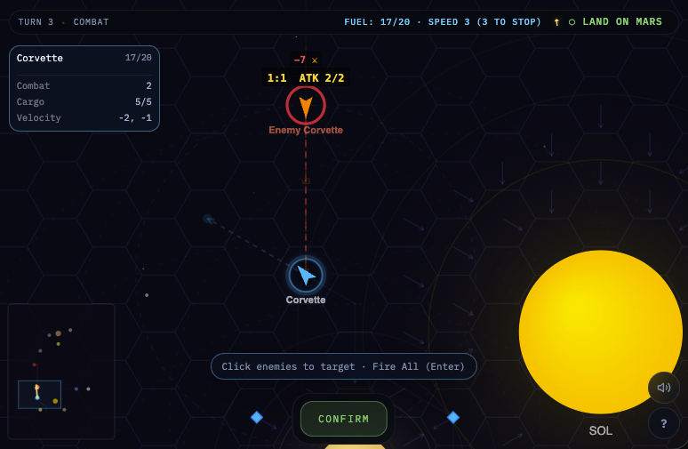

# 🚀 Delta-V

[](https://www.typescriptlang.org/)
[](https://developers.cloudflare.com/workers/)
[](https://developer.mozilla.org/en-US/docs/Web/API/Canvas_API)
[](https://vitest.dev/)

### [Play Now at delta-v.tre.systems](https://delta-v.tre.systems/)

<a href='https://ko-fi.com/N4N31DPNUS' target='_blank'></a>



**Delta-V** is an online, real-time multiplayer tactical space combat and racing game featuring realistic vector movement and orbital gravity mechanics across the inner Solar System, heavily inspired by the classic [Triplanetary (Steve Jackson Games)](https://www.sjgames.com/triplanetary/) board game.

Command your fleet, master astrogation trajectories, sling-shot around celestial bodies, and engage in high-stakes combat where positioning and velocity are just as crucial as firepower.

Check out our [**Ship Aesthetics & Visual Style Guide**](./docs/SPACESHIPS.md) and [**Technology & Lore Guide**](./docs/TECHNOLOGY.md) to understand the high-fidelity NASA-punk concept art and hard sci-fi grounding of our fleet.

## 📚 Documentation Guide

- [**SPEC.md**](./docs/SPEC.md): complete rules reference, protocol shapes, scenario definitions, and implementation notes
- [**ARCHITECTURE.md**](./docs/ARCHITECTURE.md): system boundaries, data flow, Durable Object design, and event-sourcing direction
- [**CODING_STANDARDS.md**](./docs/CODING_STANDARDS.md): coding conventions, refactoring guidance, and shared patterns
- [**PLAYABILITY.md**](./docs/PLAYABILITY.md): manual smoke, mobile, combat, and reconnect QA passes
- [**SIMULATION_TESTING.md**](./docs/SIMULATION_TESTING.md): headless AI-vs-AI coverage and planned load/stress testing
- [**SECURITY.md**](./docs/SECURITY.md): competitive-integrity posture, remaining risks, and deployment hardening notes
- [**BACKLOG.md**](./docs/BACKLOG.md): remaining open work only
- [**SPACESHIPS.md**](./docs/SPACESHIPS.md) and [**TECHNOLOGY.md**](./docs/TECHNOLOGY.md): visual direction and real-world technology anchors

## 🌟 Features

### ☄️ Realistic Vector Physics Spaceflight
- **Vector Movement Engine**: Your velocity persists between turns. Plan your burns carefully; there's no friction to stop you.
- **Orbital Mechanics**: Planetary gravity deflects your course. Master "Weak" and "Full" gravity wells to execute slingshot maneuvers.
- **Continuous Rendering vs Discrete Logic**: The visual rendering provides a smooth, continuous-space aesthetic, whilst all game logic acts on a strict, pure axial hex-coordinate system.

### ⚔️ Deep Tactical Combat
- **Odds-Based Combat**: Gun combat utilizes a classic odds-based dice resolution system, influenced by relative velocity and range modifiers.
- **Ordnance Management**: Equip and deploy mines, torpedoes, and devastating nukes.
- **Damage & Repairs**: Complex damage tracking (disabled turns vs. cumulative elimination). Find safe harbor at planetary bases for repairs and resupply.

### 🎮 Multiple Game Modes
- **8 Playable Scenarios**: Features *Bi-Planetary*, *Escape*, *Convoy*, *Duel*, *Blockade Runner*, *Fleet Action*, *Interplanetary War*, and *Grand Tour* race.
- **Local AI Opponent**: Test your skills offline against an AI component with configurable difficulty levels.
- **Real-Time Multiplayer**: Built for fast, responsive web-socket based remote play.

---

## 🛠️ Architecture

Delta-V adopts an elegant, robust architecture utilizing modern web primitives:

```text
src/
├── shared/              # Game Engine — side-effect-free (shared between client & server)
│   ├── engine/            # Phase processors: game-creation, astrogation, combat, ordnance, etc.
│   │   ├── engine-events.ts # EngineEvent domain event types (22 granular event types)
│   │   ├── game-engine.ts   # Barrel re-export (public API)
│   │   └── ...              # game-creation, fleet-building, astrogation, resolve-movement,
│   │                        # combat, ordnance, logistics, victory, util
│   ├── movement.ts        # Vector astrogation & gravity logic
│   ├── combat.ts          # Odds resolution & damage tables
│   ├── hex.ts             # Axial hex coordinate math
│   ├── map-data.ts        # Solar system bodies, gravity, bases, scenarios
│   ├── ai.ts              # AI opponent for single-player
│   ├── ai-config.ts       # Per-difficulty AI tuning parameters
│   └── ai-scoring.ts      # Composable AI course scoring strategies
├── server/              # Cloudflare Workers Backend
│   ├── index.ts           # HTTP entry point & WebSocket routing
│   └── game-do/           # Durable Object: state, messages, sessions, turns, archive
└── client/              # Browser Frontend
    ├── main.ts            # Client-side state machine & networking
    ├── game/              # Game logic helpers (combat, burn, phase, ordnance, input)
    ├── renderer/          # Canvas rendering, camera, animations, minimap
    └── ui/                # DOM overlays (menu, HUD, game log, game over)
scripts/                 # Automated Bot & AI Simulation tests
```

**Design Highlight:** The shared engine is side-effect-free — no DOM, no network, no storage. Engine functions receive inputs and return new state plus domain events (`EngineEvent[]`), making the game highly testable. All entry points clone input state on entry (`structuredClone`) — callers' state is never mutated. The engine is decomposed into focused phase processors (game-creation, astrogation, resolve-movement, combat, etc.) behind a barrel re-export. AI scoring is split into composable strategies with a data-driven config table. See [ARCHITECTURE.md](./docs/ARCHITECTURE.md) for details.

For project conventions and refactoring guidance, see [**CODING_STANDARDS.md**](./docs/CODING_STANDARDS.md).

---

## 🚀 Quick Start

Get your thrusters firing locally in seconds:

1. **Use the Project Node Version**
   ```bash
   nvm use
   ```

   Delta-V is tested in CI with **Node 25.x**.

2. **Install Dependencies**
   ```bash
   npm install
   ```

3. **Start the Local Development Server**
   ```bash
   npm run dev
   ```
   *This starts the Wrangler server.*

4. **Play the Game**
   - Open your browser to `http://localhost:8787`
   - Open a **second tab** or window to the same URL.
   - Create a game in tab 1, then use the generated invite link in tab 2.

### CLI Commands

| Command | Description |
|---------|-------------|
| `npm run dev` | Start local development server (Wrangler/esbuild) |
| `npm run build` | Build the client bundle |
| `npm run typecheck` | Run TypeScript type checking across the project |
| `npm test` | Run all unit tests via Vitest |
| `npm run test:coverage` | Run tests with a coverage report under `coverage/` |
| `npm run test:watch` | Run Vitest in continuous watch mode |
| `npm run simulate -- [scenario] [iterations] [--ci]` | Run headless AI vs AI matches to test engine stability and scenario balance |
| `npm run deploy` | Deploy straight to Cloudflare Workers |

Pass simulation arguments after npm's `--`, for example `npm run simulate -- all 25 --ci`.

---

## 📜 Game Rules Reference

For the comprehensive ruleset detailing movement edge cases, damage tables, and specific scenario rules, refer to [SPEC.md](./docs/SPEC.md).

## 🗺️ Roadmap

### Complete
- [x] 8 playable scenarios with AI opponent (Easy/Normal/Hard)
- [x] Server hardening (tokenized rooms, authenticated reconnects, runtime validation)
- [x] Hidden information (server-side state filtering for *Escape*)
- [x] Orbital bases, logistics, reinforcements, fleet conversion
- [x] PWA support (installable, offline single-player)
- [x] Engine safety (clone-on-entry, server rollback, event log)
- [x] Error reporting and anonymous telemetry (D1 storage)
- [x] 2,500+ automated tests across 178 test files, plus scenario AI simulations with per-scenario balance thresholds
- [x] Engine decomposition into focused phase processors (game-creation, astrogation, resolve-movement, combat, etc.)
- [x] Typed Ship state models (`lifecycle`, `control` fields with impossible states unrepresentable)
- [x] Granular engine events (22 `EngineEvent` types emitted by engine, replacing server-side derivation)
- [x] Data-driven AI configuration (per-difficulty scoring weights in `ai-config.ts`)
- [x] AI scoring decomposition (5 composable strategy functions in `ai-scoring.ts`)
- [x] Archive persistence extracted from Durable Object into standalone module
- [x] Replay archive foundation (transitional step toward event-sourced match persistence)
- [x] Shared rule consolidation, bounded type imports, authoritative disconnect-forfeit

### Planned
- [ ] **Event-Sourced Match Persistence**: Move from snapshot-first to append-only event stream with projections and checkpoints
- [ ] **Turn Replay**: Step through per-match recorded history with rematch selection
- [ ] **Spectator Mode**: Read-only live battle viewing from public filtered projections
- [ ] **Scenario Expansion**: Lateral 7, Fleet Mutiny, Retribution
- [ ] **Passenger Rescue Mechanics**: Rescue-specific transfer and objective rules

## 🔗 External References

- [Cloudflare Workers](https://developers.cloudflare.com/workers/) and [Durable Objects](https://developers.cloudflare.com/durable-objects/)
- [MDN Canvas API](https://developer.mozilla.org/en-US/docs/Web/API/Canvas_API) and [MDN Service Worker API](https://developer.mozilla.org/en-US/docs/Web/API/Service_Worker_API)
- [web.dev Learn PWA](https://web.dev/learn/pwa/)
- [TypeScript Handbook: Narrowing](https://www.typescriptlang.org/docs/handbook/2/narrowing.html)
- [Triplanetary overview](https://www.sjgames.com/triplanetary/)

---

## 📄 License
All rights reserved.
