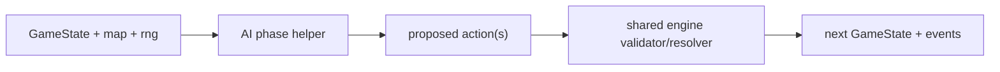

# AI Architecture and Tuning Guide

This guide is for changing the built-in Delta-V AI safely. It explains the
current architecture, how to decide whether a behavior belongs in a named plan
or a scalar score, and the verification loop expected for AI changes.

For the broader system architecture, see [ARCHITECTURE.md](./ARCHITECTURE.md).
For simulation commands and scorecard fields, see
[SIMULATION_TESTING.md](./SIMULATION_TESTING.md).

## Goals

The built-in AI has three jobs:

1. Provide a competent local opponent at easy, normal, and hard difficulty.
2. Exercise the shared engine deeply through deterministic simulation.
3. Give scripted and external agents a reliable fallback policy.

It is not trying to be a perfect minimax player. The game has simultaneous
movement, hidden information, ordnance, fuel, gravity, logistics, and asymmetric
scenario objectives. The AI should be readable, deterministic under a supplied
RNG, and easy to tune from captured failures.

## Mental Model

The engine owns legality and resolution. The AI only proposes actions.



Each phase has a focused helper:

| Phase | Main helper | Purpose |
| --- | --- | --- |
| Fleet building | `buildAIFleetPurchases` | Pick legal purchases from scenario options. |
| Astrogation | `aiAstrogation` | Pick burns, overloads, landing choices, and target overrides. |
| Ordnance | `aiOrdnance` | Pick mines, torpedoes, or nukes when scenario rules allow them. |
| Logistics | `aiLogistics` | Transfer fuel, cargo, and passengers. |
| Combat | `aiCombat` | Pick gun or anti-ordnance attacks. |

Every helper must remain deterministic for the same `GameState`, map,
difficulty, and RNG stream. Do not use `Math.random()`.

## Module Map

| File | Responsibility |
| --- | --- |
| `src/shared/ai/index.ts` | Public AI exports. |
| `src/shared/ai/types.ts` | AI difficulty type. |
| `src/shared/ai/config.ts` | Difficulty and scenario-tunable numeric knobs. |
| `src/shared/ai/common.ts` | Shared movement planning, refuel, landing, and intercept helpers. |
| `src/shared/ai/doctrine.ts` | Shared turn context: ship roles plus passenger carrier, threat, and landing-window signals. |
| `src/shared/ai/scoring.ts` | Low-level course and combat-position scoring functions. |
| `src/shared/ai/astrogation.ts` | Per-ship burn enumeration and high-level movement orchestration. |
| `src/shared/ai/ordnance.ts` | Ordnance launch selection and intercept estimation. |
| `src/shared/ai/combat.ts` | Combat target selection and attack grouping. |
| `src/shared/ai/logistics.ts` | Role assignment, passenger value, and transfer choices. |
| `src/shared/ai/fleet.ts` | Fleet purchase search and purchase preferences. |
| `src/shared/ai/plans/` | Named doctrine decisions with comparable plan evaluations. |
| `src/shared/ai/plans/passenger.ts` | Stable passenger-plan barrel; implementation is split under `plans/passenger/`. |

## Decision Layers

AI choices should flow through these layers, in this order:

1. **Rules and capability gates.** Scenario rules, ship lifecycle, fuel,
   ordnance cargo, visibility, line of sight, and legal actions.
2. **Role and objective context.** Is this ship a passenger carrier, escort,
   interceptor, tanker, race ship, or post-objective survivor?
3. **Intent-first plans.** Use a named plan when the decision has strategic
   meaning: deliver passengers, preserve a landing line, intercept a carrier,
   screen an objective runner, refuel, or finish attrition.
4. **Scalar scoring.** Use numeric scoring for local comparisons inside a
   doctrine choice, especially burn selection among legal courses.
5. **Engine validation.** The engine remains authoritative. Any rejected
   built-in AI action is a bug.

The important split is this:

| Use a named plan when... | Use scalar scoring when... |
| --- | --- |
| The choice answers "why are we doing this?" | The choice answers "which legal candidate is slightly better?" |
| The behavior should appear in failure-capture diagnostics. | The behavior is local geometry, range, velocity, or fuel arithmetic. |
| A test can assert the intent without caring about exact burn direction. | A test genuinely needs exact geometry or odds. |
| Multiple strategic goals compete, such as delivery vs combat. | One strategic goal is already chosen. |

## Intent-First Plans

The shared vocabulary lives in `src/shared/ai/plans/index.ts`.

| Type | Meaning |
| --- | --- |
| `PlanIntent` | Stable name for the strategic reason. |
| `PlanCandidate<TAction>` | Intent, concrete action, evaluation vector, priority, diagnostics. |
| `PlanDecision<TAction>` | Chosen candidate plus rejected candidates in rank order. |
| `planEvaluation()` | Builds a full vector from the explicitly relevant dimensions, defaulting omitted scores to neutral zero. |
| `chooseBestPlan()` | Deterministic selection by evaluation vector, priority, then id. |

Current named intents include:

| Intent | Current use |
| --- | --- |
| `deliverPassengers` | Preserve or start passenger delivery progress. |
| `preserveLandingLine` | Skip combat when a carrier can soon land safely. |
| `escortCarrier` | Drop objective navigation to screen a threatened carrier. |
| `interceptPassengerCarrier` | Commit an interceptor toward an enemy carrier. |
| `supportPassengerCarrier` | Keep a tanker aligned with the carrier. |
| `transferPassengers` | Move passengers to a better carrier during logistics. |
| `postCarrierLossPursuit` | Release ships to pursue after passenger delivery is impossible. |
| `refuelAtReachableBase` | Divert to a reachable base instead of a tempting unreachable target. |
| `defendAgainstOrdnance` | Prefer anti-ordnance fire when incoming ordnance is the threat. |
| `launchNuke` | Commit an expensive nuke after strategic value and interception gates pass. |
| `launchTorpedo` | Launch a torpedo when it is the preferred lower-cost intercept. |
| `deployMine` | Deploy a mine for close objective or escape denial. |
| `finishAttrition` | Finish disabled or vulnerable enemies when objective safety permits it. |
| `attackThreat` | Default combat pressure against ordinary ship threats. |
| `screenObjectiveRunner` | Hold a race/objective ship out of opportunistic combat when cover can attack. |

### Plan Evaluation Convention

`PlanEvaluation` is an ordered vector, not a single score. Higher is better for
`objective`, `survival`, `landing`, `fuel`, `combat`, `formation`, and `tempo`.
Lower is better for `risk` and `effort`.

The current values are still partly heuristic. Use these conventions when
adding new plans:

| Field | Use it for | Practical range |
| --- | --- | --- |
| `feasible` | Hard viability gate. | `true` beats every infeasible plan. |
| `objective` | Progress toward the scenario win condition. | 0-100; use 100 only for direct win preservation. |
| `survival` | Avoiding loss of mission-critical ships. | 0-100; carrier survival should outrank local combat. |
| `landing` | Preserving or starting a safe landing line. | 0-50 for setup, higher only for imminent landing. |
| `fuel` | Remaining fuel margin or refuel value. | Relative margin; avoid huge constants. |
| `combat` | Tactical pressure, attack value, anti-threat value. | Local value after objective/survival. |
| `formation` | Escort, screen, or support positioning. | Small/medium tie-breaker unless formation is the plan. |
| `tempo` | Turns gained or distance closed. | Positive means faster objective/intercept progress. |
| `risk` | Lower is safer. | 0 for normal, higher for crashes, threat exposure, uncertainty. |
| `effort` | Lower is cheaper/simpler. | Fuel spent, distance, or move complexity. |

If a plan needs a huge constant to win, first ask whether the intent ordering is
wrong or whether a separate plan should make the doctrine explicit.

## AI Change Workflow

Use this loop for behavior changes:

1. **Measure the current behavior.** Run a focused scorecard on paired seeds.
2. **Capture or build a failing state.** Use failure captures or a small test
   state that demonstrates the wrong decision class.
3. **Choose the right layer.** Named plan for doctrine, scalar score for local
   geometry, scenario setup only when the scenario itself is the problem.
4. **Add a regression.** Prefer intent assertions over exact burns unless the
   exact geometry is the behavior.
5. **Run paired scorecards.** Compare objective share, fleet elimination,
   timeout share, invalid actions, fuel stalls, transfer mistakes, and average
   turns.
6. **Update docs/backlog.** Remove completed backlog items. Add only real
   unfinished follow-up work.

### Useful Commands

```bash
# Focused unit tests
npm test -- --run src/shared/ai.test.ts
npm test -- --run src/shared/ai/plans/index.test.ts

# Focused scenario scorecard
npm run simulate -- evacuation 80 --seed 21 --quiet --json

# Failure captures for fixture promotion
npm run simulate -- convoy 80 --seed 21 --capture-failures tmp/ai-captures/convoy \
  --capture-failure-kind objectiveDrift --capture-failures-limit 10 --quiet --json

# Paired multi-seed sweep
npm run simulate:duel-sweep -- --scenario convoy --iterations 30 --json > before.json
npm run simulate:duel-sweep -- --scenario convoy --iterations 30 --json \
  --baseline-json before.json
```

## Failure Capture Triage

Failure captures are most useful when you classify them before changing code.

| Symptom | First places to inspect |
| --- | --- |
| Invalid AI action | Phase helper output, engine validator, scenario rules. |
| Fuel stall | `ai/common.ts`, `ai/astrogation.ts`, reachable refuel plans. |
| Passenger transfer mistake | `ai/logistics.ts`, passenger arrival odds, transfer formation. |
| Objective drift to fleet elimination | Combat doctrine, carrier survival, landing plan, scenario setup. |
| Timeout-heavy stalemate | Post-objective pursuit, combat thresholds, fuel/refuel loops. |
| Seat imbalance | Paired seeded sweeps, start randomization, scenario asymmetry. |

Do not tune from a single capture unless it represents a repeated pattern.
Promote representative states into fixtures under
`src/shared/ai/__fixtures__/`.

## Reporting Template

Use this shape in PRs or handoff notes for AI changes:

```text
Problem:
- Scenario, seed(s), capture/fixture, observed bad decision.

Change:
- Named intent or scoring layer changed.
- Files touched.

Regression:
- Test name and what decision class it protects.

Scorecard:
- Before: objective %, fleet elimination %, timeout %, P0 decided %, stalls/game.
- After: same paired seed set.

Risk:
- What might regress, and what future capture would prove it.
```

## Common Pitfalls

- Do not add broad weights from one anecdotal game.
- Do not assert exact burns when the intended behavior is strategic.
- Do not use randomness outside the supplied RNG.
- Do not make passenger carriers fight unless the doctrine explicitly says the
  objective is already lost or the target is safe.
- Do not make scenario setup changes to hide an AI doctrine bug.
- Do not leave completed implementation tasks in [BACKLOG.md](./BACKLOG.md).

## Current Architecture Limits

The intent-first shift is successful but incomplete:

- Combat target selection, attack grouping, hold-fire, and anti-ordnance
  grouping now emit named plan traces. The low-level odds and range math stays
  inside combat; captures show the strategic intent that used those numbers.
- Ordnance launches, race-role holds, and anti-nuke reach rejections emit named
  plan traces. Intercept geometry remains local to ordnance code; captures show
  the launch or rejection reason.
- Astrogation captures include named movement/refuel plan traces plus a generic
  scalar-course trace for orders that do not come from a named plan. Generic
  scalar traces summarize the chosen order and the strongest rejected burn
  candidates.
- Passenger doctrine has a shared turn context, and emergency escort planning
  now consumes that context for carrier, threat, and role state. Passenger
  carriers also use four-turn bounded map-continuation checks before accepting
  a course, so short-term target progress cannot win if every near follow-up
  leaves the carrier off-map or in a delayed gravity trap. Tankers mirror a
  stacked carrier and regroup toward the carrier's projected position after
  separation. Escorts can switch from threat pursuit to carrier rendezvous when
  the carrier is compromised. Future passenger fixes should keep moving
  phase-specific decisions onto this shared context when they need the same
  facts.
- `PlanEvaluation` ranges are documented here and current named plans stay
  inside those practical ranges for objective/survival/landing dimensions.

The active AI work now lives in
[BACKLOG.md#improve-passenger-objective-ai-p1](./BACKLOG.md#improve-passenger-objective-ai-p1).
