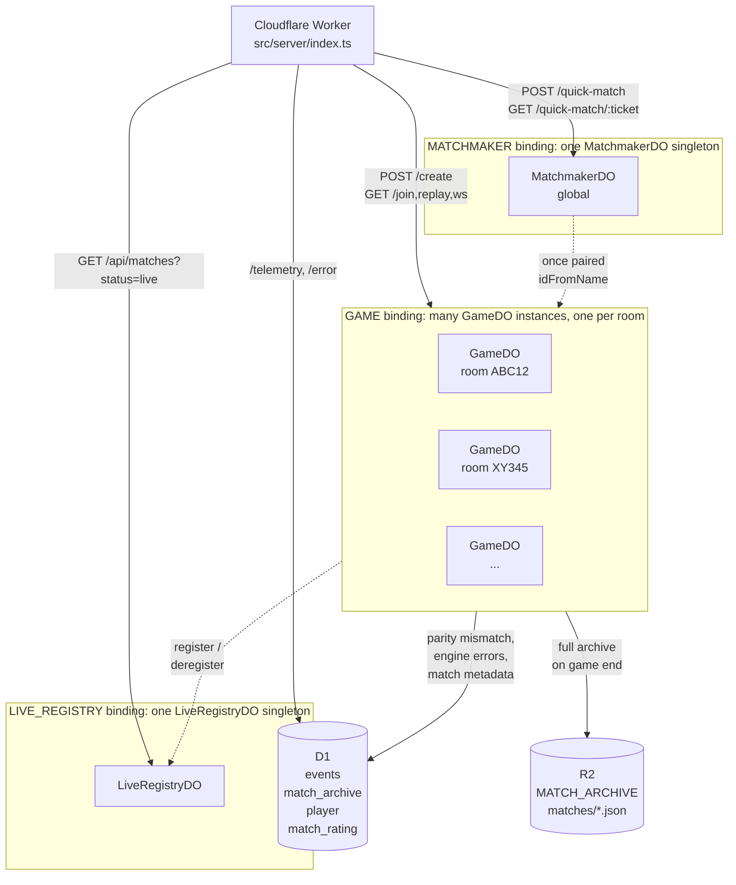
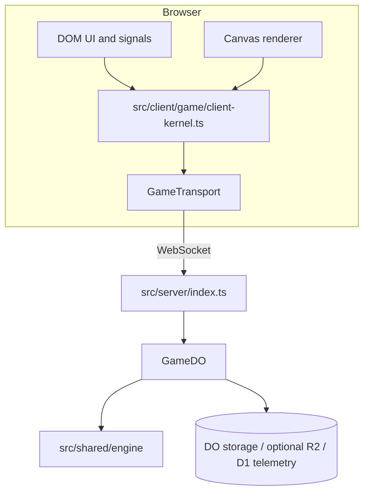
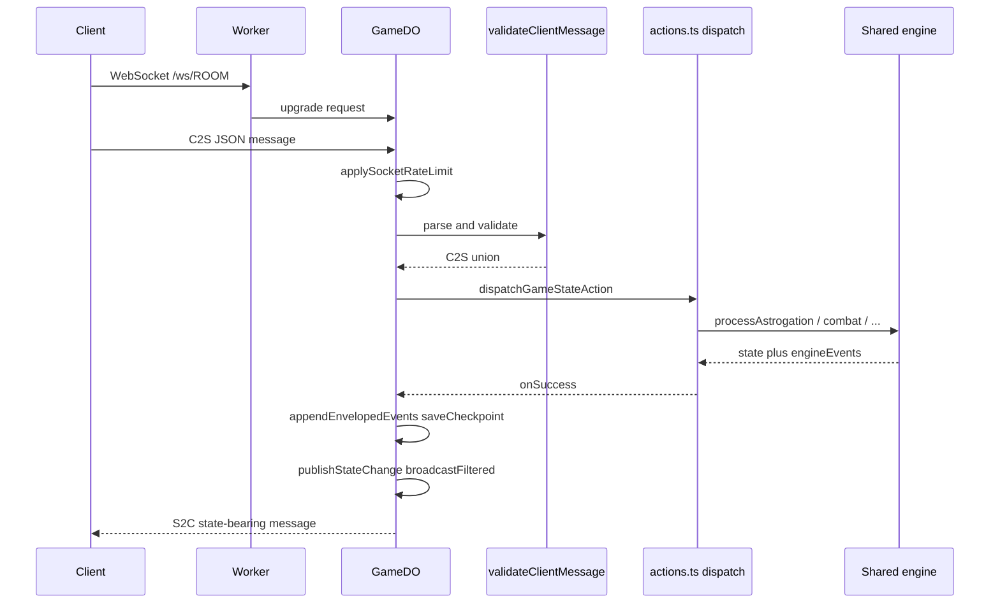
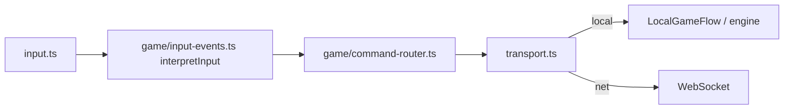
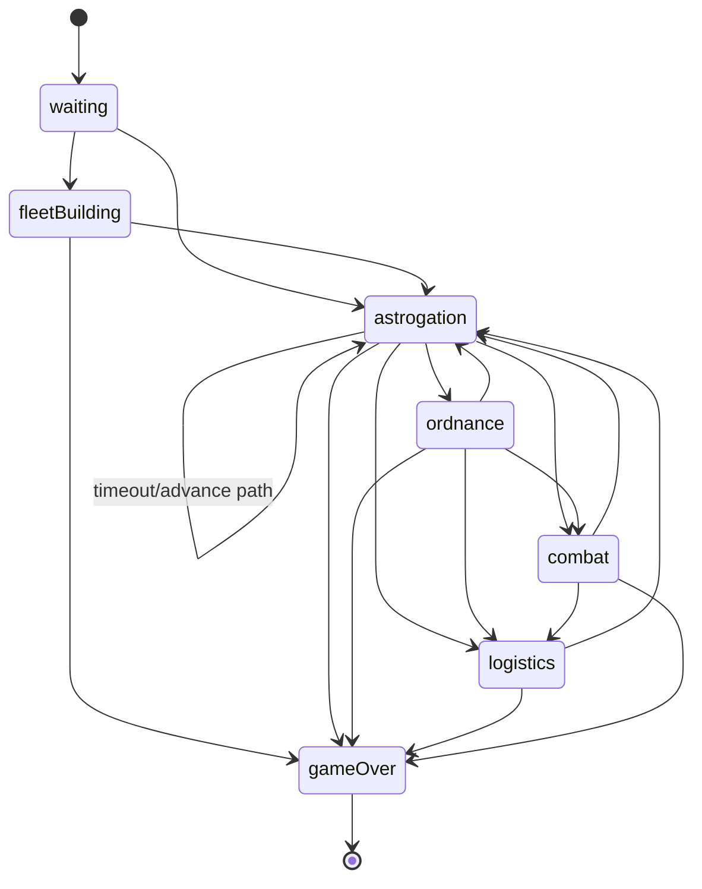
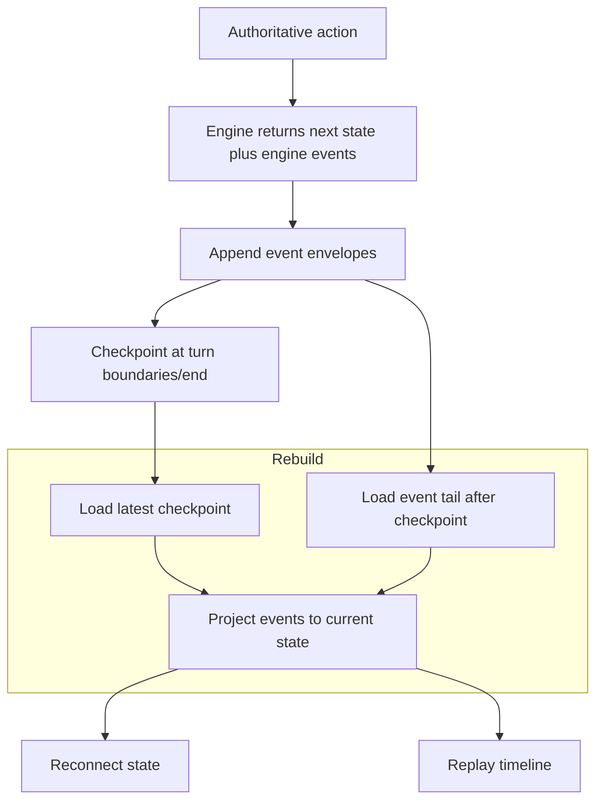
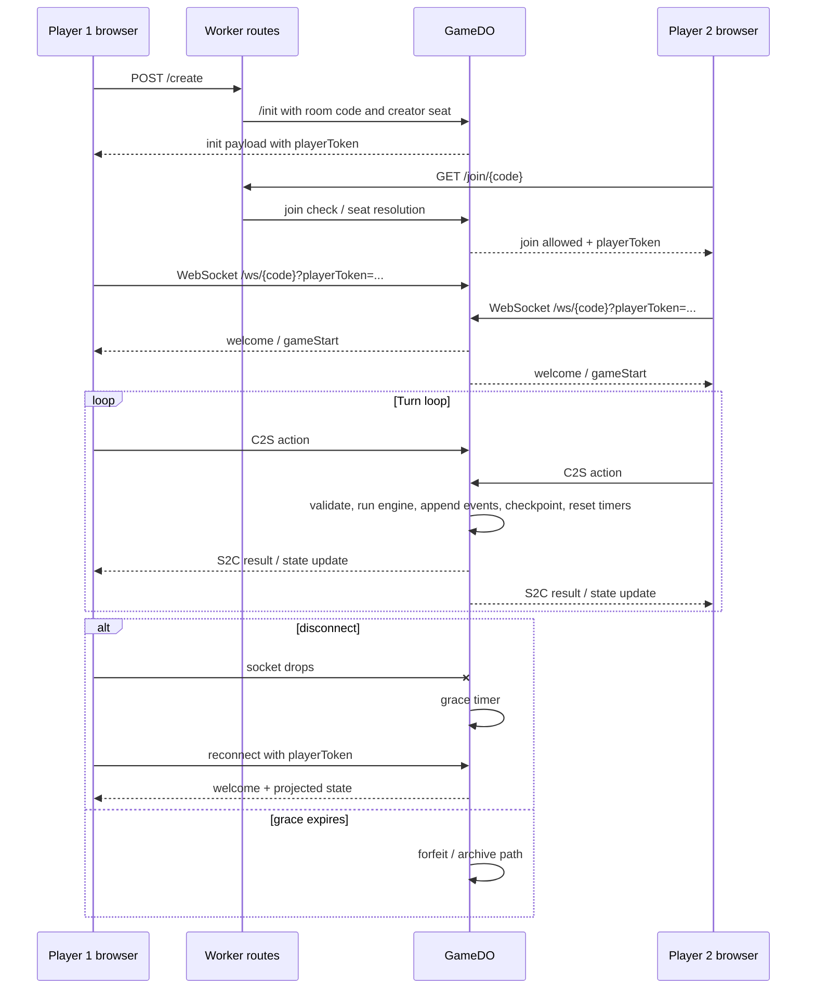

# Delta-V Architecture & Design Document

The module inventory, data flow, and Durable-Object model for the Delta-V server and shared engine. Read this to learn how a request becomes authoritative state and how state becomes bytes on the wire. Game rules live in [SPEC.md](./SPEC.md); wire format lives in [PROTOCOL.md](./PROTOCOL.md); conventions live in [CODING_STANDARDS.md](./CODING_STANDARDS.md); contributor workflow lives in [CONTRIBUTING.md](./CONTRIBUTING.md); open work lives in [BACKLOG.md](./BACKLOG.md); and the *why* behind the design choices lives in [patterns/](../patterns/README.md).

The authoritative server model is event-sourced: the Durable Object persists a match-scoped event stream plus checkpoints, and recovers authoritative state from checkpoint + event tail (not from a separate persisted `gameState` snapshot slot).

## Quick Navigation

- [1. High-Level Architecture](#1-high-level-architecture)
- [2. Core Systems Design](#2-core-systems-design)
- [3. Data Flow](#3-data-flow)
- [4. Dependency Map](#4-dependency-map)
- [5. Current Decisions and Planned Shifts](#5-current-decisions-and-planned-shifts)
- [6. Client bundle and release hygiene](#6-client-bundle-and-release-hygiene)

**Deployment assumption:** Client and Worker ship as a **single version line** (one deploy updates Worker + static assets). Staggered "old client / new server" is not supported. Breaking protocol changes need a coordinated deploy; prefer additive JSON fields. When bumping `GameState.schemaVersion`, follow [COORDINATED_RELEASE_CHECKLIST.md](./COORDINATED_RELEASE_CHECKLIST.md).

Platform references:

- [Cloudflare Workers](https://developers.cloudflare.com/workers/) · [Durable Objects](https://developers.cloudflare.com/durable-objects/) · [WebSocket Hibernation API](https://developers.cloudflare.com/durable-objects/api/websockets/)
- [MDN Canvas API](https://developer.mozilla.org/en-US/docs/Web/API/Canvas_API) · [MDN Service Worker API](https://developer.mozilla.org/en-US/docs/Web/API/Service_Worker_API)

Pattern references:

- [Gary Bernhardt, "Boundaries"](https://www.destroyallsoftware.com/talks/boundaries)
- [Martin Fowler, Event Sourcing](https://martinfowler.com/eaaDev/EventSourcing.html) · [CQRS](https://martinfowler.com/bliki/CQRS.html) · [Dependency Injection](https://martinfowler.com/articles/injection.html)
- [Mark Seemann, Composition Root](https://blog.ploeh.dk/2011/07/28/CompositionRoot/)
- [Solid Docs, Fine-grained reactivity](https://docs.solidjs.com/advanced-concepts/fine-grained-reactivity) · [Preact Signals guide](https://preactjs.com/guide/v10/signals/)

## 1. High-Level Architecture

Delta-V uses a full-stack TypeScript architecture built around a **shared side-effect-free engine with authoritative edge sessions**. The authoritative room persists an append-only match stream and derives current state from that stream plus optional checkpoints.

```
src/shared/      → Game logic (no I/O, fully testable, side-effect-free)
src/server/      → Cloudflare Workers entry + three Durable Object classes
src/client/      → State machine + Canvas renderer + DOM UI
```

### Cloudflare Durable Objects

Three DO classes back the server, bound in [`wrangler.toml`](../wrangler.toml):

| Binding | Class | Purpose |
| --- | --- | --- |
| `GAME` | `GameDO` | One room per active match — event stream, checkpoints, WebSocket, alarms |
| `MATCHMAKER` | `MatchmakerDO` | Singleton `global` instance — quick-match ticket queue and seat pairing |
| `LIVE_REGISTRY` | `LiveRegistryDO` | Singleton — "Live now" registry powering `GET /api/matches?status=live` |



`GameDO` carries nearly all game state and is the focus of the rest of this document. The two support DOs are small (`src/server/matchmaker-do.ts`, `src/server/live-registry-do.ts`) and each lives behind a singleton binding (`idFromName('global')`) so there's exactly one of each in the cluster.

### Diagrams (Mermaid)

These render on GitHub and in many Markdown preview tools. They summarize shapes that are spelled out in prose below.

**Runtime layers (who talks to whom):**



**Authoritative action path (multiplayer):**



**Client command path (local or remote):**



**Engine phase state machine (authoritative `GameState.phase`):**



**Event-sourced recovery and replay projection:**



Diagram maintenance rule: when command flow, phase transitions, or persistence/projection behavior changes, update these diagrams in the same PR.

### Key Technologies

- **Language**: TypeScript (strict mode) across the entire stack.
- **Frontend**: HTML5 Canvas 2D API for rendering (`client/renderer/renderer.ts`), raw DOM/Events for UI and Input. No heavy frameworks (React/Vue/etc.) are used, ensuring maximum performance for the game loop.
- **Backend**: Cloudflare Workers for HTTP routing and Cloudflare Durable Objects for authoritative game state and WebSocket management.
- **Build & Tools**: `esbuild` for lightning-fast client bundling, `wrangler` for local testing/deployment, and `Vitest` for unit testing.

### Architectural Stance

- **Side-effect-free engine.** `src/shared/` has no I/O; the DO wraps it with persistence and WebSocket plumbing.
- **Event-sourced authoritative state.** Match state is a projection of an event stream plus checkpoints — live play, replay, and reconnect share one code path.
- **Scenario-driven.** `ScenarioRules` (a flat flag bag) and `aiConfigOverrides` (a partial AI config) let scenarios vary gameplay without branching engine code.
- **Narrow class usage.** The only production `class` is `GameDO extends DurableObject`. Everything else uses `createXxx()` factories.
- **Zero runtime UI framework.** Canvas 2D rendering plus a small local signals library (`src/client/reactive.ts`); no React / Vue / Immer / etc.

Each of these stances is walked through in [`patterns/`](../patterns/README.md) with examples and tradeoffs.

---

## 2. Core Systems Design

The architecture is divided into three distinct layers: Shared Logic, Server, and Client.

### A. Shared Game Engine (`shared/`)

This is the heart of the project. All game rules live in a shared folder, making the system robust and completely unit-testable.

#### Module Inventory

| Module                                     | Purpose                                                                                                                 | Reusability                             |
| ------------------------------------------ | ----------------------------------------------------------------------------------------------------------------------- | --------------------------------------- |
| `hex.ts`                                   | Axial hex math: distance, neighbours, line draw, pixel conversion                                                       | **Fully generic** — zero game knowledge |
| `util.ts`                                  | Functional collection helpers (`sumBy`, `minBy`, `indexBy`, `cond`, etc.)                                               | **Fully generic** — no game knowledge   |
| `types/`                                   | Shared interfaces for domain, protocol, and scenario data                                                               | Game-specific                           |
| `shared/protocol.ts`                       | Shared runtime C2S validation and normalization (trimmed chat, bounded payloads); complements `types/protocol.ts`       | Mostly generic                          |
| `replay.ts`                                | Replay timeline structure and match identity builder                                                                    | Game-specific                           |
| `constants.ts`                             | Ship stats, ordnance mass, detection ranges, combat/movement constants                                                  | Game-specific                           |
| `movement.ts`                              | Vector movement with gravity, fuel, takeoff/landing, crash detection                                                    | Game-specific                           |
| `combat.ts`                                | Gun combat tables, LOS, range/velocity mods, heroism, counterattack                                                     | Game-specific                           |
| `map-data.ts`                              | Solar system bodies, gravity rings, bases, and scenario definitions                                                     | Game-specific                           |
| `ai/`                                      | Rule-based AI: composable scoring, per-phase decision modules, difficulty config                                         | Game-specific                           |
| `scenario-capabilities.ts`                 | Derived scenario capability layer (`deriveCapabilities`): defaults + feature predicates for `ScenarioRules`              | Game-specific                           |
| `engine/game-engine.ts`                    | Barrel re-export for the public engine API                                                                              | Game-specific                           |
| `engine/engine-events.ts`                  | `EngineEvent` discriminated union (33 granular domain event types)                                                      | Game-specific                           |
| `engine/event-projector.ts`                | Deterministic projection from persisted `EventEnvelope` stream (+ checkpoints) to `GameState`; used by server and tests | Game-specific                           |
| `engine/*` phase modules                   | Game creation, fleet building, astrogation, movement, combat, ordnance, logistics, victory, and shared helpers          | Game-specific                           |
| `engine/turn-advance.ts`                   | Turn advancement: damage recovery, player rotation, reinforcement spawning, fleet conversion                            | Game-specific                           |
| `engine/post-movement.ts`                  | Post-movement interactions: ramming, inspection, capture, resupply, detection                                           | Game-specific                           |

#### Key Design Patterns

- **`engine/game-engine.ts`**: A side-effect-free state machine. It takes the current `GameState` and player actions (e.g., astrogation orders, combat declarations) and returns a new `GameState` along with events (movements, combat results). **It has no I/O side effects (no DOM, no network, no storage)** and never mutates the caller's state — see [Engine Mutation Model and RNG Injection](#engine-mutation-model-and-rng-injection).
- **`movement.ts`**: Contains the complex vector math, gravity well logic, and collision detection. Moving a ship is resolved strictly on an axial hex grid (using `hex.ts`).
- **`combat.ts`**: Evaluates line-of-sight, calculates combat odds based on velocity/range modifiers, and resolves damage. Mutates ships directly (e.g., `applyDamage`, updating `ship.lifecycle`, heroism flags).
- **`types/`**: The single source of truth for all data structures (`GameState`, `Ship`, `CombatResult`, network message payloads), split into `domain.ts`, `protocol.ts`, and `scenario.ts` with a barrel re-export. This ensures the client and server never fall out of sync.
- **Dependency injection**: Engine functions accept `map` and `rng` as parameters so they can be tested without global state or non-determinism — see [Engine Mutation Model and RNG Injection](#engine-mutation-model-and-rng-injection).
- **Domain event emission**: Turn-resolution engine entry points emit `EngineEvent[]` (33 granular types: shipMoved, shipCrashed, combatAttack, ordnanceLaunched, phaseChanged, gameOver, committed command events, logistics events, and more) alongside state and animation data. The server reads `result.engineEvents` directly — no server-side event derivation. Movement animation data (`MovementEvent[]`, `ShipMovement[]`) remains separate for client rendering.

#### AI Strategy Design (`src/shared/ai/*`)

The AI uses a **config-weighted composable scoring** architecture rather than a monolithic decision tree:

- **`src/shared/ai/config.ts`** defines `AIDifficultyConfig` — a flat record of ~60 numeric weights and boolean flags. Three presets (`easy`, `normal`, `hard`) tune aggression, accuracy, and capability without changing any logic, and `ScenarioRules.aiConfigOverrides` can selectively override individual knobs per scenario (used by Duel to lengthen engagements). This is the [Strategy pattern](https://refactoring.guru/design-patterns/strategy) expressed as data rather than class hierarchies.
- **`src/shared/ai/doctrine.ts`** builds shared turn context for phase helpers: ship roles plus passenger-carrier, active-threat, and landing-window signals that should not be rediscovered independently in astrogation, ordnance, and combat.
- **`src/shared/ai/scoring.ts`** contains composable scoring functions, each handling one concern: `scoreNavigation` (distance/speed toward objective), `scoreEscape` (distance from center + velocity), `scoreRaceDanger` (gravity well proximity penalty), `scoreGravityLookAhead` (deferred-gravity next-turn value), and `scoreCombatPositioning` (engagement/interception posture). Each takes a course candidate and a config, returns a number.
- **`src/shared/ai/index.ts`** orchestrates: for each AI ship, enumerate all 7 burn options (6 hex directions + null), compute each course via `computeCourse()`, sum scores across all strategies, pick the highest. Combat and ordnance decisions follow the same evaluate-all-options-then-pick pattern.

Difficulty tuning is pure data, new scoring dimensions are pure additions, and all AI functions accept `rng` for deterministic testing. The contributor-facing workflow for AI changes lives in [AI.md](./AI.md). The pattern walk-through is in [patterns/scenarios-and-config.md#ai-config-as-weights-not-code](../patterns/scenarios-and-config.md#ai-config-as-weights-not-code).

#### Intent-first AI Plans

Passenger and fuel-support decisions now sit on top of the scalar scoring layer
as **named plans** in `src/shared/ai/plans/`. The purpose is not to replace
course scoring wholesale; it is to make high-risk doctrine decisions explicit
before they become small, hard-to-reason-about weight tweaks.

The shared plan vocabulary lives in `src/shared/ai/plans/index.ts`:

- `PlanIntent` names the strategic reason for a choice.
- `PlanCandidate<TAction>` stores the intent, concrete action, comparable
  `PlanEvaluation` vector, and optional diagnostics.
- `chooseBestPlan()` provides deterministic selection across candidates.

Current named intents with regression coverage:

| Intent | Purpose | Main implementation |
| --- | --- | --- |
| `deliverPassengers` | Preserve or start passenger delivery progress instead of drifting or finishing attrition combat. | `plans/passenger.ts` |
| `preserveLandingLine` | Skip combat when a passenger carrier has a one- or two-turn landing line. | `plans/passenger.ts` |
| `escortCarrier` | Drop objective navigation so an escort screens a threatened passenger carrier. | `plans/passenger.ts` |
| `interceptPassengerCarrier` | Convert a stationary pursuit fallback into a named enemy-carrier intercept. | `plans/passenger.ts` |
| `supportPassengerCarrier` | Keep a tanker stacked with the passenger carrier by mirroring the carrier burn. | `plans/passenger.ts` |
| `postCarrierLossPursuit` | Release remaining ships to pursue after the passenger objective is gone. | `plans/passenger.ts` |
| `refuelAtReachableBase` | Divert to a planner-reachable refuel base instead of a geometrically tempting but unreachable target. | `plans/navigation.ts` |
| `defendAgainstOrdnance` | Name anti-ordnance combat target choices. | `plans/combat.ts` |
| `finishAttrition` | Name disabled-target combat choices. | `plans/combat.ts` |
| `attackThreat` | Name default combat target choices when no higher doctrine applies. | `plans/combat.ts` |

The refactor was successful as an architecture change: doctrine-level tests now
assert chosen intents instead of only exact burns, and simulation captures can
record plan decisions where the caller supplies them. It did **not** fully solve
scenario balance. The remaining work is behavior tuning backed by paired
scorecards and captured states, especially evacuation's P0 skew and convoy's
remaining fleet-elimination share.

When adding AI behavior now:

1. Promote a captured bad state or add a focused fixture first.
2. Express doctrine as a named plan when the decision has strategic meaning
   beyond a local numeric score.
3. Keep scalar course scoring for low-level burn comparison.
4. Compare paired seed scorecards before and after; see
   [SIMULATION_TESTING.md](./SIMULATION_TESTING.md).

The full module map, plan-evaluation convention, change workflow, failure
triage table, and reporting template are in [AI.md](./AI.md).

#### Engine Mutation Model and RNG Injection

The shared engine is side-effect-free and externally immutable. Turn-resolution entry points `structuredClone` their input state, mutate the clone internally, and return it. RNG is a mandatory parameter on all turn-resolution entry points; the server derives a per-match, per-action PRNG from a seed persisted in storage. Full detail in [patterns/engine-and-architecture.md](../patterns/engine-and-architecture.md) (sections "Side-Effect-Free Shared Engine" and "Deterministic RNG via Per-Match Seed").

### B. The Server (`server/`)

The backend leverages Cloudflare's edge network.

#### Module Inventory

| Module                       | Purpose                                                                                                          | Reusability                                               |
| ---------------------------- | ---------------------------------------------------------------------------------------------------------------- | --------------------------------------------------------- |
| `index.ts`                   | Worker entry + top-level route dispatch and static asset proxy                                                   | Generic pattern                                           |
| `room-routes.ts`             | Room route handlers: `/create`, `/join/:code`, `/replay/:code`, `/ws/:code`                                    | **~85% generic** — room lifecycle shape is reusable      |
| `reporting.ts`               | `/error` + `/telemetry` handlers, hashing, and rate-limit helpers                                                | Generic pattern                                           |
| `env.ts`                     | Worker bindings/types (`GAME`, `DB`, `MATCH_ARCHIVE`, rate-limit binding)                                       | Generic pattern                                           |
| `protocol.ts`                | Room codes, tokens, init payload parsing, seat assignment, shared-validator re-export                            | **~85% generic** — room/token/seat logic is game-agnostic |
| `game-do/game-do.ts`         | Durable Object class: composes fetch, WebSocket, and alarm paths                                                 | **~70% generic** — multiplayer plumbing is reusable       |
| `game-do/fetch.ts`           | HTTP `/init`, `/join`, `/replay` and WebSocket upgrade + welcome/reconnect                                       | **~70% generic**                                          |
| `game-do/ws.ts`              | Hibernation `webSocketMessage` / `webSocketClose` entrypoints; delegates parsed message handling to `socket.ts` | **~70% generic**                                          |
| `game-do/alarm.ts`           | Alarm handler: disconnect forfeit, turn timeout, inactivity archive/close                                        | Mostly generic                                            |
| `game-do/turn-timeout.ts`    | Turn-timeout branch: engine outcome + `publishStateChange`                                                       | Game-specific                                             |
| `game-do/telemetry.ts`       | Engine/projection error reporting to D1                                                                          | Generic pattern                                           |
| `game-do/actions.ts`         | `runGameStateAction`, `dispatchGameStateAction`, per-action engine wiring                                        | Game-specific                                             |
| `game-do/broadcast.ts`       | `broadcastFilteredMessage`, `broadcastStateChange`, socket send helpers                                          | Game-specific                                             |
| `game-do/publication.ts`     | State publication pipeline: append events, checkpoint, parity verify, archive, timer, broadcast                  | Game-specific                                             |
| `game-do/http-handlers.ts`   | `handleInitRequest`, `handleJoinCheckRequest`, `handleReplayRequest`, `resolveJoinAttempt`                       | **~70% generic**                                          |
| `game-do/socket.ts`          | Socket helper layer: message rate limit, client parsing, aux-message dispatch map                                | **~70% generic**                                          |
| `game-do/projection.ts`      | Replay timeline shaping; uses `event-projector`; viewer-filtered replay entries                                  | Game-specific                                             |
| `game-do/match.ts`           | `initGameSession`, rematch handling                                                                              | Game-specific                                             |
| `game-do/archive.ts`         | Match-scoped event envelopes (gameId/seq/ts/actor), checkpoints, replay projection helpers, match identity       | Game-specific                                             |
| `game-do/archive-storage.ts` | Chunked event stream keys in DO storage                                                                          | Game-specific                                             |
| `game-do/match-archive.ts`   | Persistent archival of completed matches to R2 + D1 metadata                                                     | **Fully generic**                                         |
| `game-do/message-builders.ts`| S2C message construction from engine results                                                                     | Game-specific                                             |
| `game-do/session.ts`         | Disconnect grace period, alarm scheduling                                                                        | **Fully generic**                                         |
| `game-do/turns.ts`           | Turn timeout auto-advance                                                                                        | Mostly generic                                            |
| `auth/`                      | Agent/match token signing, `POST /api/agent-token` issuance, HMAC/SHA-256 helpers, `AGENT_TOKEN_SECRET` resolution | **Fully generic**                                         |
| `leaderboard/`               | Glicko-2 rating writer, claim-name route, `GET /api/leaderboard`, per-player rank lookup, provisional rules       | Game-agnostic rating + identity pattern                   |

#### Key Patterns (pointers)

- **Event-sourced matches**: chunked event stream + checkpoints; state is projected from the stream. See [patterns/protocol-and-persistence.md](../patterns/protocol-and-persistence.md) sections "Chunked Event Storage", "Checkpoints at Turn Boundaries", "Publication Pipeline", and "Parity Check" (the last in the engine chapter).
- **Hibernatable WebSocket + single-alarm scheduling**: sockets tagged with `player:N`; one alarm multiplexes disconnect grace, turn timeout, and inactivity. See [patterns/protocol-and-persistence.md](../patterns/protocol-and-persistence.md) sections "Hibernatable WebSocket" and "Single-Alarm Multi-Deadline Scheduling".
- **Single state-bearing outbound message per action**: one S2C frame carries the full updated `GameState`; `gameOver` follows as a separate frame. See [patterns/protocol-and-persistence.md#single-state-bearing-message-per-action](../patterns/protocol-and-persistence.md#single-state-bearing-message-per-action).
- **Viewer-aware filtering**: `filterStateForPlayer` strips hidden state before send; used for live play, reconnect, replay, and spectators. See [patterns/protocol-and-persistence.md#viewer-aware-filtering](../patterns/protocol-and-persistence.md#viewer-aware-filtering).
- **Single choke points**: `publishStateChange`, `runGameStateAction`, `applyClientStateTransition`, `applyClientGameState`. See [patterns/engine-and-architecture.md#single-choke-points-for-side-effects](../patterns/engine-and-architecture.md#single-choke-points-for-side-effects).
- **Shared runtime protocol validation** lives in `src/shared/protocol.ts` beside the protocol types — the DO consumes `validateClientMessage()` rather than owning message shape.
- **Rate limiting**: canonical table in [SECURITY.md#3-rate-limiting-architecture](./SECURITY.md#3-rate-limiting-architecture).
- **Match archive binding**: production `wrangler.toml` binds `MATCH_ARCHIVE` to R2 so completed rooms can persist replay data after the DO goes inactive.

#### Seat Assignment and Disconnect Grace

`resolveSeatAssignment()` in `src/server/protocol.ts` uses a fallback order:

1. Player-token match → returning player gets their seat, even if the previous socket is still open.
2. Presented token with no match → reject (`403`).
3. Tokenless join → allowed when an open seat has no player token (default guest flow).
4. No open unclaimed seats → reject (`409`).

On disconnect, the DO stores a marker (player ID + 30 s deadline) and schedules an alarm. Reconnect within 30 s with a valid token clears the marker; alarm-fire with the marker intact ends the game by forfeit.

### C. The Client (`client/`)

The frontend renders the pure hex-grid state into a smooth, continuous graphical experience.

#### Module Inventory

| Directory          | Purpose                                                                                                                                                          |
| ------------------ | ---------------------------------------------------------------------------------------------------------------------------------------------------------------- |
| `client/` (root)   | Entry point, raw input, audio, tutorial, DOM helpers, telemetry, viewport, reactive signals                                                                      |
| `client/game/`     | Game logic: command routing, planning store, game-state store, state transitions, session control, phases, transport, actions, HUD controller, camera controller |
| `client/renderer/` | Canvas rendering: camera, scene, entities, effects, overlays                                                                                                     |
| `client/ui/`       | DOM overlays: menu, HUD, ship list, fleet building, game log, formatters, button bindings, screens                                                               |

#### Three-Layer Input Architecture

1. **Raw Input** (`input.ts`): Mouse/touch/keyboard → `InputEvent` (clickHex, hoverHex). No game knowledge.
2. **Game Interpretation** (`game/input-events.ts`): `InputEvent` + phase + state → `GameCommand[]`. Pure function.
3. **Command Dispatch** (`game/command-router.ts`): `GameCommand` → local state update or network transmission.

#### Client State Machine (`ClientState`)

- `menu` → `connecting` → `waitingForOpponent` → `playing_*` → `gameOver`
- Playing substates: `fleetBuilding`, `astrogation`, `ordnance`, `logistics`, `combat`, `movementAnim`, `opponentTurn`
- Phase-locked: input only processed when phase matches active player.

#### Interaction FSM (Library-free)

To prevent UI race conditions and ensure visibility is strictly synchronized with the game state, the client uses a lightweight **Interaction FSM** (`src/client/game/interaction-fsm.ts`).

- **Single Source of Truth**: `ClientSession.state` is the only stored client mode. `interaction-fsm.ts` derives the UI interaction mode (`astrogation`, `animating`, `waiting`, etc.) directly from that state instead of maintaining a second mutable session field.
- **Kernel Integration**: `applyClientStateTransition` owns stored `ClientState` changes, and reactive consumers derive interaction mode from `stateSignal` as needed.
- **Visual Mapping**: `src/client/ui/screens.ts` maps these interaction modes to declarative DOM visibility states, ensuring buttons like `#confirmBtn` or `#fireBtn` are never visible during unauthorized transitions (like animations).

#### Rendering Pipeline (per frame)

1. **Scene layer** (world coords): starfield, hex grid, gravity indicators, bodies, asteroids, bases
2. **Entity layer** (animated): ship trails, velocity vectors, ships, ordnance, combat effects
3. **Overlay layer** (screen coords): ordnance guidance, combat highlights, minimap

#### Key Design Patterns

- **`main.ts`**: Browser entry only — global setup (error handlers, viewport, service worker reload) and `createGameClient()` from `game/client-kernel.ts`, then assigns `window.game`.
- **`game/client-kernel.ts`**: Exports `createGameClient()`, the top-level client coordinator. It owns WebSocket/local-AI orchestration and delegates command dispatch, authoritative-state apply/clear, planning mutations, runtime/session fields, state-entry side effects, and session lifecycle to focused `game/*` modules. `GameClient` is `ReturnType<typeof createGameClient>`, and runtime bootstrap exposes only `renderer`, `showToast`, and `dispose` on `window.game`.
- **`renderer/renderer.ts`**: A highly optimized Canvas 2D renderer factory. It separates logical hex coordinates from pixel coordinates, while extracted helpers such as `renderer/animation.ts` now own movement-animation lifecycle and trail state. `createRenderer()` remains the canvas shell and per-frame orchestrator, and now composites a cached static scene layer for stars, grid, gravity, asteroids, and bodies when the camera and viewport are unchanged.
- **`input.ts`**: Manages user interaction (panning, zooming, clicking). It translates raw browser events into `InputEvent` objects, while `input-interaction.ts` owns pointer drag/pinch/minimap state and math. The input shell now owns its DOM listener lifecycle explicitly, including outside-canvas pointer release and touch-cancel cleanup. Pure `interpretInput()` then maps these to `GameCommand[]`, ensuring the input layer never directly mutates the application state.
- **`game/`**: Command routing, action handlers (astrogation/combat/ordnance), planning-state helpers, runtime/session helpers, phase derivation, game-state helpers, transition helpers, session helpers, transport abstraction, connection management, input interpretation, view-model helpers, and presentation logic. Ordnance-phase auto-selection and HUD legality are derived from shared engine rules instead of client-only cargo heuristics.
- **`renderer/`**: Canvas drawing layers (scene, entities, vectors, effects, overlays), camera, minimap, and animation management.
- **`ui/`**: Screen visibility, HUD view building, button bindings, game log, fleet building, ship list, formatters, layout metrics, and small reactive DOM view models.
- **`reactive.ts` + `ui/ui.ts` + `game/session-signals.ts`**: The client stays framework-free, but durable session and UI state now use a small signals runtime where it removes duplicate mirrors or imperative fan-out. `ClientSession` owns reactive `gameState`, `state`, player identity, waiting/reconnect fields, and logistics references; `createUIManager()` owns long-lived view instances and derives DOM visibility directly from `stateSignal` via `interaction-fsm.ts` (with a small `scenarioActiveSignal` for the menu/scenario UI sub-state); `overlay-state.ts`, replay controls, and the turn timer expose signal-backed view state; and short-lived events such as toasts remain imperative. `session-signals.ts` is the composition point for the grouped reactive session effects in `session-planning-effects.ts` and `session-ui-effects.ts`.
- **`game/planning.ts` + derived view/order modules**: `PlanningStore` owns local planning mutation methods and a `revisionSignal` that bumps after local planning changes. Pure derivation modules such as `hud-view-model.ts`, `astrogation-orders.ts`, and `client-message-plans.ts` build HUD state, submitted orders, and message handling plans from that session/planning state instead of relying on one broad helper module.
- **Client session file split**: `game/session-model.ts` defines the `ClientSession` aggregate shape; `session-links.ts` owns route/WebSocket URL helpers; `session-api.ts` handles create/join/replay HTTP flows; and `session-token-service.ts` plus `session-token-store.ts` own reconnect token persistence. Stores/controllers mutate the aggregate through focused collaborators (`client-context-store.ts`, `session-controller.ts`, `session-signals.ts`).
- **`audio.ts`**: Handles Web Audio API interactions.

### D. Progressive Web App (`static/sw.js`, `static/site.webmanifest`)

Delta-V is a fully installable PWA. A lightweight hand-written service worker provides:

- **Precaching** of the app shell (`/`, `client.js`, `style.css`, icons) for instant repeat loads.
- **Offline single-player**: The AI opponent works entirely client-side, so cached assets allow full gameplay without network.
- **Network/API passthrough**: The service worker never intercepts non-`GET` requests and explicitly bypasses multiplayer/reporting routes (`/ws/*`, `/create`, `/join/*`, `/error`, `/telemetry`), ensuring sockets, join validation, and reporting stay authoritative.
- **Stale-while-revalidate** for static assets and **network-first** for navigation, complementing Cloudflare's edge caching rather than fighting it.
- **Automatic cache busting**: The build script (`esbuild.client.mjs`) injects a content hash into the SW cache name, so every deploy with code changes triggers automatic SW update and page reload.

### E. Build Pipeline

Minimal, fast build tooling with no heavy bundler configuration:

- **Client bundle**: `esbuild.client.mjs` produces a single ESM bundle from `src/client/main.ts`. Production builds minify; dev builds include source maps. esbuild was chosen for sub-second build times.
- **Server bundle**: `wrangler` handles server compilation and deployment. `wrangler dev` provides local development with Durable Object simulation.
- **Cache busting**: the build script hashes the output bundle and CSS, then injects the hash into the service worker's cache name (`delta-v-${hash}`). Every deploy with code changes triggers an automatic SW update.
- **Type checking**: `tsc --noEmit` runs separately from bundling — esbuild strips types without checking them.
- **Linting**: Biome runs as a pre-commit hook and in CI.
- **Cloudflare bindings** (`wrangler.toml`):

  | Binding                  | Type           | Purpose                                        |
  | ------------------------ | -------------- | ---------------------------------------------- |
  | `GAME`                   | Durable Object | Authoritative game rooms                       |
  | `MATCHMAKER`             | Durable Object | Singleton quick-match queue                    |
  | `LIVE_REGISTRY`          | Durable Object | Singleton "Live now" registry                  |
  | `DB`                     | D1             | Telemetry + `match_archive` + `player` tables  |
  | `MATCH_ARCHIVE`          | R2             | Completed match JSON archives                  |
  | `ASSETS`                 | Static Assets  | `./dist/` static bundle                        |
  | `CREATE_RATE_LIMITER`    | Rate Limit     | 5/60s edge layer for `/create`, `/api/agent-token`, `/quick-match`, `/api/claim-name`; paired with a strict Worker-local bucket |
  | `TELEMETRY_RATE_LIMITER` | Rate Limit     | 120/60s — edge fallback for `/telemetry`       |
  | `ERROR_RATE_LIMITER`     | Rate Limit     | 40/60s — edge fallback for `/error`            |
  | `MCP_RATE_LIMITER`       | Rate Limit     | 20/60s — per `agentToken` hash or hashed IP    |

### F. Testing Infrastructure

Testing uses Vitest with co-located test files, property-based testing via fast-check, and enforced shared-engine coverage.

**Test organization:**

- Unit tests: `foo.test.ts` next to `foo.ts`
- Property tests: `foo.property.test.ts` next to `foo.ts`
- Contract fixtures: JSON files in `__fixtures__/`
  directories for protocol shape assertions
- No `__tests__/` folders

**Mock patterns for Durable Objects:**

- Focused `game-do-*.test.ts` modules (`alarm`, `fetch`, `turn-timeout`, `ws`)
  stub `DurableObjectStorage` and handler deps with `vi.fn` instead of full DO
  harnesses where a narrow branch is under test.
- `MockStorage`: in-memory `Map<string, unknown>` with `get`, `put`, `delete`, `list` matching the DO storage API. Supports atomic multi-key `put(Record<string, T>)`.
- `MockDurableObjectState`: tracks sockets via `WeakMap` for tag-based lookup, matching the hibernatable WebSocket API surface (`acceptWebSocket`, `getWebSockets`, `getTags`).

**Deterministic RNG in tests.** Engine tests pass a deterministic `rng` function (e.g. `() => 0.5` or a seeded sequence) to reproduce exact outcomes. This is why RNG injection is mandatory for all turn-resolution entry points.

**Property-based test generators.** Custom fast-check arbitraries generate valid game inputs within bounded ranges (`arbCoord()` for hex coordinates, `arbSmallVelocity()` for velocity vectors, and so on). Tests verify invariants that must hold across all inputs: fuel never goes negative, hex distance is symmetric, movement preserves conservation laws.

**Coverage thresholds.** The engine, server, MCP adapter, and client each have enforced coverage thresholds (statements, branches, functions, lines) via Vitest config. CI and the full local gate (`npm run verify` or `DELTAV_FULL_PRE_PUSH=1 git push`) run `test:coverage`, which executes separate client and server/shared coverage passes to avoid Vitest temp-file races.

### Library Stance

A narrow dependency surface is the default.

- **Do not add framework / state-machine / rendering stacks by default.** React, Vue, Redux, Zustand, RxJS, XState, and canvas/game frameworks would blur boundaries that are explicit and testable today.
- **Prefer targeted libraries only when they remove a real maintenance or security burden.**
- **Potentially good additions later**: `DOMPurify` if any user-controlled or external HTML needs to be rendered; a schema library such as `Valibot` or `Zod` if protocol or event-envelope schemas expand enough that handwritten validators become harder to reason about.
- **Not worth swapping**: the custom `reactive.ts` layer — it is small, tested, and intentionally scoped. Replacing it with a library would only make sense if the project no longer wants to own reactive internals.

---

## 3. Data Flow

### A Movement Turn

1. During the Astrogation phase, players select their burn (acceleration) vectors via `client/input.ts`.
2. The client sends a `type: 'astrogation'` WebSocket message to the server.
3. The Durable Object (`game-do.ts`) gathers orders from both players.
4. When both players have submitted (or the turn timer expires), the server calls `processAstrogation()` in the shared engine.
5. The engine calculates the new physics vectors, resolves gravity effects, and detects crashes.
6. The Durable Object saves the new state and broadcasts a `movementResult` to both clients.
7. The clients receive the result, pause input, and `client/renderer/renderer.ts` smoothly interpolates the ships along their calculated paths. Once the animation finishes, the game proceeds to the Ordnance/Combat phase.

### WebSocket Protocol

**Client→Server (C2S)**: `fleetReady`, `astrogation`, `ordnance`, `emplaceBase`, `skipOrdnance`, `beginCombat`, `combat`, `combatSingle`, `endCombat`, `skipCombat`, `logistics`, `skipLogistics`, `surrender`, `rematch`, `chat`, `ping`

**Server→Client (S2C)**: `welcome`, `spectatorWelcome`, `matchFound`, `gameStart`, `movementResult`, `combatResult`, `combatSingleResult`, `stateUpdate`, `gameOver`, `rematchPending`, `chat`, `error`, `actionAccepted`, `actionRejected`, `pong`, `opponentStatus`

All messages are discriminated unions validated at the protocol boundary. Chat payloads are trimmed before validation and blank post-trim messages are rejected, so non-UI clients cannot inject empty log entries. Clients never mutate authoritative state. The server persists authoritative events plus optional checkpoints, and replay/reconnect are derived from that same persisted stream.

### Multiplayer Session Lifecycle



```
POST /create → Worker generates room code + creator token → DO /init
GET /join/{code}?playerToken=X → optional preflight join validation
GET /replay/{code}?playerToken=X&gameId=Y → authenticated replay / history fetch from checkpoint + event stream
WebSocket /ws/{code}[?playerToken=X] → DO accepts, tags socket with player ID
Both unique seats connected → createGame() → broadcast gameStart
Game loop: C2S action → engine → save state/events → restart timer → broadcast S2C result
Disconnect → 30s grace period → reconnect with token or forfeit
```

### Event-Sourced Match Lifecycle

At a high level (matching the server section above):

1. Client submits a validated command.
2. The Durable Object appends canonical, versioned domain events to a per-match stream.
3. Authoritative state is rebuilt or incrementally projected from checkpoint plus event tail.
4. Player and spectator/public views are derived from that projection.
5. The server broadcasts one state-bearing update plus any animation/log summaries needed by the client.

Under that model, `GameState` snapshots are transport payloads and optional checkpoints rather than the authoritative persisted truth.

---

## 4. Dependency Map

```
main.ts → game/client-kernel.ts (createGameClient — composition root)
  ├→ renderer/renderer.ts (draw canvas, reads planningState by reference)
  ├→ input.ts (parse mouse/keyboard → InputEvent)
  ├→ ui/ui.ts (manage screens, accept UIEvent)
  ├→ game/command-router.ts (GameCommand → state mutation or network)
  ├→ game/client-context-store.ts (apply shared runtime/session field updates)
  ├→ game/game-state-store.ts (apply/clear authoritative game state + renderer sync)
  ├→ game/planning.ts (planning state shape + owned store mutations)
  ├→ game/session-controller.ts (create/join/local-start/exit session lifecycle)
  ├→ game/session-api.ts (HTTP create/join + token persistence)
  ├→ game/main-session-shell.ts (session/network/replay orchestration)
  ├→ game/message-handler.ts, game/client-message-plans.ts (typed S2C handling)
  ├→ game/client-runtime.ts (browser event wiring + URL auto-join)
  ├→ game/main-interactions.ts (UI/input/keyboard → GameCommand)
  ├→ game/state-transition.ts (client-state entry effects and screen changes)
  ├→ game/transport.ts (WebSocket, Local, and LocalGame transport factories)
  ├→ game/phase.ts (derive ClientState from GameState)
  ├→ game/keyboard.ts (KeyboardAction → GameCommand)
  ├→ game/hud-view-model.ts, game/astrogation-orders.ts (derived HUD/orders)
  ├→ game/[astrogation|combat|ordnance]-actions.ts (phase-specific actions)
  ├→ shared/types/{domain,protocol,scenario} (bounded shared type ownership)
  ├→ shared/engine/game-engine.ts (createGame, local resolution)
  ├→ shared/hex.ts (coordinate math)
  └→ shared/constants.ts (ship stats, animation timing)

renderer/renderer.ts
  ├→ renderer/camera.ts (viewport transform)
  ├→ renderer/[scene|entities|vectors|effects|overlay|...].ts (pure drawing)
  └→ shared/ (types, hex, constants)

game-do/game-do.ts (Durable Object)
  ├→ actions.ts (runGameStateAction, dispatch)
  ├→ archive.ts, archive-storage.ts (event stream, checkpoints)
  ├→ publication.ts (runPublicationPipeline used by publishStateChange)
  ├→ broadcast.ts (broadcastStateChange, broadcastFilteredMessage, socket send)
  ├→ fetch.ts, http-handlers.ts, ws.ts, socket.ts (HTTP, WS upgrade, hibernation)
  ├→ projection.ts (replay timelines; uses shared/event-projector)
  ├→ match.ts, match-archive.ts (session init, rematch, R2 archive)
  ├→ message-builders.ts (S2C shapes)
  ├→ alarm.ts, session.ts, turns.ts, turn-timeout.ts
  ├→ telemetry.ts (D1 error reporting)
  ├→ server/protocol.ts (room codes, seat assignment)
  └→ shared/engine/game-engine.ts (pure game logic)
```

### Coupling Characteristics

| Boundary                 | Coupling      | Notes                                                                                                                    |
| ------------------------ | ------------- | ------------------------------------------------------------------------------------------------------------------------ |
| Input → GameCommand      | **Minimal**   | Pure function, no state mutation                                                                                         |
| Coordinator → Transport  | **Minimal**   | `GameTransport` hides WebSocket vs local; wired inside `createGameClient()`                                              |
| Renderer → GameState     | **High**      | Reads full state for entity positions, damage, etc.                                                                      |
| Renderer → PlanningState | **High**      | Reads by reference for UI overlays (previews, selections)                                                                |
| UI → GameState           | **High**      | HUD needs ship stats, phase, fuel, objective                                                                             |
| Client → Shared Engine   | **Medium**    | Local transport delegates to shared engine; types must align                                                             |
| ALL → shared/types/\*    | **Very High** | Shared types remain the integration point; all imports use bounded modules (`domain` / `protocol` / `scenario`) directly |

---

## 5. Current Decisions and Planned Shifts

See [BACKLOG.md](./BACKLOG.md) for open work. This section captures current architectural stances and why they exist.

- **User accounts / auth**: Adds login friction that hurts adoption during user testing. The current anonymous token model is sufficient. Revisit for native app store distribution or payment integration.
- **N-player generalisation**: Delta-V is a 2-player game. `[PlayerState, PlayerState]` is clearer and more type-safe than `PlayerState[]`. Generalise when a second game actually needs it.
- **Generic hex engine extraction**: Designing a framework from N=1 games is premature abstraction. Fork Delta-V when game #2 starts and build the framework from two concrete implementations.
- **Serialisation codec**: `GameState` is plain JSON. A codec adds overhead with zero current benefit.
- **Replay architecture / event sourcing**: Implemented on the authoritative path. Match-scoped event streams with versioned envelopes (`EventEnvelope`: gameId, seq, ts, actor, event), checkpoints, and parity checks are in place. Replay is projected directly from stored events, including spectator-filtered projections and authenticated replay endpoints. **Live** spectating uses the same filtered `GameState` over WebSocket (`?viewer=spectator`, `spectatorWelcome`). Remaining work is mostly spectator UX polish (lobby links, read-only affordances) and optional rate limits/protocol simplification.
- **Public leaderboard**: Shipped. Glicko-2 (`src/shared/rating/glicko2.ts`) ratings are written after each rated match by `src/server/leaderboard/rating-writer.ts`. `player` (claimed username + current rating) and `match_rating` (per-match rating snapshots) are D1 tables from `migrations/0004_leaderboard.sql`. Humans claim a username via `POST /api/claim-name`; agents claim via `POST /api/agent-token` with an optional `claim` body. Provisional players are hidden from the default view until their RD shrinks and they meet a distinct-opponents threshold (`src/shared/rating/provisional.ts`). The public page is `/leaderboard`; the API is `GET /api/leaderboard[?…]` and `GET /api/leaderboard/me?playerKey=…`.
- **UI framework adoption**: The DOM UI layer is still small enough to own directly. The current compromise is a tiny local signals layer for view-local state and cleanup, without paying the cost of adopting a full framework (Preact, etc.) across the entire client.
- **Structural sharing / Immer**: Reconsidered with the event-sourcing shift. Immer is not a prerequisite and should not block current work. Near-term value is in event schema stability, append ordering, explicit RNG facts, and projector correctness, not a wholesale Proxy-based rewrite. Revisit only if projector reducers or future command handlers become materially clearer with Immer; if adopted, start at the projection layer.
- **Internationalization:** **English-only** product surface for now (inline strings in `src/client/ui`, `src/client/game`, toasts, server errors). No message catalogs, locales, or RTL until localization is prioritized. [SPEC.md](./SPEC.md) remains the canonical English rules reference for scenarios.

---

## 6. Client bundle and release hygiene

**Bundle baseline** (re-measured **2026-04-24** from the current minified `dist/client.js`; update after large renderer or dependency changes):

| Artifact         | Raw (approx.) | Gzip (approx.) |
| ---------------- | ------------- | -------------- |
| `dist/client.js` | ~397 KB       | ~119 KB        |

**Supply chain:** run `npm audit` before releases; use `npm run update-deps` judiciously and run `verify` after bumps.

**D1 migrations:** treat as **forward-only** unless Cloudflare backup/restore is used; rollback is **redeploy previous Worker + compatible schema**, not automatic down-migration. Current migrations live in [`migrations/`](../migrations/): `0001_create_events.sql`, `0002_match_archive.sql`, `0003_match_archive_listing.sql`, `0004_leaderboard.sql`, `0005_match_archive_official_bot.sql`.

**Event retention:** `events` rows older than `EVENTS_RETENTION_MS` (**30 days**) are deleted by the daily `scheduled` cron (`wrangler.toml` `crons = ["0 4 * * *"]` → `purgeOldEvents` in [`src/server/reporting.ts`](../src/server/reporting.ts)).

**CI:** Node **25** is pinned in [`.github/workflows/ci.yml`](../.github/workflows/ci.yml), and [`.nvmrc`](../.nvmrc) matches.
