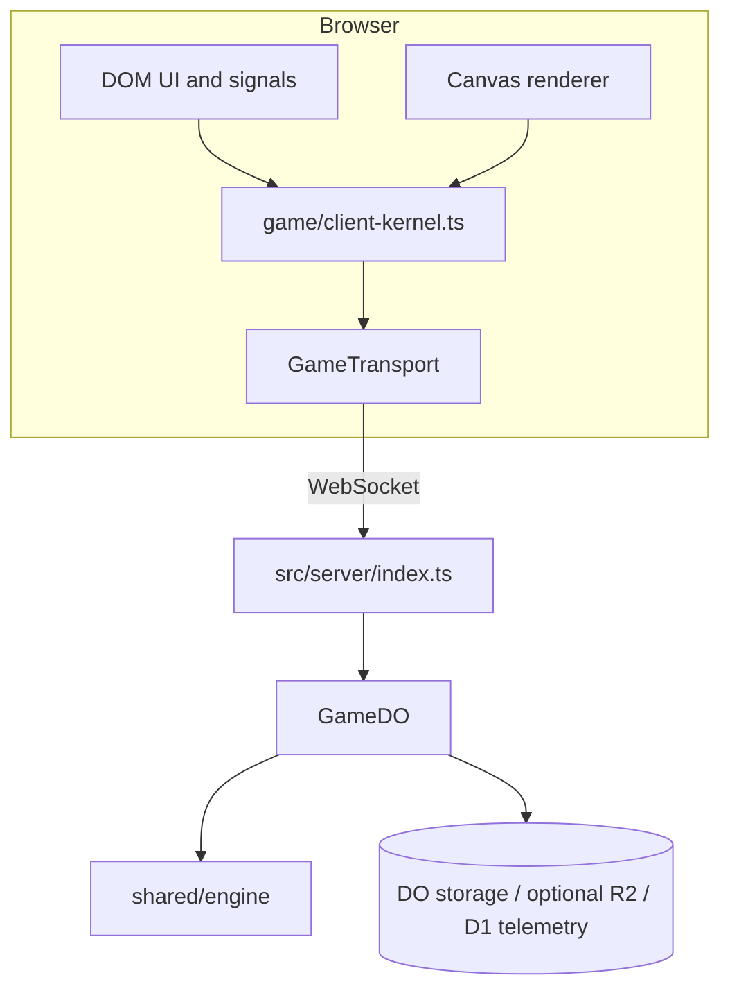
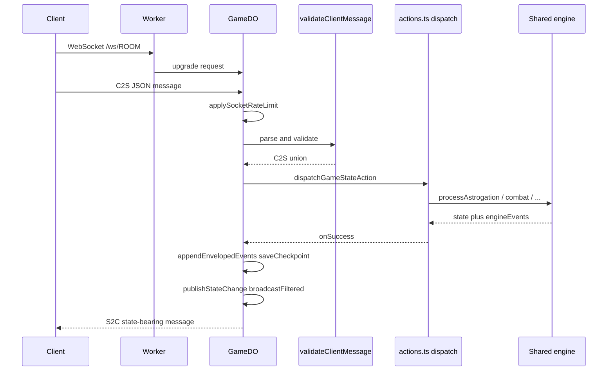
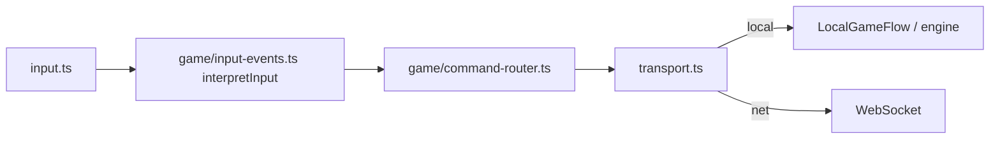
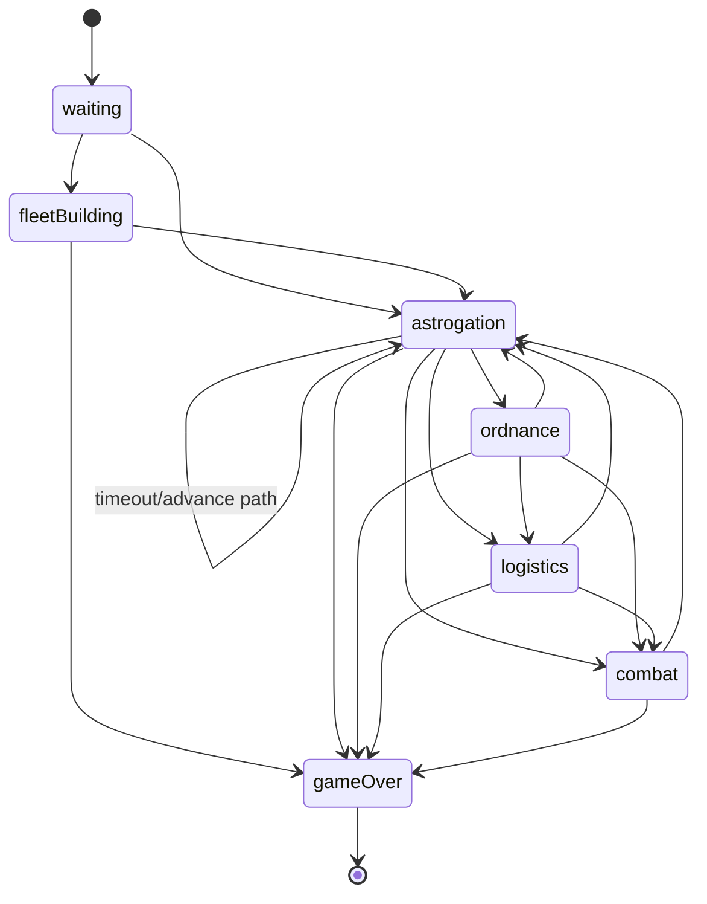

# Delta-V Architecture & Design Document

Delta-V is an online multiplayer space combat and racing game. This document describes the current architecture, core systems, major design patterns, and the highest-value follow-ups.

The authoritative server model is event-sourced: the Durable Object persists a match-scoped event stream plus checkpoints, and recovers authoritative state from checkpoint + event tail (not from a separate persisted `gameState` snapshot slot).

## Quick Navigation

- [1. High-Level Architecture](#1-high-level-architecture)
- [2. Core Systems Design](#2-core-systems-design)
- [3. Data Flow](#3-data-flow)
- [4. Dependency Map](#4-dependency-map)
- [5. Reusability Analysis: Generic Hex Game Engine](#5-reusability-analysis-generic-hex-game-engine)
- [6. Current Decisions and Planned Shifts](#6-current-decisions-and-planned-shifts)
- [7. Client bundle and release hygiene](#7-client-bundle-and-release-hygiene)

**Deployment assumption:** Client and Worker ship as a **single version line** (one deploy updates Worker + static assets). Staggered “old client / new server” is **not** a supported requirement today. Breaking protocol changes need a **coordinated deploy** and, if needed, force reload / cache-bust the SPA; prefer **additive** JSON fields. There is no feature-flag protocol negotiation in the client today. When bumping **`GameState.schemaVersion`**, follow [BACKLOG.md](./BACKLOG.md) priority **11** (projector, replay, recovery tests).

Platform references:

- [Cloudflare Workers](https://developers.cloudflare.com/workers/)
- [Cloudflare Durable Objects](https://developers.cloudflare.com/durable-objects/)
- [Cloudflare Durable Objects WebSocket Hibernation API](https://developers.cloudflare.com/durable-objects/api/websockets/)
- [MDN Canvas API](https://developer.mozilla.org/en-US/docs/Web/API/Canvas_API)
- [MDN Service Worker API](https://developer.mozilla.org/en-US/docs/Web/API/Service_Worker_API)

Pattern references:

- [MDN `structuredClone`](https://developer.mozilla.org/en-US/docs/Web/API/Window/structuredClone)
- [Gary Bernhardt, "Boundaries"](https://www.destroyallsoftware.com/talks/boundaries)
- [Martin Fowler, Event Sourcing](https://martinfowler.com/eaaDev/EventSourcing.html)
- [Martin Fowler, CQRS](https://martinfowler.com/bliki/CQRS.html)
- [Martin Fowler, Dependency Injection](https://martinfowler.com/articles/injection.html)
- [Mark Seemann, Composition Root](https://blog.ploeh.dk/2011/07/28/CompositionRoot/)
- [Solid Docs, Fine-grained reactivity](https://docs.solidjs.com/advanced-concepts/fine-grained-reactivity)
- [Preact Signals guide](https://preactjs.com/guide/v10/signals/)

## 1. High-Level Architecture

Delta-V uses a full-stack TypeScript architecture built around a **shared side-effect-free engine with authoritative edge sessions**. The authoritative room persists an append-only match stream and derives current state from that stream plus optional checkpoints.

```
shared/          → Game logic (no I/O, fully testable, side-effect-free)
server/          → Thin Durable Object multiplayer shell
client/          → State machine + Canvas renderer + DOM UI
```

### Diagrams (Mermaid)

These render on GitHub and in many Markdown preview tools. They summarize shapes that are spelled out in prose below.

**Runtime layers (who talks to whom):**



**Authoritative action path (multiplayer):**



**Client command path (local or remote):**



**Engine phase state machine (authoritative `GameState.phase`):**



**Event-sourced recovery and replay projection:**

```mermaid
flowchart TB
  A[Authoritative action] --> B[Engine returns next state + EngineEvent[]]
  B --> C[Append event envelopes]
  C --> D[Checkpoint at turn boundaries/end]

  subgraph Rebuild
    E[Load latest checkpoint]
    F[Load event tail after checkpoint]
    G[Project events to current state]
  end

  D --> E
  C --> F
  E --> G
  F --> G

  G --> H[Reconnect state]
  G --> I[Replay timeline]
```

Diagram maintenance rule: when command flow, phase transitions, or persistence/projection behavior changes, update these diagrams in the same PR.

### Key Technologies

- **Language**: TypeScript (strict mode) across the entire stack.
- **Frontend**: HTML5 Canvas 2D API for rendering (`client/renderer/renderer.ts`), raw DOM/Events for UI and Input. No heavy frameworks (React/Vue/etc.) are used, ensuring maximum performance for the game loop.
- **Backend**: Cloudflare Workers for HTTP routing and Cloudflare Durable Objects for authoritative game state and WebSocket management.
- **Build & Tools**: `esbuild` for lightning-fast client bundling, `wrangler` for local testing/deployment, and `Vitest` for unit testing.

### Key Architectural Strengths

- **Side-effect-free engine.** The shared engine has no I/O: no DOM, no network, no storage. The DO wraps it with persistence and WebSocket plumbing. This makes everything testable and portable. Turn-resolution engine entry points clone the input state on entry (`structuredClone`) — callers' state is never mutated. See [Engine Mutation Model](#engine-mutation-model) for details.
- **Transport abstraction.** `GameTransport` decouples the client from WebSocket vs local (AI) play. The client doesn't know or care where state comes from.
- **Functional style throughout.** Pure derivation functions (`deriveHudViewModel`, `deriveKeyboardAction`, `deriveBurnChangePlan`), mandatory injectable RNG, `cond()` for branching.
- **Narrow class usage.** Pure rules and coordinators stay function/factory-based. The only production `class` is `GameDO` (`extends DurableObject`). Client composition stays in `createGameClient()` (`game/client-kernel.ts`) with factory-style collaborators (`createInputHandler()`, `createUIManager()`, `createRenderer()`, `createCamera()`, `createBotClient()`).
- **Pure planner + narrow applier flows.** Client screen changes, phase entry, message handling, and game-state application route through pure planners plus a small number of side-effect owners instead of scattering equivalent writes across many call sites.
- **Scenario-driven.** `ScenarioRules` controls behavior: ordnance types, base sharing, combat enabled, logistics, checkpoints, escape edges, reinforcements, and fleet conversion. New scenarios can vary gameplay without engine changes.
- **Shared rule reuse across layers.** Client ordnance entry, HUD button visibility, and engine validation now all derive from the same shared ordnance-rule helpers, so restricted scenarios do not drift between UI and server authority.
- **Hidden state filtering.** `filterStateForPlayer` hides fugitive identities in escape scenarios — the server never leaks information the client shouldn't have.
- **Stable event-sourced boundaries.** Mandatory RNG injection, stable per-match IDs, side-effect-free engine entry points, and narrow server/client contracts make the authoritative event stream practical without throwing away the whole engine.

### Next Improvements

These are the main architectural follow-ups still open:

- **Single trusted-HTML boundary.** Some complex client markup is still imperative. If freeform/external content grows, route HTML injection through one reviewed boundary instead of ad hoc `innerHTML` writes.
- **Docs as source of truth.** Keep protocol, auth, and product-shape decisions aligned across this file, [SECURITY.md](./SECURITY.md), [CODING_STANDARDS.md](./CODING_STANDARDS.md), and [BACKLOG.md](./BACKLOG.md).
- **Profile before renderer optimization.** Use Chrome Performance (or equivalent) and per-frame timing before investing in layer caching or other micro-optimizations.
- **Keep composition roots thin.** `createGameClient()` should keep composing modules, not absorb feature logic. Apply the same rule to `createRenderer()` and `createInputHandler()` as those files grow.

---

## 2. Core Systems Design

The architecture is divided into three distinct layers: Shared Logic, Server, and Client.

### A. Shared Game Engine (`shared/`)

This is the heart of the project. All game rules live in a shared folder, making the system robust and completely unit-testable.

#### Module Inventory

| Module                                     | Purpose                                                                                                                 | Reusability                             |
| ------------------------------------------ | ----------------------------------------------------------------------------------------------------------------------- | --------------------------------------- |
| `hex.ts`                                   | Axial hex math: distance, neighbours, line draw, pixel conversion                                                       | **Fully generic** — zero game knowledge |
| `util.ts`                                  | Functional collection helpers (`sumBy`, `minBy`, `indexBy`, `cond`, etc.)                                               | **Fully generic** — no game knowledge   |
| `types/`                                   | Shared interfaces for domain, protocol, and scenario data                                                               | Game-specific                           |
| `shared/protocol.ts`                       | Shared runtime C2S validation and normalization (trimmed chat, bounded payloads); complements `types/protocol.ts`       | Mostly generic                          |
| `replay.ts`                                | Replay timeline structure and match identity builder                                                                    | Game-specific                           |
| `constants.ts`                             | Ship stats, ordnance mass, detection ranges, combat/movement constants                                                  | Game-specific                           |
| `movement.ts`                              | Vector movement with gravity, fuel, takeoff/landing, crash detection                                                    | Game-specific                           |
| `combat.ts`                                | Gun combat tables, LOS, range/velocity mods, heroism, counterattack                                                     | Game-specific                           |
| `map-data.ts`                              | Solar system bodies, gravity rings, bases, and scenario definitions                                                     | Game-specific                           |
| `ai.ts` / `ai-config.ts` / `ai-scoring.ts` | Rule-based AI and its scoring configuration                                                                             | Game-specific                           |
| `engine/game-engine.ts`                    | Barrel re-export for the public engine API                                                                              | Game-specific                           |
| `engine/engine-events.ts`                  | `EngineEvent` discriminated union (32 granular domain event types)                                                      | Game-specific                           |
| `engine/event-projector.ts`                | Deterministic projection from persisted `EventEnvelope` stream (+ checkpoints) to `GameState`; used by server and tests | Game-specific                           |
| `engine/*` phase modules                   | Game creation, fleet building, astrogation, movement, combat, ordnance, logistics, victory, and shared helpers          | Game-specific                           |

#### Key Design Patterns

- **`engine/game-engine.ts`**: A side-effect-free state machine. It takes the current `GameState` and player actions (e.g., astrogation orders, combat declarations) and returns a new `GameState` along with events (movements, combat results). **It has no I/O side effects (no DOM, no network, no storage)** and never mutates the caller's state — see [Engine Mutation Model](#engine-mutation-model).
- **`movement.ts`**: Contains the complex vector math, gravity well logic, and collision detection. Moving a ship is resolved strictly on an axial hex grid (using `hex.ts`).
- **`combat.ts`**: Evaluates line-of-sight, calculates combat odds based on velocity/range modifiers, and resolves damage. Mutates ships directly (e.g., `applyDamage`, updating `ship.lifecycle`, heroism flags).
- **`types/`**: The single source of truth for all data structures (`GameState`, `Ship`, `CombatResult`, network message payloads), split into `domain.ts`, `protocol.ts`, and `scenario.ts` with a barrel re-export. This ensures the client and server never fall out of sync.
- **Dependency injection**: Engine functions accept `map` and `rng` as parameters so they can be tested without global state or non-determinism — see [RNG Injection](#rng-injection).
- **Domain event emission**: Turn-resolution engine entry points emit `EngineEvent[]` (32 granular types: shipMoved, shipCrashed, combatAttack, ordnanceLaunched, phaseChanged, gameOver, committed command events, logistics events, and more) alongside state and animation data. The server reads `result.engineEvents` directly — no server-side event derivation. Movement animation data (`MovementEvent[]`, `ShipMovement[]`) remains separate for client rendering.

#### AI Strategy Design (`ai.ts`, `ai-config.ts`, `ai-scoring.ts`)

The AI uses a **config-weighted composable scoring** architecture rather than a monolithic decision tree:

- **`ai-config.ts`** defines `AIDifficultyConfig` — a flat record of about 50 numeric weights and boolean flags (currently 54 fields). Three presets (`easy`, `normal`, `hard`) tune aggression, accuracy, and capability without changing any logic. This is the [Strategy pattern](https://refactoring.guru/design-patterns/strategy) expressed as data rather than class hierarchies.
- **`ai-scoring.ts`** contains composable scoring functions, each handling one concern: `scoreNavigation` (distance/speed toward objective), `scoreEscape` (distance from center + velocity), `scoreRaceDanger` (gravity well proximity penalty), `scoreGravityLookAhead` (deferred-gravity next-turn value), and `scoreCombatPositioning` (engagement/interception posture). Each takes a course candidate and a config, returns a number.
- **`ai.ts`** orchestrates: for each AI ship, enumerate all 7 burn options (6 hex directions + null), compute each course via `computeCourse()`, sum scores across all strategies, pick the highest. Combat and ordnance decisions follow the same evaluate-all-options-then-pick pattern.

This separation means:

- New scoring dimensions are added by writing a new function and a new config weight — no existing functions change.
- Difficulty tuning is pure data: adjust weights in `AI_CONFIG` without touching scoring logic.
- All AI functions accept `rng` for deterministic testing of decision quality.

#### Engine Mutation Model

The shared engine is **side-effect-free** (no I/O) and **externally immutable**. All 11 engine entry points (`processAstrogation`, `processOrdnance`, `skipOrdnance`, `processFleetReady`, `beginCombatPhase`, `processCombat`, `skipCombat`, `processLogistics`, `skipLogistics`, `processSurrender`, `processEmplacement`) call `structuredClone(inputState)` on entry. Internally, the clone is mutated in place for efficiency, but the caller's state is never touched. Callers must use the returned `result.state`.

This design provides:

- **Rollback safety**: if the engine throws mid-mutation, the server's state is untouched.
- **Snapshot diffing**: before/after state snapshots are naturally available without manual cloning.
- **Speculative branching**: AI search and projection verification can call engine functions without defensive cloning.

Internal mutation patterns (e.g. `applyDamage()`, `ship.lifecycle = 'destroyed'`, phase transitions) remain unchanged — they operate on the cloned state.

`client/game/local.ts` also captures `structuredClone(state)` before combat calls for animation diffing (`previousState`). This is redundant with clone-on-entry but harmless — it may be removed in a future cleanup.

#### RNG Injection

Turn-resolution entry points (`processAstrogation`, `processCombat`, `skipCombat`, `beginCombatPhase`, `processOrdnance`, `skipOrdnance`, and other `process*` / `skip*` handlers) require `rng: () => number`. Internal functions (`rollD6`, `resolveCombat`, `resolveBaseDefense`, `shuffle`, `randomChoice`, `checkRamming`, `moveOrdnance`, `resolvePendingAsteroidHazards`) also require `rng`. There are no `Math.random` fallbacks in the turn-resolution path.

`createGame` and AI functions (`aiAstrogation`, `aiOrdnance`) accept optional `rng` with `Math.random` default, since they are setup/heuristic functions rather than turn-resolution functions.

The server generates a random 32-bit seed per match (via `crypto.getRandomValues` in `allocateMatchIdentity`) and persists it in DO storage. Before each engine call, `getActionRng()` derives a deterministic PRNG from the match seed and current event sequence (`deriveActionRng(matchSeed, eventSeq)` in `shared/prng.ts`). This gives reproducible per-action randomness without persisting a mutable RNG counter. The seed is also recorded in the `gameCreated` event so the event stream alone is sufficient for offline replay validation.

Client callers (local AI play) still pass `Math.random`. Tests can pass deterministic RNGs for reproducible results. Pre-seed matches fall back to `Math.random` for backward compatibility.

### B. The Server (`server/`)

The backend leverages Cloudflare's edge network.

#### Module Inventory

| Module                       | Purpose                                                                                                          | Reusability                                               |
| ---------------------------- | ---------------------------------------------------------------------------------------------------------------- | --------------------------------------------------------- |
| `index.ts`                   | Worker entry: `/create`, `/join/:code`, `/replay/:code`, `/ws/:code`, `/error`, `/telemetry`, static asset proxy | Generic pattern                                           |
| `protocol.ts`                | Room codes, tokens, init payload parsing, seat assignment, shared-validator re-export                            | **~85% generic** — room/token/seat logic is game-agnostic |
| `game-do/game-do.ts`         | Durable Object class: composes fetch, WebSocket, and alarm paths                                                 | **~70% generic** — multiplayer plumbing is reusable       |
| `game-do/fetch.ts`           | HTTP `/init`, `/join`, `/replay` and WebSocket upgrade + welcome/reconnect                                       | **~70% generic**                                          |
| `game-do/ws.ts`              | Hibernation `webSocketMessage` / `webSocketClose` bodies                                                         | **~70% generic**                                          |
| `game-do/alarm.ts`           | Alarm handler: disconnect forfeit, turn timeout, inactivity archive/close                                        | Mostly generic                                            |
| `game-do/turn-timeout.ts`    | Turn-timeout branch: engine outcome + `publishStateChange`                                                       | Game-specific                                             |
| `game-do/telemetry.ts`       | Engine/projection error reporting to D1                                                                          | Generic pattern                                           |
| `game-do/actions.ts`         | `runGameStateAction`, `dispatchGameStateAction`, per-action engine wiring                                        | Game-specific                                             |
| `game-do/broadcast.ts`       | `broadcastFiltered`, `publishStateChange`, socket send helpers                                                   | Game-specific                                             |
| `game-do/http-handlers.ts`   | `handleInitRequest`, `handleJoinCheckRequest`, `handleReplayRequest`, `resolveJoinAttempt`                       | **~70% generic**                                          |
| `game-do/socket.ts`          | WebSocket message rate limit, `parseClientSocketMessage`, aux messages (chat, ping, rematch)                     | **~70% generic**                                          |
| `game-do/projection.ts`      | Replay timeline shaping; uses `event-projector`; viewer-filtered replay entries                                  | Game-specific                                             |
| `game-do/match.ts`           | `initGameSession`, rematch handling                                                                              | Game-specific                                             |
| `game-do/archive.ts`         | Match-scoped event envelopes (gameId/seq/ts/actor), checkpoints, replay projection helpers, match identity       | Game-specific                                             |
| `game-do/archive-storage.ts` | Chunked event stream keys in DO storage                                                                          | Game-specific                                             |
| `game-do/match-archive.ts`   | Persistent archival of completed matches to R2 + D1 metadata                                                     | **Fully generic**                                         |
| `game-do/messages.ts`        | S2C message construction from engine results                                                                     | Game-specific                                             |
| `game-do/session.ts`         | Disconnect grace period, alarm scheduling                                                                        | **Fully generic**                                         |
| `game-do/turns.ts`           | Turn timeout auto-advance                                                                                        | Mostly generic                                            |

#### Key Design Patterns

- **[WebSocket Hibernation API](https://developers.cloudflare.com/durable-objects/api/websockets/)**: The DO uses Cloudflare's hibernatable WebSocket API (`acceptWebSocket`, `webSocketMessage`, `webSocketClose`) instead of the standard `addEventListener` pattern. This allows the DO to hibernate between messages, reducing costs. Sockets are tagged with `player:${playerId}` on accept, enabling player lookup via `getWebSockets(['player:0'])` without maintaining an in-memory map.

- **`runGameStateAction(ws, action, onSuccess)`** (`game-do/actions.ts`, wired from `GameDO`): Shared action wrapper that removes boilerplate across 12+ handlers. Flow: load current state, run engine action in try/catch, send validation errors to the socket, report runtime failures with game/phase/turn context, and invoke `onSuccess` (usually persist + broadcast). `handleTurnTimeout` applies equivalent protection for alarm-driven execution.

- **Shared protocol validation**: Runtime C2S validation now lives in `shared/protocol.ts` instead of the server shell. The Durable Object still consumes `validateClientMessage()`, but the message-shape ownership sits beside the shared protocol types rather than inside server-only plumbing.

- **Single state-bearing outbound message per action**: `publishStateChange()` appends domain events, then emits exactly one state-bearing message (`movementResult`, `combatResult`, or `stateUpdate`). If the resulting state is terminal, the DO appends a separate `gameOver` notification after that state-bearing message. This one-action / one-update client contract remains intact even though server recovery no longer depends on a separate persisted live snapshot.

- **Single choke points for coordination**: High-risk side effects are intentionally concentrated. On the server, `publishStateChange()` owns persist/archive/broadcast/timer restart for state transitions. On the client, `dispatchGameCommand()`, `applyClientGameState()`, and `applyClientStateTransition()` own command routing, authoritative-state application, and state-entry effects.

- **Event-sourced authoritative matches**: `initGame()` allocates a stable match identity (`gameId` like `ROOM1-m2`). `publishStateChange()` appends versioned envelopes to a chunked per-match stream, checkpoints are saved at turn boundaries/match end, and parity checks validate projected state against the live result before transport. Reconnect, alarm-path recovery, and replay are all derived from checkpoint + event tail, so there is no parallel state-bearing replay cache to keep in sync.

- **Viewer-aware filtered broadcasting**: `broadcastFiltered()` applies per-viewer filtering when scenarios contain hidden information (for example, fugitive identities in escape scenarios). Players keep full own-state visibility, unrevealed enemy ships are masked as `type: 'unknown'`, and spectators receive spectator-safe state. The same filter is used for reconnect, replay, spectator-tagged broadcasts, and **live spectator WebSockets** (`/ws/:code?viewer=spectator`, `spectatorWelcome`, filtered `gameStart` and updates).

- **Single-alarm scheduling**: One alarm per DO, rescheduled after each state change. Three independent deadlines are tracked: `disconnectAt` (30s grace), `turnTimeoutAt` (2 min), `inactivityAt` (5 min). `getNextAlarmAt()` computes the nearest deadline. When the alarm fires, `resolveAlarmAction()` returns a discriminated action (`disconnectExpired`, `turnTimeout`, `inactivityTimeout`) and the handler dispatches accordingly. `inactivityAt` is cached in memory and flushed to storage at most once per 60s to avoid write amplification from frequent pings. Chat rate limiting is also in-memory (not storage-backed).

- **WebSocket throttle**: A per-socket message counter (in-memory `WeakMap`) limits clients to 10 messages per second. Connections exceeding this are closed with code 1008. This prevents garbage-message floods from spiking DO CPU or I/O.

- **Room creation rate limit**: The Worker hashes the client IP and checks `POST /create` against the checked-in Cloudflare `[[ratelimits]]` binding in `wrangler.toml` (5 requests per IP per 60s window, 429 with `Retry-After`). Lower environments can still run against Wrangler's local simulation or intentionally omit the binding, in which case the Worker falls back to an in-memory per-isolate limiter.
- **Reporting endpoints (`/error`, `/telemetry`)**: JSON bodies only, max **4KB**, **204** responses; rows go to D1 asynchronously. Per-isolate per-IP windows (**120** telemetry / **40** error per 60s, hashed IP) — see [SECURITY.md](./SECURITY.md). Optional cross-edge WAF / `[[ratelimits]]`: [BACKLOG.md](./BACKLOG.md) priority **1**.

- **Match archive binding**: Production config also binds `MATCH_ARCHIVE` to R2 so completed rooms can persist replay/support data after the Durable Object goes inactive. That keeps replay/debug history available in production without forcing lower environments to use remote storage during local development.

- **Seat assignment**: `resolveSeatAssignment()` in `protocol.ts` implements a multi-step fallback: (1) player token match → returning player gets their original seat, even if the previous socket is still open; (2) tokenless join → allowed when an open seat has no player token (the default guest-join path); (3) no seats available → reject. Duplicate sockets are replaced only after reclaim is accepted, and match start uses unique connected seats rather than raw socket count.

- **Disconnect grace period**: When a player disconnects, the DO stores a disconnect marker (player ID + 30s deadline) and schedules an alarm. If the player reconnects within 30s with a valid player token, the marker is cleared and the game continues. If the alarm fires with an unexpired marker, the game ends by forfeit. The marker is validated on reconnect, and reclaim succeeds during the grace window even if the stale socket has not yet fully torn down.

### C. The Client (`client/`)

The frontend renders the pure hex-grid state into a smooth, continuous graphical experience.

#### Module Inventory

| Directory          | Purpose                                                                                                                                                          |
| ------------------ | ---------------------------------------------------------------------------------------------------------------------------------------------------------------- |
| `client/` (root)   | Entry point, raw input, audio, tutorial, DOM helpers, telemetry, viewport, reactive signals                                                                      |
| `client/game/`     | Game logic: command routing, planning store, game-state store, state transitions, session control, phases, transport, actions, HUD controller, camera controller |
| `client/renderer/` | Canvas rendering: camera, scene, entities, effects, overlays                                                                                                     |
| `client/ui/`       | DOM overlays: menu, HUD, ship list, fleet building, game log, formatters, button bindings, screens                                                               |

#### Three-Layer Input Architecture

1. **Raw Input** (`input.ts`): Mouse/touch/keyboard → `InputEvent` (clickHex, hoverHex). No game knowledge.
2. **Game Interpretation** (`game/input-events.ts`): `InputEvent` + phase + state → `GameCommand[]`. Pure function.
3. **Command Dispatch** (`game/command-router.ts`): `GameCommand` → local state update or network transmission.

#### Client State Machine (`ClientState`)

- `menu` → `connecting` → `waitingForOpponent` → `playing_*` → `gameOver`
- Playing substates: `fleetBuilding`, `astrogation`, `ordnance`, `logistics`, `combat`, `movementAnim`, `opponentTurn`
- Phase-locked: input only processed when phase matches active player.

#### Rendering Pipeline (per frame)

1. **Scene layer** (world coords): starfield, hex grid, gravity indicators, bodies, asteroids, bases
2. **Entity layer** (animated): ship trails, velocity vectors, ships, ordnance, combat effects
3. **Overlay layer** (screen coords): ordnance guidance, combat highlights, minimap

#### Key Design Patterns

- **`main.ts`**: Browser entry only — global setup (error handlers, viewport, service worker reload) and `createGameClient()` from `game/client-kernel.ts`, then assigns `window.game`.
- **`game/client-kernel.ts`**: Exports `createGameClient()`, the top-level client coordinator. It owns WebSocket/local-AI orchestration and delegates command dispatch, authoritative-state apply/clear, planning mutations, runtime/session fields, state-entry side effects, and session lifecycle to focused `game/*` modules. `GameClient` is `ReturnType<typeof createGameClient>`, and runtime bootstrap exposes only `renderer`, `showToast`, and `dispose` on `window.game`.
- **`renderer/renderer.ts`**: A highly optimized Canvas 2D renderer factory. It separates logical hex coordinates from pixel coordinates, while extracted helpers such as `renderer/animation.ts` now own movement-animation lifecycle and trail state. `createRenderer()` remains the canvas shell and per-frame orchestrator, and now composites a cached static scene layer for stars, grid, gravity, asteroids, and bodies when the camera and viewport are unchanged.
- **`input.ts`**: Manages user interaction (panning, zooming, clicking). It translates raw browser events into `InputEvent` objects, while `input-interaction.ts` owns pointer drag/pinch/minimap state and math. The input shell now owns its DOM listener lifecycle explicitly, including outside-canvas pointer release and touch-cancel cleanup. Pure `interpretInput()` then maps these to `GameCommand[]`, ensuring the input layer never directly mutates the application state.
- **`game/`**: Command routing, action handlers (astrogation/combat/ordnance), planning-state helpers, runtime/session helpers, phase derivation, game-state helpers, transition helpers, session helpers, transport abstraction, connection management, input interpretation, view-model helpers, and presentation logic. Ordnance-phase auto-selection and HUD legality are derived from shared engine rules instead of client-only cargo heuristics.
- **`renderer/`**: Canvas drawing layers (scene, entities, vectors, effects, overlays), camera, minimap, and animation management.
- **`ui/`**: Screen visibility, HUD view building, button bindings, game log, fleet building, ship list, formatters, layout metrics, and small reactive DOM view models.
- **`reactive.ts` + `ui/ui.ts`**: The overlay layer stays framework-free, but stateful DOM views use a small signals runtime for derived copy/visibility and explicit disposal. `createUIManager()` owns long-lived view instances and their teardown; helpers such as `createScreenActions()` and `createHudActions()` compose screen/HUD behaviors. Overlay, lobby, fleet-building, ship-list, HUD chrome, game log, tutorial, and turn telemetry follow the same factory style as other client modules.
- **`game/session-signals.ts` + `game/planning-hud-sync.ts`**: `createSessionReactiveMirror()` tracks `gameState`, `clientState`, and `planningRevision`. The kernel updates the mirror, and mirror effects drive `hud.updateHUD()` and `renderer.setGameState()` so command routing, replay, and phase entry no longer thread duplicate HUD/render callbacks through many call sites.
- **`audio.ts`**: Handles Web Audio API interactions.
- **Visual Polish**: Employs a premium design system with glassmorphism tokens (backdrop-filters), tactile micro-animations (recoil, scaling glows), and pulsing orbital effects for high-end UX.

### D. Progressive Web App (`static/sw.js`, `static/site.webmanifest`)

Delta-V is a fully installable PWA. A lightweight hand-written service worker provides:

- **Precaching** of the app shell (`/`, `client.js`, `style.css`, icons) for instant repeat loads.
- **Offline single-player**: The AI opponent works entirely client-side, so cached assets allow full gameplay without network.
- **Network/API passthrough**: The service worker never intercepts non-`GET` requests and explicitly bypasses multiplayer/reporting routes (`/ws/*`, `/create`, `/join/*`, `/error`, `/telemetry`), ensuring sockets, join validation, and reporting stay authoritative.
- **Stale-while-revalidate** for static assets and **network-first** for navigation, complementing Cloudflare's edge caching rather than fighting it.
- **Automatic cache busting**: The build script (`esbuild.client.mjs`) injects a content hash into the SW cache name, so every deploy with code changes triggers automatic SW update and page reload.

### E. Build Pipeline

The project uses minimal, fast build tooling with no
heavy bundler configuration:

- **Client bundle**: `esbuild.client.mjs` produces a
  single ESM bundle from `src/client/main.ts`. Production
  builds minify; dev builds include source maps. esbuild
  was chosen for sub-second build times.
- **Server bundle**: `wrangler` handles server
  compilation and deployment. `wrangler dev` provides
  local development with Durable Object simulation.
- **Cache busting**: The build script hashes the output
  bundle and CSS, then injects the hash into the service
  worker's cache name (`delta-v-${hash}`). Every deploy
  with code changes triggers automatic SW update.
- **Type checking**: `tsc --noEmit` runs separately from
  bundling — esbuild strips types without checking them.
- **Linting**: Biome runs as a pre-commit hook and in CI.
- **Cloudflare bindings** (`wrangler.toml`):

  | Binding               | Type           | Purpose                  |
  | --------------------- | -------------- | ------------------------ |
  | `GAME`                | Durable Object | Authoritative game rooms |
  | `DB`                  | D1             | Telemetry database       |
  | `MATCH_ARCHIVE`       | R2             | Completed match storage  |
  | `CREATE_RATE_LIMITER` | Rate Limit     | 5 creates/IP/60s         |

### F. Testing Infrastructure

Testing uses Vitest with co-located test files, property-based testing via fast-check, and enforced shared-engine coverage.

**Test organization:**

- Unit tests: `foo.test.ts` next to `foo.ts`
- Property tests: `foo.property.test.ts` next to `foo.ts`
- Contract fixtures: JSON files in `__fixtures__/`
  directories for protocol shape assertions
- No `__tests__/` folders

**Mock patterns for Durable Objects:**

- Focused `game-do-*.test.ts` modules (`alarm`, `fetch`, `turn-timeout`, `ws`)
  stub `DurableObjectStorage` and handler deps with `vi.fn` instead of full DO
  harnesses where a narrow branch is under test.
- `MockStorage`: In-memory `Map<string, unknown>` with
  `get`, `put`, `delete`, `list` matching the DO storage
  API. Supports atomic multi-key `put(Record<string, T>)`.
- `MockDurableObjectState`: Tracks sockets via `WeakMap`
  for tag-based lookup, matching the hibernatable
  WebSocket API surface (`acceptWebSocket`,
  `getWebSockets`, `getTags`).

**Deterministic RNG in tests:**
Engine tests pass a deterministic `rng` function
(e.g. `() => 0.5` or a seeded sequence) to reproduce
exact outcomes. This is why RNG injection is mandatory
for all turn-resolution entry points.

**Property-based test generators:**
Custom fast-check arbitraries generate valid game inputs
within bounded ranges (`arbCoord()` for hex coordinates,
`arbSmallVelocity()` for velocity vectors, etc.). Tests
verify invariants that must hold across all inputs:
fuel never goes negative, hex distance is symmetric,
movement preserves conservation laws.

**Coverage thresholds:**
`src/shared/` has enforced coverage thresholds (statements,
branches, functions, lines) via vitest config. The
pre-commit hook and CI both run `test:coverage` to
prevent backsliding.

### Library Stance

The architecture currently benefits from a narrow
dependency surface. That remains the default.

- **Do not add framework/state-machine/rendering stacks by
  default.** React, Vue, Redux, Zustand, RxJS, XState, and
  canvas/game frameworks would blur boundaries that are
  currently explicit and testable.
- **Prefer targeted libraries only when they remove a real
  maintenance or security burden.**
- **Potentially good additions later**:
  `DOMPurify` if any user-controlled or external HTML needs
  to be rendered; a schema library such as `Valibot` or
  `Zod` if protocol or event-envelope schemas expand enough
  that handwritten validators become harder to reason
  about.
- **Not worth swapping right now**:
  the custom `reactive.ts` layer. It is small, tested, and
  intentionally scoped. Replacing it with a library would
  only make sense if the project no longer wants to own
  reactive internals.

---

## 3. Data Flow

### A Movement Turn

1. During the Astrogation phase, players select their burn (acceleration) vectors via `client/input.ts`.
2. The client sends a `type: 'astrogation'` WebSocket message to the server.
3. The Durable Object (`game-do.ts`) gathers orders from both players.
4. When both players have submitted (or the turn timer expires), the server calls `processAstrogation()` in the shared engine.
5. The engine calculates the new physics vectors, resolves gravity effects, and detects crashes.
6. The Durable Object saves the new state and broadcasts a `movementResult` to both clients.
7. The clients receive the result, pause input, and `client/renderer/renderer.ts` smoothly interpolates the ships along their calculated paths. Once the animation finishes, the game proceeds to the Ordnance/Combat phase.

### WebSocket Protocol

**Client→Server (C2S)**: `fleetReady`, `astrogation`, `ordnance`, `emplaceBase`, `skipOrdnance`, `beginCombat`, `combat`, `skipCombat`, `logistics`, `skipLogistics`, `surrender`, `rematch`, `chat`, `ping`

**Server→Client (S2C)**: `welcome`, `matchFound`, `gameStart`, `movementResult`, `combatResult`, `stateUpdate`, `gameOver`, `rematchPending`, `chat`, `error`, `pong`

All messages are discriminated unions validated at the protocol boundary. Chat payloads are trimmed before validation and blank post-trim messages are rejected, so non-UI clients cannot inject empty log entries. Clients never mutate authoritative state. The server persists authoritative events plus optional checkpoints, and replay/reconnect are derived from that same persisted stream.

### Multiplayer Session Lifecycle

```
POST /create → Worker generates room code + creator token → DO /init
GET /join/{code}?playerToken=X → optional preflight join validation
GET /replay/{code}?playerToken=X&gameId=Y → authenticated replay / history fetch from checkpoint + event stream
WebSocket /ws/{code}[?playerToken=X] → DO accepts, tags socket with player ID
Both unique seats connected → createGame() → broadcast gameStart
Game loop: C2S action → engine → save state/events → restart timer → broadcast S2C result
Disconnect → 30s grace period → reconnect with token or forfeit
```

### Event-Sourced Match Lifecycle

At a high level (matching the server section above):

1. Client submits a validated command.
2. The Durable Object appends canonical, versioned
   domain events to a per-match stream.
3. Authoritative state is rebuilt or incrementally
   projected from checkpoint plus event tail.
4. Player and spectator/public views are derived from
   that projection.
5. The server broadcasts one state-bearing update plus
   any animation/log summaries needed by the client.

Under that model, `GameState` snapshots are transport
payloads and optional checkpoints rather than the
authoritative persisted truth.

---

## 4. Dependency Map

```
main.ts → game/client-kernel.ts (createGameClient — composition root)
  ├→ renderer/renderer.ts (draw canvas, reads planningState by reference)
  ├→ input.ts (parse mouse/keyboard → InputEvent)
  ├→ ui/ui.ts (manage screens, accept UIEvent)
  ├→ game/command-router.ts (GameCommand → state mutation or network)
  ├→ game/client-context-store.ts (apply shared runtime/session field updates)
  ├→ game/game-state-store.ts (apply/clear authoritative game state + renderer sync)
  ├→ game/planning-store.ts (apply shared planning-state mutations)
  ├→ game/session-controller.ts (create/join/local-start/exit session lifecycle)
  ├→ game/session-api.ts (HTTP create/join + token persistence)
  ├→ game/action-deps.ts (lazy-cached deps for action handlers + presentation)
  ├→ game/state-transition.ts (client-state entry effects and screen changes)
  ├→ game/network.ts, game/messages.ts (handle S2C)
  ├→ game/transport.ts (WebSocket, Local, and LocalGame transport factories)
  ├→ game/phase.ts (derive ClientState from GameState)
  ├→ game/keyboard.ts (KeyboardAction → GameCommand)
  ├→ game/helpers.ts (derive HUD view models)
  ├→ game/[combat|burn|ordnance]-actions.ts (phase-specific actions)
  ├→ game/planning.ts (user input accumulation)
  ├→ shared/types/{domain,protocol,scenario} (bounded shared type ownership)
  ├→ shared/engine/game-engine.ts (createGame, local resolution)
  ├→ shared/hex.ts (coordinate math)
  └→ shared/constants.ts (ship stats, animation timing)

renderer/renderer.ts
  ├→ renderer/camera.ts (viewport transform)
  ├→ renderer/[scene|entities|vectors|effects|overlay|...].ts (pure drawing)
  └→ shared/ (types, hex, constants)

game-do/game-do.ts (Durable Object)
  ├→ actions.ts (runGameStateAction, dispatch)
  ├→ archive.ts, archive-storage.ts (event stream, checkpoints)
  ├→ broadcast.ts (publishStateChange, filtered send)
  ├→ fetch.ts, http-handlers.ts, ws.ts, socket.ts (HTTP, WS upgrade, hibernation)
  ├→ projection.ts (replay timelines; uses shared/event-projector)
  ├→ match.ts, match-archive.ts (session init, rematch, R2 archive)
  ├→ messages.ts (S2C shapes)
  ├→ alarm.ts, session.ts, turns.ts, turn-timeout.ts
  ├→ telemetry.ts (D1 error reporting)
  ├→ server/protocol.ts (room codes, seat assignment)
  └→ shared/engine/game-engine.ts (pure game logic)
```

### Coupling Characteristics

| Boundary                 | Coupling      | Notes                                                                                                                    |
| ------------------------ | ------------- | ------------------------------------------------------------------------------------------------------------------------ |
| Input → GameCommand      | **Minimal**   | Pure function, no state mutation                                                                                         |
| Coordinator → Transport  | **Minimal**   | `GameTransport` hides WebSocket vs local; wired inside `createGameClient()`                                              |
| Renderer → GameState     | **High**      | Reads full state for entity positions, damage, etc.                                                                      |
| Renderer → PlanningState | **High**      | Reads by reference for UI overlays (previews, selections)                                                                |
| UI → GameState           | **High**      | HUD needs ship stats, phase, fuel, objective                                                                             |
| Client → Shared Engine   | **Medium**    | Local transport delegates to shared engine; types must align                                                             |
| ALL → shared/types/\*    | **Very High** | Shared types remain the integration point; all imports use bounded modules (`domain` / `protocol` / `scenario`) directly |

---

## 5. Reusability Analysis: Generic Hex Game Engine

An analysis of what could be extracted as a reusable hex-grid multiplayer game framework for building other games on top of.

### What Is Already Generic

| Component                   | Reusability | Notes                                                                          |
| --------------------------- | ----------- | ------------------------------------------------------------------------------ |
| `shared/hex.ts`             | **100%**    | Zero game knowledge. Axial coords, line draw, pixel conversion.                |
| `shared/util.ts`            | **100%**    | Pure FP collection helpers.                                                    |
| `renderer/camera.ts`        | **95%**     | Pan/zoom/lerp. Only tie: `HEX_SIZE` constant.                                  |
| `client/input.ts`           | **90%**     | Mouse/touch/pinch → clickHex/hoverHex. No game knowledge.                      |
| Server multiplayer plumbing | **80%**     | Room codes, tokens, seat assignment, disconnect grace, alarms.                 |
| `game/transport.ts`         | **70%**     | Command submission pattern. Interface is game-specific but pattern is generic. |
| Renderer orchestration      | **60%**     | Render loop, effect management, animation interpolation.                       |
| Everything else             | **0–20%**   | Deeply game-specific.                                                          |

### What a Generic Framework Would Look Like

```
hex-engine/
├── hex/           → Axial coord math, line draw, pixel conversion
├── camera/        → Pan/zoom/lerp, world↔screen transforms
├── input/         → Mouse/touch/pinch → { clickHex, hoverHex }
├── multiplayer/   → DO-based room management
│   ├── room.ts        → Room codes, tokens, seat assignment
│   ├── session.ts     → Disconnect grace, reconnection
│   ├── protocol.ts    → Message validation framework
│   └── game-do.ts     → Generic DO lifecycle (fetch/alarm/websocket)
├── renderer/      → Hex grid drawing, animation loop
└── types.ts       → HexCoord, HexVec, PixelCoord, generic Phase/Player
```

A game implementation would provide:

- Game-specific entity types extending a base `HexEntity { id, position, owner }`
- Phase handlers conforming to a `GameEngine<State, Action>` interface
- Entity renderers and layer renderers for game-specific visuals
- Scenario/map definitions

### Assessment

The extractable core is a modest fraction of the repo — enough to avoid rewriting for a second game, but small enough that copy-paste is also viable.

**Arguments for extraction:**

- `hex.ts` + `camera.ts` + `input.ts` are immediately reusable with zero changes
- The DO multiplayer plumbing (rooms, tokens, reconnection) would otherwise be rewritten verbatim
- Forces cleaner boundaries, which would improve Delta-V itself
- ROI is positive after game #2

**Arguments against:**

- Game-specific logic dominates the repo. The "generic" part is small.
- Abstraction has a cost: type parameters and trait interfaces make code harder to read. `processAstrogation` is crystal clear because it knows exactly what a Ship is.
- Designing a framework from N=1 games is the classic premature abstraction. The right abstractions only emerge after building game #2.
- The game-specific parts (gravity, vector movement, combat tables) are the interesting and hard parts. The generic hex plumbing is straightforward.

**Recommendation:** Don't extract a framework yet. When starting game #2, fork Delta-V and gut the game-specific parts. The pure engine, transport abstraction, and clean shared/server/client split make forking straightforward. Build the framework _from two concrete implementations_, not from one.

---

## 6. Current Decisions and Planned Shifts

See [BACKLOG.md](./BACKLOG.md) for open work. This section captures current architectural stances and why they exist.

- **User accounts / auth**: Adds login friction that hurts adoption during user testing. The current anonymous token model is sufficient. Revisit for native app store distribution or payment integration.
- **N-player generalisation**: Delta-V is a 2-player game. `[PlayerState, PlayerState]` is clearer and more type-safe than `PlayerState[]`. Generalise when a second game actually needs it.
- **Generic hex engine extraction**: Designing a framework from N=1 games is premature abstraction. Fork Delta-V when game #2 starts and build the framework from two concrete implementations.
- **Serialisation codec**: `GameState` is plain JSON. A codec adds overhead with zero current benefit.
- **Replay architecture / event sourcing**: Implemented on the authoritative path. Match-scoped event streams with versioned envelopes (`EventEnvelope`: gameId, seq, ts, actor, event), checkpoints, and parity checks are in place. Replay is projected directly from stored events, including spectator-filtered projections and authenticated replay endpoints. **Live** spectating uses the same filtered `GameState` over WebSocket (`?viewer=spectator`, `spectatorWelcome`). Remaining work is mostly spectator UX polish (lobby links, read-only affordances) and optional rate limits/protocol simplification.
- **UI framework adoption**: The DOM UI layer is still small enough to own directly. The current compromise is a tiny local signals layer for view-local state and cleanup, without paying the cost of adopting a full framework (Preact, etc.) across the entire client.
- **Structural sharing / Immer**: Reconsidered with the event-sourcing shift. Immer is not a prerequisite and should not block current work. Near-term value is in event schema stability, append ordering, explicit RNG facts, and projector correctness, not a wholesale Proxy-based rewrite. Revisit only if projector reducers or future command handlers become materially clearer with Immer; if adopted, start at the projection layer.
- **Internationalization:** **English-only** product surface for now (inline strings in `src/client/ui`, `src/client/game`, toasts, server errors). No message catalogs, locales, or RTL until localization is prioritized. [SPEC.md](./SPEC.md) remains the canonical English rules reference for scenarios.

---

## 7. Client bundle and release hygiene

**Bundle baseline** (re-measured **2026-03-28** via `npm run build`; update after large renderer or dependency changes):

| Artifact         | Raw (approx.) | Gzip (approx.) |
| ---------------- | ------------- | -------------- |
| `dist/client.js` | ~596 KB       | ~123 KB        |

**Supply chain:** run `npm audit` before releases; use `npm run update-deps` judiciously and run `verify` after bumps.

**D1 migrations:** treat as **forward-only** unless Cloudflare backup/restore is used; rollback is **redeploy previous Worker + compatible schema**, not automatic down-migration.

**CI:** Node version is set in `.github/workflows/ci.yml` (Node **25** at last doc update).
