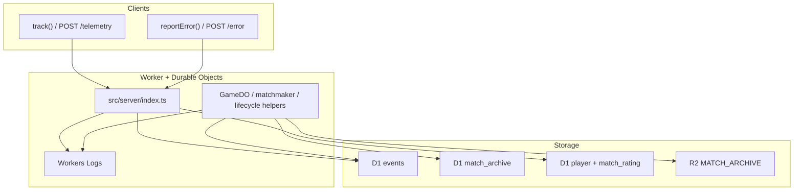
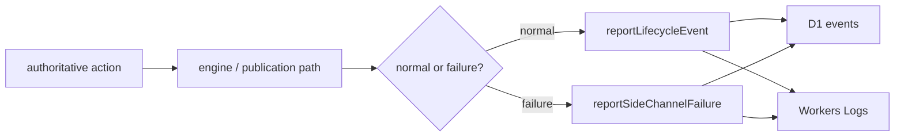
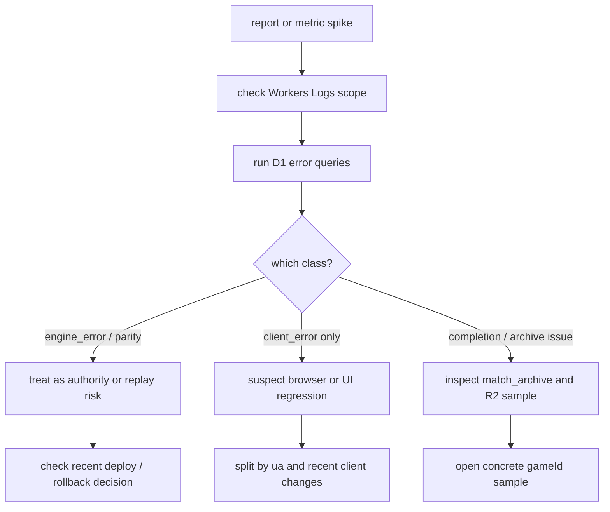

# Observability

What Delta-V emits today and how to use it for incidents and tuning. Complements [SECURITY.md](./SECURITY.md) (telemetry abuse) and [ARCHITECTURE.md](./ARCHITECTURE.md) (server layout).

- [Sources](#sources)
- [D1 `events` schema and event catalog](#d1-events-schema-summary)
- [Server-side lifecycle and side-channel events](#server-side-lifecycle-and-side-channel-events)
- [Incident triage quickstart](#incident-triage-quickstart)
- [Starter alert thresholds](#starter-alert-thresholds-tune-to-baseline)
- [Operational D1 queries](#operational-d1-queries)
- [Workers log filters](#workers-log-filters)
- [PII / privacy stance](#pii-privacy-stance-technical)
- [Gaps and follow-ups](#gaps-and-follow-ups)

## Sources



| Source                          | What                                                                             | Where to read it                                                       |
| ------------------------------- | -------------------------------------------------------------------------------- | ---------------------------------------------------------------------- |
| **Worker + DO logs**            | `console.log` / `console.error` from `src/server/index.ts`, `GameDO`, handlers   | Cloudflare Workers **Logs** (observability enabled in `wrangler.toml`) |
| **D1 `events`**                 | Client telemetry, client errors, DO `engine_error`, `projection_parity_mismatch`, `game_abandoned`, lifecycle/side-channel rows (30-day rolling window) | D1 **SQL** in dashboard or `wrangler d1 execute`                       |
| **D1 `match_archive`**          | One row per completed match (metadata index)                                     | Same                                                                   |
| **D1 `player` / `match_rating`**| Leaderboard identity + per-rated-match Glicko-2 snapshots                        | Same                                                                   |
| **R2 `MATCH_ARCHIVE`**          | Full JSON per match (`matches/{gameId}.json`)                                    | R2 bucket browser / API                                                |
| **Client**                      | `track()` → `POST /telemetry`, `reportError()` → `POST /error`                   | Implemented in `src/client/telemetry.ts`                               |
| **Internal `GET /api/metrics`** | Auth-gated aggregate snapshot over D1 `events` + `match_archive`                 | Worker route (`Authorization: Bearer <INTERNAL_METRICS_TOKEN>`)        |

## D1 `events` schema (summary)

From `migrations/0001_create_events.sql`:

- `ts`, `anon_id`, `event`, `props` (JSON string), `ip_hash` (hashed `cf-connecting-ip` for client posts; literal `'server'` for DO inserts), `ua`, `created`.

**Current `event` values**

- From client **`/telemetry`**:
  - `create_game_attempted` with `{ scenario }`
  - `create_game_failed` with `{ scenario, reason, status? }`
  - `game_created` with `{ scenario, mode, difficulty? }`
  - `join_game_attempted` with `{ hasPlayerToken }`
  - `join_game_succeeded` with no additional props
  - `join_game_retried_without_token` with `{ reason }`
  - `join_game_failed` with `{ reason, status?, hasPlayerToken }`
  - `quick_match_attempted`, `quick_match_queued`, `quick_match_found`, `quick_match_failed`, `quick_match_expired`, `quick_match_cancelled` (props vary by path — see `session-api.ts`)
  - `spectate_join_succeeded` with no additional props
  - `reconnect_attempt_scheduled` with `{ attempt, delayMs }`
  - `reconnect_succeeded` with `{ attempts }`
  - `reconnect_failed` with `{ attempts }`
  - `replay_fetch_failed` with `{ reason, gameId, status? }`
  - `replay_fetch_succeeded` with `{ gameId }`
  - `archived_replay_fetch_failed` / `archived_replay_fetch_succeeded` with `{ gameId, ... }`
  - `leaderboard_viewed` with `{ includeProvisional, entries }`
  - `matches_list_viewed` with `{ entries, hasMore }`
  - `match_replay_opened` with `{ gameId, roomCode, matchNumber, scenario, source }`
  - `replay_reached_end` with `{ gameId, roomCode, matchNumber, scenario, atIndex, atTurn, progress, source }`
  - `replay_exited_early` with `{ gameId, roomCode, matchNumber, scenario, atIndex, atTurn, progress, source }`
  - `replay_speed_changed` with `{ speed }`
  - `game_over` with `{ won, reason, scenario, mode, turn? }`
  - `server_error_received` with `{ message, code? }`
  - `action_rejected_received` with `{ reason, expectedTurn?, expectedPhase?, actualTurn, actualPhase, activePlayer }` (browser path when ActionGuards reject)
  - `ws_parse_error` with no additional props
  - `ws_invalid_message` with `{ error }`
  - `ws_connect_error` with no additional props (fires on `WebSocket` `error` before close)
  - `ws_connect_closed` with `{ code, wasClean, reasonLen }` (first connect / reconnect close telemetry)
  - `ws_session_quality` with `{ durationMs, samples, latencyAvgMs, latencyMinMs, latencyMaxMs, closeCode }` (one event per WS lifecycle that received at least one pong; aggregates the 5-second RTT samples so we can spot players on consistently slow / jittery connections without piling per-pong rows into D1)
  - `turn_completed` with `{ turn, totalMs, phases, scenario, mode }`
  - `first_turn_completed` with `{ turn, totalMs, phases, scenario, mode }`
  - `scenario_browsed` with no additional props
  - `scenario_selected` with `{ scenario, from: 'ai' | 'private', difficulty? }` (fires when the player commits to a scenario from the menu, before the round-trip — captures intent even when the user bails out of the waiting room)
  - `tutorial_started` with `{ step }` (id of the first step shown — typically `welcome`)
  - `tutorial_step_shown` with `{ step }` (per-step display; lets the funnel be measured even when the player doesn't click "Got it" — added 2026-04-27 after a D1 audit found 116 starts vs 0 completes with no per-step signal)
  - `tutorial_completed` with `{ totalTimeMs }` (fires only when "Got it" clicked on all 6 steps; rare in practice — use `tutorial_step_shown` for funnel)
  - `tutorial_skipped` with `{ step }` (id of the step active when skipped)
  - `tutorial_open_help` with `{ step, section }` (the player tapped "Help" from a tip)
  - `fleet_ready_submitted`, `surrender_submitted` (see `main-interactions.ts`)
  - `ai_game_started` with `{ scenario, difficulty }` (local AI path)
- From client **`/error`**: `client_error` with `{ error, url, ua, ...context }`; current global handlers add either `{ source, line, col }` or `{ type: 'unhandledrejection' }`.
- From **`game-do/telemetry.ts`**: `engine_error` with `{ code, phase, turn, message, stack? }` where message/stack are capped before D1 persistence; `projection_parity_mismatch` with `{ gameId, liveTurn, livePhase, projectedTurn, projectedPhase }`; `game_abandoned` with `{ gameId, turn, phase, reason, scenario }` (server-side; `anon_id` null, `ip_hash` `'server'`).

### Server-side lifecycle and side-channel events

Emitted from `src/server/game-do/telemetry.ts` (`reportLifecycleEvent`, `reportSideChannelFailure`) and `src/server/matchmaker-do.ts`. All share `anon_id = null` and `ip_hash = 'server'`. Lifecycle events emit `console.log`; side-channel failures emit `console.error` so the two streams are easy to separate in Workers Logs.



**Lifecycle (normal signals):**

- `game_started` — `{ gameId, code, scenario }`
- `game_ended` — `{ gameId, code, turn, winner, reason }` (`winner` is `null` on draws)
- `disconnect_grace_started` — `{ code, player, disconnectAt }` (ms epoch the grace expires)
- `disconnect_grace_resolved` — `{ code, player }` (marker cleared because the player reconnected)
- `disconnect_grace_expired` — `{ code, player }` (grace ran out; engine will forfeit)
- `turn_timeout_fired` — `{ code, gameId, turn, phase, activePlayer }`
- `matchmaker_paired` — `{ code, scenario, leftKey, rightKey, waitMsLeft, waitMsRight, officialBotMatch }`
- `matchmaker_official_bot_filled` — `{ code, scenario, waitedMs, playerKey }` (explicit quick-match fallback acceptance)
- `matchmaker_official_bot_declined` — `{ scenario, ticket, waitedMs, playerKey }` (player explicitly chose “keep waiting” after the offer appeared)
- `rating_applied` / `rating_skipped` / `rating_failed` — per-match Glicko-2 outcomes (see `src/server/game-do/telemetry.ts` for props)

Official-bot segmentation is now carried through the authoritative server path:

- `game_started` / `game_ended` include `officialBotMatch`
- `rating_applied` summaries include `officialBotMatch`
- `match_archive` rows and `GET /api/matches` rows include `officialBotMatch`

That means queue relief, rating impact, and replay/history uptake can all be segmented without inferring from player keys.

**Side-channel failures (investigate on spike):**

- `live_registry_register_failed` — `{ code, scenario, status?, error? }` (match may be missing from `/matches`)
- `live_registry_deregister_failed` — `{ code, status?, error? }` (stale "Live now" entry)
- `mcp_observation_timeout` — `{ handler, timeoutMs }` (10 s hard ceiling; future async paths could hang requests otherwise)
- `matchmaker_pairing_split` — `{ code?, reason, conflicts?, status?, attempts? }` (`reason` ∈ `room_code_collision` / `allocation_failed` / `max_retries_exceeded`)
- `game_do_code_update_evicted` — `{ entrypoint, code, gameId, turn, phase, playerId, actionType, message }` (old Durable Object instance handled a post-deploy callback and hit the Cloudflare storage-eviction TypeError; the triggering interaction is lost, but the room can recover on the next callback against the fresh instance)

Static **`GET /version.json`** (built into `dist/` at bundle time) exposes `{ packageVersion, assetsHash }` for support — it is not written to D1.

Health probes live on **`GET /healthz`** with supported aliases **`/health`** and **`/status`**. The payload is `{ ok, sha, bootedAt }`, where `sha` resolves from Worker deploy metadata (`CF_VERSION_METADATA.id`, then `CF_PAGES_COMMIT_SHA`, then `GIT_COMMIT_SHA`, then bundled `/version.json` `assetsHash`) and `bootedAt` is stamped once at Worker module load.

Worker entrypoint observability also records two abuse-focused signals:

- `server_create_request` in the D1 `events` table for every `POST /create`, with `{ route, outcome, scenario, payloadBytes, status, error? }`. This covers direct script traffic that never emits first-party client telemetry.
- sampled `console.log` lines under `[auth-failure]` and `[rate-limit]` for invalid MCP / quick-match Bearers, malformed `POST /api/agent-token` payloads, and create-class / MCP rate-limit hits. Sampling is deterministic per hashed IP so repeated abuse from the same source still leaves a tail signal without flooding logs.

### Internal metrics endpoint

`GET /api/metrics` now exposes a small auth-gated aggregate snapshot for operators. It is intentionally narrow: enough to answer "is the game healthy this week?" without turning the Worker into a dashboard service.

- auth: `Authorization: Bearer <INTERNAL_METRICS_TOKEN>`
- local dev / test: loopback requests may omit the token when `INTERNAL_METRICS_TOKEN` is unset
- query: optional `?days=<1-30>` window, default `7`

Current response sections:

- `dailyActiveMatches`
- `scenarioPlayMix`
- `aiDifficultyDistribution`
- `firstTurnCompletion`
- `wsHealth`
- `reconnects`
- `averageTurnDurationByScenario`
- `officialBot`

This route is the application-supported alternative to pasting ad-hoc SQL for the most common health questions. Raw SQL is still the better tool for one-off investigations.

## Orphan rooms and inactivity cleanup

`POST /create` allocates a `GameDO` immediately, even before a second player joins. If nobody ever connects, that room is considered an orphaned private room. There is currently no public or operator HTTP endpoint that lists orphan room counts.

The cleanup policy is:

- every room touch refreshes `inactivityAt` to `Date.now() + 5 minutes` (`INACTIVITY_TIMEOUT_MS` in [src/shared/constants.ts](../src/shared/constants.ts))
- when the alarm reaches that deadline, `GameDO` closes any sockets, marks the room archived, clears disconnect/turn/rematch/MCP session markers, and purges match-scoped event/checkpoint residue from DO storage
- if a game state exists at cleanup time, the alarm path also schedules the archival mirror to R2 + D1 before the local DO storage is scrubbed
- orphan rooms never appear in `GET /api/matches?status=live`; that surface only reports seated live matches from `LIVE_REGISTRY`

Operationally, the two signals to watch are:

- `server_create_request` rows with `outcome: "created"` but no corresponding `game_started` / `game_ended` lifecycle for the same room within a few minutes
- Workers Logs entries mentioning `Inactivity timeout` or `game_abandoned` when diagnosing cost from abandoned rooms

## Incident triage quickstart

Use this when someone reports "game is broken" or metrics look wrong.



1. Confirm scope quickly in Workers Logs:
   - Is it one room code or many?
   - Is it one browser/device cohort or broad?
2. Check for an error spike, then split by hour:

```sql
-- Error spike (last 24h)
SELECT event, COUNT(*) AS n
FROM events
WHERE ts > (strftime('%s','now') - 86400) * 1000
  AND event IN ('client_error', 'engine_error', 'projection_parity_mismatch')
GROUP BY event
ORDER BY n DESC;

-- Same, split by hour (last 6h)
SELECT
  event,
  strftime('%Y-%m-%d %H:00', ts / 1000, 'unixepoch') AS hour,
  COUNT(*) AS n
FROM events
WHERE ts > (strftime('%s','now') - 6 * 3600) * 1000
  AND event IN ('client_error', 'engine_error', 'projection_parity_mismatch')
GROUP BY event, hour
ORDER BY hour DESC, n DESC;
```

3. If `projection_parity_mismatch` or `engine_error` rises:
   - Treat as server-authority/replay integrity risk first.
   - Check recent deploy/commit range and disable risky rollout if needed.
4. If `client_error` rises without server errors:
   - Suspect client/runtime or browser-specific regressions.
   - Correlate by `ua` and recent UI changes.
5. If match completion looks wrong, inspect:
   - D1 `match_archive` rows for missing/abnormal completions.
   - R2 `matches/{gameId}.json` for a concrete broken sample.

## Starter alert thresholds (tune to baseline)

These are practical defaults until formal dashboards/alerts are added.

- `engine_error` > 0 in a 15-minute window: page maintainer.
- `projection_parity_mismatch` > 0 in a 15-minute window: page maintainer (high severity).
- `client_error`: warn when current 15-minute count is >3x the same weekday/hour baseline.
- `POST /telemetry` or `POST /error` 429 rate spikes: investigate abuse/noisy clients and consider tighter global WAF caps.
- `mcp_observation_timeout` > 0 in any rolling 15-minute window: investigate — expected rate is 0.
- `live_registry_register_failed` or `live_registry_deregister_failed` > 2 in 15 minutes: LiveRegistryDO may be down; `/matches` will lag reality.
- `matchmaker_pairing_split` / `matchmaker_paired` > 5% sustained over 1 hour: queue is hot enough to warrant coalesced allocation.
- `disconnect_grace_expired` / (`disconnect_grace_resolved` + `disconnect_grace_expired`) > 50% over 1 hour: reconnect flow is failing for most players.

## Operational D1 queries

Paste these into the Cloudflare D1 console or run via `wrangler d1 execute`.

```sql
-- Telemetry volume by event name (last 24h)
SELECT event, COUNT(*) AS n
FROM events
WHERE ts > (strftime('%s','now') - 86400) * 1000
GROUP BY event
ORDER BY n DESC
LIMIT 30;

-- Match completions by scenario (last 7 days)
SELECT scenario, COUNT(*) AS matches,
       AVG(turns) AS avg_turns,
       AVG(completed_at - created_at) / 1000.0 AS avg_duration_s
FROM match_archive
WHERE completed_at > (strftime('%s','now') - 7 * 86400) * 1000
GROUP BY scenario
ORDER BY matches DESC;

-- Official Bot uptake and outcome summary (last 7 days)
SELECT
  official_bot_match,
  COUNT(*) AS matches,
  AVG(turns) AS avg_turns
FROM match_archive
WHERE completed_at > (strftime('%s','now') - 7 * 86400) * 1000
GROUP BY official_bot_match
ORDER BY official_bot_match DESC;

-- Duel seat-balance segmentation (last 30 days). Use this before changing
-- Duel AI or rules: local hard-vs-hard sweeps can be balanced while live play
-- is skewed by official bots, rematches, or a particular seat assignment.
WITH duel AS (
  SELECT
    ma.game_id,
    ma.winner,
    ma.official_bot_match,
    mr.player_a_key,
    mr.player_b_key,
    mr.winner_key,
    CASE
      WHEN mr.winner_key = mr.player_a_key THEN 'A'
      WHEN mr.winner_key = mr.player_b_key THEN 'B'
      ELSE 'draw'
    END AS rating_winner_seat,
    CASE
      WHEN mr.player_a_key LIKE 'agent_official_%'
        OR mr.player_b_key LIKE 'agent_official_%'
        THEN 1
      ELSE 0
    END AS official_key_seen
  FROM match_archive ma
  LEFT JOIN match_rating mr ON mr.game_id = ma.game_id
  WHERE ma.scenario = 'duel'
    AND ma.completed_at > (strftime('%s','now') - 30 * 86400) * 1000
)
SELECT
  official_bot_match,
  official_key_seen,
  rating_winner_seat,
  COUNT(*) AS matches,
  ROUND(AVG(CASE WHEN winner = 0 THEN 1.0 ELSE 0.0 END), 3) AS p0_win_rate
FROM duel
GROUP BY official_bot_match, official_key_seen, rating_winner_seat
ORDER BY matches DESC;

-- Matchmaker fallback accept volume (last 7 days)
SELECT
  strftime('%Y-%m-%d', ts / 1000, 'unixepoch') AS day,
  COUNT(*) AS fills
FROM events
WHERE event = 'matchmaker_official_bot_filled'
  AND ts > (strftime('%s','now') - 7 * 86400) * 1000
GROUP BY day
ORDER BY day DESC;

-- Matchmaker fallback declines (last 7 days)
SELECT
  strftime('%Y-%m-%d', ts / 1000, 'unixepoch') AS day,
  COUNT(*) AS declines
FROM events
WHERE event = 'matchmaker_official_bot_declined'
  AND ts > (strftime('%s','now') - 7 * 86400) * 1000
GROUP BY day
ORDER BY day DESC;

-- Active unique clients (last 24h, by anon_id)
SELECT COUNT(DISTINCT anon_id) AS unique_clients
FROM events
WHERE ts > (strftime('%s','now') - 86400) * 1000
  AND anon_id IS NOT NULL;

-- Scenario popularity (games created, last 7 days)
SELECT json_extract(props, '$.scenario') AS scenario, COUNT(*) AS n
FROM events
WHERE event = 'game_created'
  AND ts > (strftime('%s','now') - 7 * 86400) * 1000
GROUP BY scenario
ORDER BY n DESC;

-- Discovery-surface views (last 7 days)
SELECT event, COUNT(*) AS n
FROM events
WHERE event IN ('leaderboard_viewed', 'matches_list_viewed')
  AND ts > (strftime('%s','now') - 7 * 86400) * 1000
GROUP BY event
ORDER BY n DESC;

-- Replay funnel (last 7 days): opened vs completed vs early exits.
SELECT event, COUNT(*) AS n
FROM events
WHERE event IN (
  'match_replay_opened',
  'replay_reached_end',
  'replay_exited_early'
)
  AND ts > (strftime('%s','now') - 7 * 86400) * 1000
GROUP BY event
ORDER BY n DESC;

-- Replay abandonment by turn/progress (last 7 days)
SELECT
  json_extract(props, '$.scenario') AS scenario,
  ROUND(AVG(CAST(json_extract(props, '$.progress') AS REAL)), 3) AS avg_progress,
  ROUND(AVG(CAST(json_extract(props, '$.atTurn') AS REAL)), 1) AS avg_turn,
  COUNT(*) AS exits
FROM events
WHERE event = 'replay_exited_early'
  AND ts > (strftime('%s','now') - 7 * 86400) * 1000
GROUP BY scenario
ORDER BY exits DESC;

-- Replay speed usage (last 7 days)
SELECT json_extract(props, '$.speed') AS speed, COUNT(*) AS n
FROM events
WHERE event = 'replay_speed_changed'
  AND ts > (strftime('%s','now') - 7 * 86400) * 1000
GROUP BY speed
ORDER BY CAST(speed AS REAL);

-- Disconnects and reconnects (last 24h)
SELECT event, COUNT(*) AS n
FROM events
WHERE ts > (strftime('%s','now') - 86400) * 1000
  AND event IN ('reconnect_attempt_scheduled', 'reconnect_failed', 'ws_parse_error', 'ws_invalid_message')
GROUP BY event
ORDER BY n DESC;

-- Top client errors by message (last 24h)
SELECT json_extract(props, '$.message') AS error_msg, COUNT(*) AS n
FROM events
WHERE event = 'client_error'
  AND ts > (strftime('%s','now') - 86400) * 1000
GROUP BY error_msg
ORDER BY n DESC
LIMIT 10;

-- Lifecycle cadence (last 24h)
SELECT event, COUNT(*) AS n
FROM events
WHERE ts > (strftime('%s','now') - 86400) * 1000
  AND event IN (
    'game_started', 'game_ended',
    'disconnect_grace_started', 'disconnect_grace_resolved', 'disconnect_grace_expired',
    'turn_timeout_fired', 'matchmaker_paired'
  )
GROUP BY event
ORDER BY n DESC;

-- Disconnect-grace outcomes — resolved (player reconnected) vs expired (forfeit).
-- A high expired/(resolved+expired) ratio means reconnects are failing.
SELECT
  SUM(CASE WHEN event = 'disconnect_grace_resolved' THEN 1 ELSE 0 END) AS resolved,
  SUM(CASE WHEN event = 'disconnect_grace_expired'  THEN 1 ELSE 0 END) AS expired
FROM events
WHERE ts > (strftime('%s','now') - 7 * 86400) * 1000
  AND event IN ('disconnect_grace_resolved', 'disconnect_grace_expired');

-- Matchmaker split rate (last 7 days). If splits / paired > ~1% in a quiet
-- period, consider coalesced enqueue or longer retry budget in MatchmakerDO.
SELECT
  SUM(CASE WHEN event = 'matchmaker_paired'         THEN 1 ELSE 0 END) AS paired,
  SUM(CASE WHEN event = 'matchmaker_pairing_split'  THEN 1 ELSE 0 END) AS splits
FROM events
WHERE ts > (strftime('%s','now') - 7 * 86400) * 1000
  AND event IN ('matchmaker_paired', 'matchmaker_pairing_split');

-- Matchmaker split reasons (breaks down the 'splits' counter above).
SELECT json_extract(props, '$.reason') AS reason, COUNT(*) AS n
FROM events
WHERE event = 'matchmaker_pairing_split'
  AND ts > (strftime('%s','now') - 7 * 86400) * 1000
GROUP BY reason
ORDER BY n DESC;

-- MCP observation timeouts (last 24h). Expected value is 0; any spike
-- suggests a hung dependency under buildObservation or DO contention.
SELECT COUNT(*) AS n
FROM events
WHERE event = 'mcp_observation_timeout'
  AND ts > (strftime('%s','now') - 86400) * 1000;

-- LIVE_REGISTRY failures (last 24h). Non-zero means some matches never
-- appeared on /matches (register) or stayed visible after end (deregister).
SELECT event, COUNT(*) AS n
FROM events
WHERE event IN ('live_registry_register_failed', 'live_registry_deregister_failed')
  AND ts > (strftime('%s','now') - 86400) * 1000
GROUP BY event;

-- Turn-timeout rate per scenario (last 7 days). Correlate with
-- game_abandoned to tell "AFK player" from "engine wedge".
SELECT json_extract(props, '$.phase') AS phase, COUNT(*) AS n
FROM events
WHERE event = 'turn_timeout_fired'
  AND ts > (strftime('%s','now') - 7 * 86400) * 1000
GROUP BY phase
ORDER BY n DESC;

-- Rating-history audit trail: one row per rated match, with pre/post
-- ratings preserved even after archived match metadata ages out.
SELECT
  game_id,
  created_at,
  player_a_key,
  pre_rating_a,
  post_rating_a,
  player_b_key,
  pre_rating_b,
  post_rating_b,
  winner_key
FROM match_rating
WHERE player_a_key = 'player_key_here'
   OR player_b_key = 'player_key_here'
ORDER BY created_at DESC
LIMIT 20;
```

## Workers log filters

In the Cloudflare Workers **Logs** tab, filter by:

- `Engine error` — catches `console.error` from game action failures
- `Inactivity timeout` — room cleanup events
- `Rate limit exceeded` — WebSocket abuse
- `projection_parity_mismatch` — replay integrity issues (critical)
- `[game_started]` / `[game_ended]` — lifecycle trace for a single match
- `[matchmaker_pairing_split]` — immediate smoke-test when the matchmaker looks unhealthy
- `[mcp_observation_timeout]` — any hit is unexpected; inspect the handler label in `props`

## PII / privacy stance (technical)

- **Client:** `anonId` is a random UUID in `localStorage` (`deltav_anon_id`). `reportError` may include `url`, `ua`, and arbitrary context — keep context **non-sensitive** at call sites.
- **Server:** stores **hashed IP** (`ip_hash`), not raw IP, for client-originated rows.
- **Chat text** is not written to D1 by default (in-game only).

User-facing policy copy is out of scope here; align any public privacy text with this behavior. See [PRIVACY_TECHNICAL.md](./PRIVACY_TECHNICAL.md).

## Gaps and follow-ups

- No built-in **dashboards** or **alerts** — use Cloudflare + D1 exports or third-party tools. Operational D1 queries are documented above.
- **Rate limits:** canonical table in [SECURITY.md#3-rate-limiting-architecture](./SECURITY.md#3-rate-limiting-architecture); optional cross-edge WAF if distributed abuse is observed.
- **Retention:** `events` rows older than 30 days are deleted daily by `purgeOldEvents` (cron `0 4 * * *` in `wrangler.toml`); the same cron also calls `purgeExpiredMatchArchives` to remove `match_archive` rows and their R2 objects older than 180 days. Other tables (`player`, `match_rating`) have no automatic TTL — see [SECURITY.md § Data retention](./SECURITY.md#data-retention-d1-r2-do).
- **`match_rating` intent:** `pre_rating_*` / `post_rating_*` are intentionally kept as an audit/history trail for future player-profile charts, admin anti-cheat review, and balance analysis. They are not dead schema just because the current public app does not read them yet.
- **Sampling** or caps can be added in `src/server/index.ts` before `insertEvent` if volume grows.
