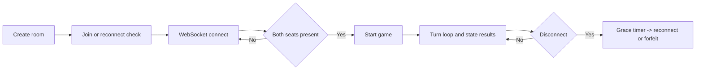
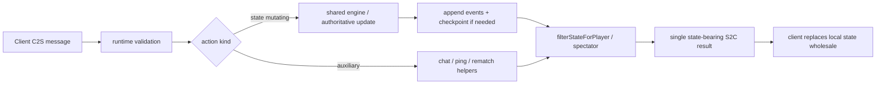

# Delta-V Protocol & Data Contracts

Wire format, state shapes, and hex math — the surface area an agent writer or server-side developer needs to read. Rules and scenarios live in [SPEC.md](./SPEC.md); module layout lives in [ARCHITECTURE.md](./ARCHITECTURE.md). The TypeScript modules are authoritative when prose drifts:

- `src/shared/types/protocol.ts` — C2S / S2C messages
- `src/shared/types/domain.ts` — `GameState`, `Ship`, `Phase`
- `src/shared/types/scenario.ts` — `ScenarioDefinition`, `ScenarioRules`

## Cloudflare Topology

Delta-V runs on Cloudflare Workers with three Durable Object classes ([`wrangler.toml`](../wrangler.toml)):

| Binding | Class | Role |
| --- | --- | --- |
| `GAME` | `GameDO` | One room per active match — event stream, checkpoints, WebSocket, alarms |
| `MATCHMAKER` | `MatchmakerDO` | Singleton `global` — quick-match ticket queue and seat pairing |
| `LIVE_REGISTRY` | `LiveRegistryDO` | Singleton — "Live now" registry for `GET /api/matches?status=live` |

Plus a D1 database (`DB`) for telemetry + match archive metadata, and an R2 bucket (`MATCH_ARCHIVE`) for completed match JSON. See [ARCHITECTURE.md](./ARCHITECTURE.md) for how these fit together.

## HTTP Endpoints

| Route | Method | Purpose |
| --- | --- | --- |
| `/` | GET | Serve the SPA |
| `/create` | POST | Generate a 5-char room code + creator reconnect token; lock the scenario |
| `/quick-match` | POST | Enqueue a matchmaking ticket |
| `/quick-match/:ticket` | GET | Poll ticket state (`waiting`, `matched`, `expired`) |
| `/join/:code` | GET | Preflight join / reconnect validation; returns `{ ok, scenario, seatStatus }` on success |
| `/replay/:code` | GET | Replay for a specific match: public archived replay via `?viewer=spectator&gameId=ROOMCODE-mN`, or player-authenticated replay via `playerToken` |
| `/ws/:code` | GET (upgrade) | WebSocket upgrade to the room's `GameDO` |
| `/api/agent-token` | POST | Issue 24 h HMAC-signed `agentToken`; optional `claim: {username}` binds the agent to a leaderboard row (see [AGENT_SPEC.md](../AGENT_SPEC.md)) |
| `/api/claim-name` | POST | Bind a human `playerKey` to a leaderboard username (first-call-wins) |
| `/api/leaderboard` | GET | Public leaderboard query (ordered by Glicko-2 rating; provisional rows hidden by default) |
| `/api/leaderboard/me` | GET | Per-player rank lookup (`?playerKey=…`) for the home-screen hint |
| `/mcp` | POST | Remote MCP endpoint (stateless JSON — see [DELTA_V_MCP.md](./DELTA_V_MCP.md)) |
| `/api/matches` | GET | Match listing (`?status=live` for in-progress from `LIVE_REGISTRY`; archived listing accepts `limit`, `before`, optional `scenario`, optional `winner=0|1|draw`, and optional `status=archived`; invalid filters return `400 invalid_query`; no usernames in the public response) |
| `/matches` | GET | Public match-history HTML page |
| `/leaderboard` | GET | Public leaderboard HTML page |
| `/agents` | GET | Agent landing page |
| `/.well-known/agent.json` | GET | Machine-readable agent manifest |
| `/agent-playbook.json` | GET | Phase/action map for agents |
| `/version.json` | GET | Build-time `{ packageVersion, assetsHash }` for support/cache-bust debugging |
| `/healthz` (aliases: `/health`, `/status`) | GET | Liveness probe: `{ ok, sha, bootedAt }` (`sha` resolves from deploy metadata, then `/version.json` `assetsHash`) |
| `/telemetry`, `/error` | POST | Client-side reporting (JSON, ≤ 4 KB) |

Rate limits for each route: [SECURITY.md#3-rate-limiting-architecture](./SECURITY.md#3-rate-limiting-architecture).

Public read endpoints (`/healthz`, `/api/matches`, `/api/leaderboard`, `/api/leaderboard/me`, `/replay/:code`, `/.well-known/agent.json`) send `Access-Control-Allow-Origin: *` plus the shared response-security header baseline documented in [SECURITY.md](./SECURITY.md).

## Room Lifecycle



```
1. POST /create
   → Worker allocates a 5-char room code + creator token → DO /init
   → { code, playerToken, ... }

2. GET /join/{code}?playerToken=X        (optional preflight)
   → `{ ok: true, scenario, seatStatus }` when the room exists

3. GET /replay/{code}?viewer=spectator&gameId=ROOMCODE-mN
   → public archived replay fetch, projected from checkpoint + event stream
   (or `?playerToken=X&gameId=ROOMCODE-mN` for player-authenticated replay)

4. WebSocket /ws/{code}[?playerToken=X]
   → DO accepts, tags the socket with player ID (0 | 1 | spectator)

5. Both unique seats connected
   → createGame() → broadcast gameStart

6. Game loop
   → C2S action → engine → save events → restart timer → broadcast S2C result

7. Disconnect
   → 30 s grace period → reconnect with token, or forfeit
```

Players are seat-based (Player 0 / Player 1). The creator seat is token-protected; the guest seat is claimed by room code alone until a player token is issued in the `welcome` message.

## WebSocket Protocol

JSON messages over WebSocket. Turn-based, so frequency is low. The snippets below are intentionally concise — `src/shared/types/protocol.ts` is authoritative.



### Client → Server (C2S)

```typescript
type C2S =
  | { type: 'fleetReady'; purchases: FleetPurchase[] }
  | { type: 'astrogation'; orders: AstrogationOrder[] }
  | { type: 'surrender'; shipIds: string[] }
  | { type: 'ordnance'; launches: OrdnanceLaunch[] }
  | { type: 'emplaceBase'; emplacements: OrbitalBaseEmplacement[] }
  | { type: 'skipOrdnance' }
  | { type: 'beginCombat' }
  | { type: 'combat'; attacks: CombatAttack[] }
  | { type: 'combatSingle'; attack: CombatAttack }
  | { type: 'endCombat' }
  | { type: 'skipCombat' }
  | { type: 'logistics'; transfers: TransferOrder[] }
  | { type: 'skipLogistics' }
  | { type: 'rematch' }
  | { type: 'chat'; text: string }
  | { type: 'ping'; t: number };

type FleetPurchase =
  | { kind: 'ship'; shipType: PurchasableShipType }
  | { kind: 'orbitalBaseCargo' };
```

All messages are discriminated unions validated at the protocol boundary. Chat payloads are trimmed before validation; blank post-trim messages are rejected.

### Server → Client (S2C)

```typescript
type S2C =
  | { type: 'welcome'; playerId: number; code: string; playerToken: string }
  | { type: 'spectatorWelcome'; code: string }
  | { type: 'matchFound' }
  | { type: 'gameStart'; state: GameState }
  | {
      type: 'movementResult';
      movements: ShipMovement[];
      ordnanceMovements: OrdnanceMovement[];
      events: MovementEvent[];
      state: GameState;
    }
  | { type: 'combatResult'; results: CombatResult[]; state: GameState }
  | { type: 'combatSingleResult'; result: CombatResult; state: GameState }
  | {
      type: 'stateUpdate';
      state: GameState;
      transferEvents?: LogisticsTransferLogEvent[];
    }
  | { type: 'gameOver'; winner: number; reason: string }
  | { type: 'rematchPending' }
  | { type: 'chat'; playerId: number; text: string }
  | { type: 'error'; message: string; code?: ErrorCode }
  | { type: 'actionAccepted'; guardStatus: 'inSync' | 'stalePhaseForgiven'; ... }
  | { type: 'actionRejected'; reason: ActionRejectionReason; state: GameState; ... }
  | { type: 'pong'; t: number }
  | { type: 'opponentStatus'; status: 'disconnected' | 'reconnected'; graceDeadlineMs?: number };
```

Every state-mutating action produces exactly one state-bearing S2C message (`gameStart`, `stateUpdate`, `movementResult`, `combatResult`, or `combatSingleResult`). Clients replace local state wholesale on receipt — no delta patching. `gameOver` is sent *after* the terminal state-bearing message.

For hidden-information scenarios (like Escape), the server applies `filterStateForPlayer` before send — see the Viewer-Aware Filtering pattern in [patterns/protocol-and-persistence.md](../patterns/protocol-and-persistence.md).

## Game State

```typescript
interface GameState {
  schemaVersion?: number;
  gameId: string;                          // stable per-match ID (e.g. "ROOM1-m2")
  scenario: string;
  scenarioRules: ScenarioRules;
  escapeMoralVictoryAchieved: boolean;
  turnNumber: number;
  phase: Phase;
  activePlayer: number;                    // 0 | 1
  ships: Ship[];
  ordnance: Ordnance[];
  pendingAstrogationOrders: AstrogationOrder[] | null;
  pendingAsteroidHazards: AsteroidHazard[];
  destroyedAsteroids: string[];            // hexKey[] — removed by nukes
  destroyedBases: string[];                // hexKey[] — destroyed by nukes
  players: [PlayerState, PlayerState];
  outcome: { winner: number; reason: string } | null;
}

interface Ship {
  id: string;
  type: string;                            // key into SHIP_STATS
  owner: number;                           // 0 | 1
  originalOwner: number;                   // pre-capture owner
  position: HexCoord;
  lastMovementPath?: HexCoord[];
  velocity: HexVec;                        // (dq, dr) per turn
  fuel: number;
  cargoUsed: number;                       // mass of ordnance consumed
  nukesLaunchedSinceResupply: number;
  resuppliedThisTurn: boolean;
  lifecycle: 'active' | 'landed' | 'destroyed';
  control: 'own' | 'captured' | 'surrendered';
  detected: boolean;
  heroismAvailable: boolean;
  overloadUsed: boolean;
  baseStatus?: 'carryingBase' | 'emplaced';
  identity?: {                             // hidden-identity scenarios only
    hasFugitives: boolean;                 // stripped for unrevealed opponents
    revealed: boolean;
  };
  pendingGravityEffects?: GravityEffect[];
  damage: { disabledTurns: number };       // 0 = operational, ≥ 6 = eliminated
}

interface PlayerState {
  connected: boolean;
  ready: boolean;
  targetBody: string;                      // '' if none
  homeBody: string;
  bases: string[];                         // hexKey[] of controlled bases
  escapeWins: boolean;
}

type Phase =
  | 'waiting'
  | 'fleetBuilding'
  | 'astrogation'
  | 'ordnance'
  | 'logistics'
  | 'combat'
  | 'gameOver';
```

## Hex Math

Axial coordinates (`q`, `r`) with standard flat-top orientation. The 6 directions:

```typescript
interface HexCoord { q: number; r: number }
interface HexVec   { dq: number; dr: number }

const HEX_DIRECTIONS: HexVec[] = [
  { dq: +1, dr:  0 },   // E
  { dq: +1, dr: -1 },   // NE
  { dq:  0, dr: -1 },   // NW
  { dq: -1, dr:  0 },   // W
  { dq: -1, dr: +1 },   // SW
  { dq:  0, dr: +1 },   // SE
];

// Core primitives (src/shared/hex.ts):
hexDistance(a, b): number         // hexes between two points (max(|dq|, |dr|, |dq+dr|))
hexLineDraw(a, b): HexCoord[]     // hexes along a straight line (course, LOS)
hexNeighbors(h):    HexCoord[]    // 6 adjacent hexes
hexToPixel(h):      PixelCoord    // hex → screen position (flat-top)
pixelToHex(x, y):   HexCoord      // screen tap / click → nearest hex
hexAdd(h, v):       HexCoord
hexSubtract(a, b):  HexVec
hexKey({ q, r }):   HexKey        // branded "q,r" string for Map/Set keys
```

For a good intro to the underlying math, see Red Blob Games' [Hexagonal Grids](https://www.redblobgames.com/grids/hexagons/) guide.

### Vector Movement Algorithm

```
computeCourse(ship, burn, map):
  1. predicted = ship.position + ship.velocity          // coast target
  2. predicted += burn.direction                        // 1 fuel per hex (optional)
     predicted += burn.direction2                       // overload: 2 fuel total, warships only
  3. path = hexLineDraw(ship.position, predicted)       // trace current move
  4. for each hex in path:
       if map.isGravityHex(hex):
         if map.isWeakGravity(hex) && isFirstWeakGravity && playerIgnores:
           continue
         predicted += map.getGravityDirection(hex)      // deferred — applied NEXT turn
  5. finalPath = hexLineDraw(ship.position, predicted)  // recompute with gravity
  6. newVelocity = predicted - ship.position

  return { destination: predicted, path: finalPath, newVelocity }
```

Gravity applies on the turn *after* the ship enters a gravity hex — `pendingGravityEffects` on `Ship` tracks which deflections are queued.

## Scenario Definition

```typescript
interface ScenarioDefinition {
  name: string;
  description: string;
  players: ScenarioPlayer[];
  rules?: ScenarioRules;
  startingPlayer?: 0 | 1;
  startingCredits?: number | [number, number];
  availableFleetPurchases?: string[];
}

interface ScenarioPlayer {
  ships: ScenarioShip[];
  targetBody: string;                      // '' if none
  homeBody: string;
  bases?: HexCoord[];
  escapeWins: boolean;
  hiddenIdentity?: boolean;
}

interface ScenarioRules {
  allowedOrdnanceTypes?: Ordnance['type'][];
  availableFleetPurchases?: string[];
  planetaryDefenseEnabled?: boolean;
  hiddenIdentityInspection?: boolean;
  escapeEdge?: 'any' | 'north';
  combatDisabled?: boolean;
  checkpointBodies?: string[];
  randomizeStartingPlayer?: boolean;
  sharedBases?: string[];
  logisticsEnabled?: boolean;
  passengerRescueEnabled?: boolean;
  targetWinRequiresPassengers?: boolean;
  reinforcements?: Reinforcement[];
  fleetConversion?: FleetConversion;
  aiConfigOverrides?: Partial<AIDifficultyConfig>;
}
```

Defaults are permissive — omitting a field means the feature is enabled. The pattern is walked through in [patterns/scenarios-and-config.md](../patterns/scenarios-and-config.md).

## Map Data

The solar-system map is generated from TypeScript body definitions (`src/shared/map-data.ts`), not a JSON asset. Each hex becomes a `MapHex` keyed by hex coordinate in the generated map:

```typescript
interface MapHex {
  terrain: 'space' | 'asteroid' | 'planetSurface' | 'sunSurface';
  gravity?: {
    direction: number;                     // hex direction index 0..5
    bodyName: string;                      // owning body
    strength: 'full' | 'weak';
  };
  base?: {
    name: string;
    bodyName: string;                      // owning body
  };
  body?: {
    name: string;
    destructive: boolean;                  // Sol / large bodies destroy on contact
  };
}
```

`buildSolarSystemMap()` produces a `SolarSystemMap` (hex map, celestial-body list, bounds) used at engine entry. See [patterns/scenarios-and-config.md#data-driven-solar-system-map](../patterns/scenarios-and-config.md#data-driven-solar-system-map).

## Error Model

S2C `error` messages carry an optional `ErrorCode` (`src/shared/types/domain.ts`):

```typescript
enum ErrorCode {
  INVALID_PHASE, NOT_YOUR_TURN,            // timing
  INVALID_SHIP, INVALID_TARGET, INVALID_SELECTION,  // reference
  INVALID_INPUT,                           // input shape
  NOT_ALLOWED, INVALID_PLAYER,             // authorization
  RESOURCE_LIMIT,                          // resources
  STATE_CONFLICT,                          // consistency
  ROOM_NOT_FOUND, ROOM_FULL,               // room lifecycle
  GAME_IN_PROGRESS, GAME_COMPLETED,        // match lifecycle
}
```

Rate-limit closures use WebSocket close code 1008 (not an `error` message). Multi-stage validation is walked through in [patterns/type-system-and-validation.md](../patterns/type-system-and-validation.md).

## Further Reading

- [SPEC.md](./SPEC.md) — gameplay rules and scenarios
- [ARCHITECTURE.md](./ARCHITECTURE.md) — module inventory and data flow
- [SECURITY.md](./SECURITY.md) — rate limits, auth, abuse controls
- [AGENT_SPEC.md](../AGENT_SPEC.md) — agent-specific observation / action model on top of this protocol
- [patterns/protocol-and-persistence.md](../patterns/protocol-and-persistence.md) — why the wire format looks like this
