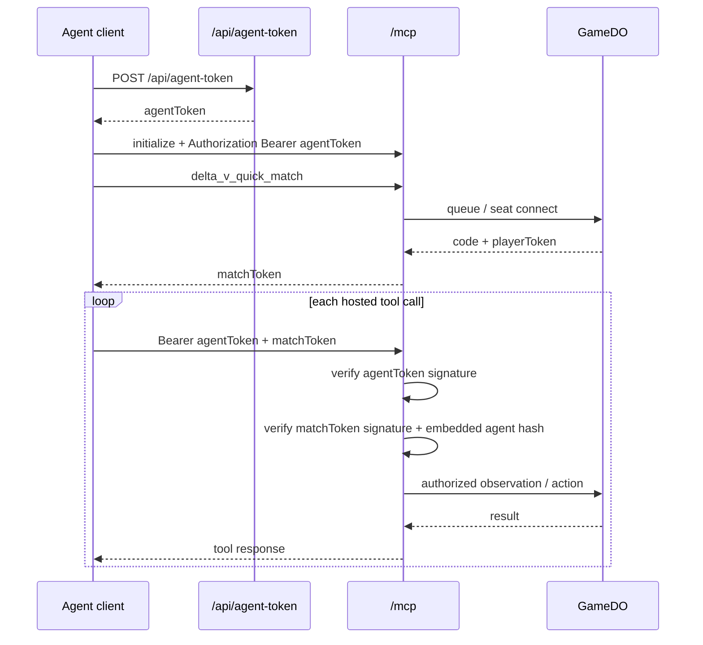
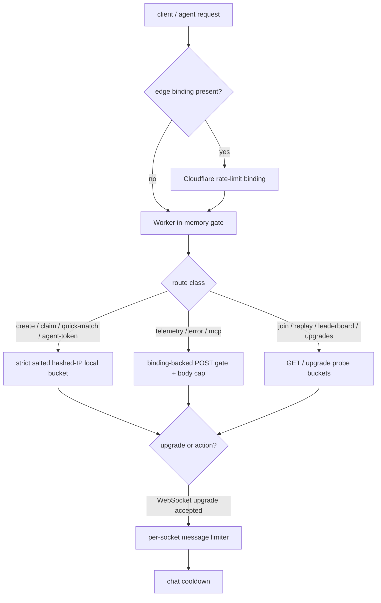

# Security & Competitive Integrity Review

This document describes the current security posture of Delta-V with emphasis on competitive multiplayer. It distinguishes protections that are already enforced from the risks that still remain if the game were exposed to untrusted public players.

Use it as an implementation-level security baseline for engineering decisions. It is not a legal policy document.

Related docs: [ARCHITECTURE](./ARCHITECTURE.md), [BACKLOG](./BACKLOG.md) (open and trigger-gated tasks), [MANUAL_TEST_PLAN](./MANUAL_TEST_PLAN.md).

## Current Protections

The authoritative-server boundary enforces these invariants on every match:

- WebSocket actions resolve server-side against the authoritative game engine.
- Hidden-identity state is filtered per player before broadcast, so the fugitive flag itself is not sent to the opponent.
- Room creation is authoritative: `/create` initialises the room, locks the scenario up front, and rejects room-code collisions.
- The room creator receives a reserved player token for seat 0.
- The guest seat is shared by room code or copied room link — anyone with the 5-character code can claim the open seat.
- Reconnects require the stored player token, and seat reclamation is keyed to player identity even if the previous WebSocket has not finished closing.
- Client-to-server WebSocket messages are runtime-validated before any engine handler executes; malformed payloads are rejected rather than trusted structurally.
- After a WebSocket is accepted, **per-socket message rate limiting** (10 messages per second, then close with code 1008) caps garbage traffic to the Durable Object. Chat is also throttled in-memory (minimum 500 ms between accepted chat messages per player).
- Room codes are generated from a cryptographically strong RNG rather than `Math.random()` (see `generateRoomCode` in `src/server/protocol.ts`).
- `GET /join/:code`, `GET /quick-match/:ticket`, `GET /api/matches`, `GET /api/leaderboard`, and `GET /api/leaderboard/me` share a **join-style** salted hashed-IP probe throttle in the Worker (**100** GETs / 60 s, per isolate). `GET /replay/:code` uses a **separate** replay probe bucket (**250** GETs / 60 s, per isolate) so replay traffic cannot exhaust the join budget.
- `GET /ws/:code` WebSocket upgrades have a salted hashed-IP in-memory cap (20 upgrades / 60 s, per isolate), reducing repeated socket-churn abuse in lower environments.
- `POST /telemetry` and `POST /error` are JSON-only with a 4 KB cap and salted hashed-IP window limits, limiting abuse and D1 write amplification in the default path. A daily cron (`purgeOldEvents`) deletes `events` rows older than **30 days**.
- `POST /mcp` uses Cloudflare's edge `MCP_RATE_LIMITER` binding (20 RPM keyed on `agentToken` hash or salted hashed IP) with a **16 KB body cap** checked before JSON-RPC dispatch ([`packages/mcp-adapter/src/handlers.ts`](../packages/mcp-adapter/src/handlers.ts)).
- `GET /api/metrics` is **not** a public read surface. It requires `Authorization: Bearer <INTERNAL_METRICS_TOKEN>` in production and exists only for operator-facing aggregate snapshots over D1 telemetry.
- Worker responses apply a shared hardening baseline: `Content-Security-Policy`, `Strict-Transport-Security`, `X-Frame-Options: DENY`, `X-Content-Type-Options: nosniff`, `Referrer-Policy: strict-origin-when-cross-origin`, and `Permissions-Policy: geolocation=(), microphone=(), camera=()`.
- Public read endpoints (`/healthz`, `/api/matches`, `/api/leaderboard`, `/api/leaderboard/me`, `/replay/:code`, and `/.well-known/agent.json`) return explicit wildcard CORS headers so browser-hosted embeds and third-party tools can consume those read-only surfaces without a same-origin proxy.

Together these cover host-seat integrity, reconnect safety, and server authority for private multiplayer.

## Remote MCP token model

Agents that connect via the hosted MCP endpoint (`POST https://delta-v.tre.systems/mcp`) use a layered two-token scheme so raw match credentials never reach the agent's LLM context:

| Token | Purpose | Lifetime | Carrier | Source |
|-------|---------|----------|---------|--------|
| `agentToken` | Long-lived agent identity (embeds `playerKey`) | 24 h, renewable | `Authorization: Bearer …` header | `POST /api/agent-token` |
| `matchToken` | Per-match credential (HMAC payload with `code` + `playerToken`) | 4 h | Tool args field `matchToken` | `delta_v_quick_match` (when called with agentToken auth) |

Both are HMAC-SHA-256 signed with `AGENT_TOKEN_SECRET` (set via `wrangler secret put AGENT_TOKEN_SECRET` in production). The Worker **fails closed** when the secret is unset: `/mcp` and `/api/agent-token` return `500 server_misconfigured` instead of signing with a placeholder. The default `wrangler.toml` `[vars]` keeps `DEV_MODE = "0"`. For local `wrangler dev`, copy `.dev.vars.example` to `.dev.vars` and set `DEV_MODE=1` so deterministic placeholders can engage when `AGENT_TOKEN_SECRET` or `IP_HASH_SALT` are unset (Wrangler merges `.dev.vars` over `[vars]`). Production deploys do not load `.dev.vars`, so the placeholder path never engages there. `npm run deploy` also runs `scripts/check-deploy-secrets.mjs`, which calls `wrangler secret list` and refuses to proceed when `AGENT_TOKEN_SECRET` or `IP_HASH_SALT` is missing on the target environment.

`matchToken` embeds a SHA-256 hash of the issuing `agentToken`. Hosted MCP **requires** the matching `agentToken` as `Authorization: Bearer …` on every tool call that passes `matchToken` (or the hosted compatibility alias `sessionId`), so a leaked blob alone cannot be replayed.

`POST /quick-match` with an `agent_…` `playerKey` also requires a valid agent Bearer (or a preceding `POST /api/agent-token` mint step used by the shared queue helper) so leaderboard rows are not tagged `is_agent` from the prefix alone.

Hosted MCP no longer accepts raw `{code, playerToken}` tool args. Agents must mint an `agentToken`, call `delta_v_quick_match` or `delta_v_list_sessions`, and then use the returned `matchToken` (or hosted `sessionId` alias) on later tool calls.

Token revocation is currently coarse: rotate `AGENT_TOKEN_SECRET` to invalidate every issued token. Per-token revocation lists are out of scope for v1; agents that suspect a leak should re-issue and rotate the secret.

Implementation: `src/server/auth/` (token signing, issuance route), `packages/mcp-adapter/src/handlers.ts` (Authorization-header validation, matchToken minting + verification on every tool call).

## Remaining Competitive Risks

### 1. Guest-seat claiming is still code/link based in the default flow

Current status: **acceptable for friendly matches, weak for public matchmaking**

- The creator seat is token-protected.
- The guest seat is still usually claimed through possession of the 5-character room code or the copied `/?code=ROOM1` link.
- Room-code guest joins are the deliberate product model for now — designed for friends sharing codes in conversation.

Implications:

- Anyone who gets the room code before the intended guest can still occupy seat 1.
- This is weaker than authenticated accounts, signed invites, or tournament admin tooling, but appropriate for the current friendly-match scope.

Recommended next step:

- For public matchmaking or tournament play, add longer opaque room identifiers or authenticated invite links.

### 2. Room secrecy is limited by short codes

Current status: **acceptable for friendly matches, weak for public matchmaking**

- Room codes are collision-checked and cryptographically generated from **32** characters (`A–Z` excluding **I** and **O**, plus digits `2–9`): **32⁵ ≈ 33.6M** combinations (`src/server/protocol.ts`, `CODE_CHARS`).
- Short codes are a deliberate product choice — designed for voice/chat sharing between friends.
- For public matchmaking or tournament play, longer opaque identifiers would be needed to prevent code guessing.

### 3. Rate limiting architecture

This is the canonical rate-limit table for the project. Other docs should link here rather than restate values.

| Endpoint / scope | Limit | Window | Scope | Binding | On exceed |
| --- | --- | --- | --- | --- | --- |
| `POST /create` | 5 | 60 s | per salted hashed IP | in-memory (strict per isolate) + Cloudflare `CREATE_RATE_LIMITER` (best-effort edge layer) | 429 + `Retry-After` |
| `POST /api/agent-token` | 5 | 60 s | per salted hashed IP | reuses the same strict local bucket + `CREATE_RATE_LIMITER` edge layer | 429 |
| `POST /quick-match` | 5 | 60 s | per salted hashed IP | reuses the same strict local bucket + `CREATE_RATE_LIMITER` edge layer | 429 |
| `GET /ws/:code` (upgrade) | 20 | 60 s | per salted hashed IP | in-memory (per isolate) | 429 |
| `GET /join/:code`, `GET /quick-match/:ticket`, `GET /api/matches` | 100 | 60 s | per salted hashed IP | in-memory (per isolate) | 429 |
| `GET /replay/:code` | 250 | 60 s | per salted hashed IP | in-memory (per isolate, separate bucket) | 429 |
| `POST /telemetry` | 120 | 60 s | per salted hashed IP | Cloudflare `TELEMETRY_RATE_LIMITER` (global), in-memory fallback; body capped at 4 KB | 429 |
| `POST /error` | 40 | 60 s | per salted hashed IP | Cloudflare `ERROR_RATE_LIMITER` (global), in-memory fallback; body capped at 4 KB | 429 |
| `POST /mcp` (hosted MCP entry) | 20 | 60 s | per `agentToken` hash (Bearer) or salted hashed IP | Cloudflare `MCP_RATE_LIMITER`; body capped at 16 KB | 429 + `Retry-After` |
| `POST /api/claim-name` | 5 | 60 s | per salted hashed IP | reuses the same strict local bucket + `CREATE_RATE_LIMITER` edge layer | 429 |
| `GET /api/leaderboard`, `GET /api/leaderboard/me` | 100 | 60 s | per salted hashed IP | in-memory (shares the join-probe bucket) | 429 |
| WebSocket messages (after connect) | 10 | 1 s | per socket | in-memory (`WeakMap<WebSocket, RateWindow>`) | close 1008 |
| Chat messages | 1 per 500 ms | — | per player ID | in-memory | silently dropped |
| Room-code guessing | 32⁵ ≈ 33.6 M combinations | — | — | cryptographic RNG | collision-checked at `/create` |

Constants live in [`src/server/reporting.ts`](../src/server/reporting.ts) (per-IP Worker layer), [`src/server/game-do/socket.ts`](../src/server/game-do/socket.ts) (per-socket DO layer), and [`packages/mcp-adapter/src/handlers.ts`](../packages/mcp-adapter/src/handlers.ts) (`MCP_MAX_BODY_BYTES`, rate-limit key derivation).

**Tier topology.**

- **Edge binding** — `CREATE_RATE_LIMITER`, `TELEMETRY_RATE_LIMITER`, `ERROR_RATE_LIMITER`, and `MCP_RATE_LIMITER` (declared in [`wrangler.toml`](../wrangler.toml)) are a best-effort Cloudflare edge layer. Production has them; lower environments (e.g. `wrangler dev` without bindings) simply skip that layer.
- **In-memory per-isolate** covers WebSocket upgrades, join/replay/match-list/leaderboard GET probes, and now also acts as the strict first line for `/create`, `/api/agent-token`, `/quick-match`, and `/api/claim-name`. A distributed attacker spraying many edges could still exceed the per-isolate buckets, so WAF or a DO/D1 counter remains the escalation path if observed.
- **Per-socket DO layer** (the "WebSocket messages" and "Chat messages" rows) is enforced after the socket upgrade, inside the `GameDO`; it does not scale with IPs.

**Deployment recommendation.** Treat the checked-in `wrangler.toml` as the production baseline. If the `delta-v-match-archive` bucket does not exist yet, `wrangler deploy` should fail until it is created rather than silently shipping without replay storage. Lower environments may choose local simulation or intentionally omit remote resources; public-facing production should keep the rate-limit and archive bindings enabled.

**Escalation levers** (not wired today) if per-isolate limits prove insufficient:

- **Cloudflare WAF** or extra `[[ratelimits]]` namespaces can cap `POST /telemetry`, `POST /error`, join/replay probes, and WebSocket upgrades *across all edge isolates*.
- **Turnstile** on `/create` if automated room creation becomes a problem (integration surface described in §5 below).
- WebSocket **upgrades** have a per-isolate salted hashed-IP window in application code but are not globally message-throttled at the edge. Two-seats-per-room plus per-socket post-upgrade message limits further blunt the abuse shape.

### 4. Cost-abuse surface (current gaps)

Distinct from competitive integrity — these are paths where a motivated attacker can drive Cloudflare billing faster than the current controls throttle them. Treat follow-ups as scoped engineering/product work when any path below becomes material.

- `POST /telemetry` and `POST /error` rate limits are per-isolate `Map`s, not edge-global; a distributed caller can cycle POPs to bypass them. Accepted POSTs write a ≤ 4 KB D1 `events` row. **Retention:** a daily `scheduled` cron (`wrangler.toml` `crons = ["0 4 * * *"]`) calls `purgeOldEvents(env.DB, EVENTS_RETENTION_MS)` to delete rows older than **30 days** ([`src/server/reporting.ts`](../src/server/reporting.ts)).
- `POST /mcp` rate limit and body cap are enforced, but a distributed attacker cycling POPs still sees the per-isolate fallback when the `MCP_RATE_LIMITER` binding is absent (e.g. `wrangler dev`). Also: `delta_v_quick_match` polling storms and `/mcp/wait` long-polls can hold GAME DOs warm within the cap.
- `MatchmakerDO` serializes the full quick-match queue under one legacy-KV key (128 KB ceiling). Sustained distributed heartbeats can push the queue past that limit — enqueue then throws and quick-match stops working globally.
- Abandoned `/create` rooms still consume a `GameDO` for up to the 5-minute inactivity window, but `archiveRoomState()` now purges match-scoped event/checkpoint residue on timeout. See [OBSERVABILITY.md](./OBSERVABILITY.md#orphan-rooms-and-inactivity-cleanup) for the exact lifecycle and operator signals.
- `GET /replay/{code}` re-projects the full event stream on every uncached hit. Terminal-state responses are cached (`public, max-age=60, s-maxage=3600` — 1 h at the CDN, 1 min in-browser) so repeated scrapes of finished matches don't hit the DO; mid-match timelines remain `no-store` and still pay the projection cost per request.

Stores **without** automatic application-level retention: D1 `player` (one row per unique playerKey with a claimed username), D1 `match_rating` (one row per rated match), and per-room DO storage. D1 `events` (30-day purge) and D1 `match_archive` + R2 `matches/{gameId}.json` (180-day purge) both have scheduled purges today (see the "Data retention" section below for operational levers on the rest).

### 5. Bot challenge protection (optional)

Cloudflare Turnstile can be added to the room creation flow with a narrow integration surface:

1. Add a Turnstile widget to the client's "Create Game" UI
2. Include the Turnstile token in the `POST /create` body
3. Validate the token server-side via the Turnstile `/siteverify` API before proceeding

This is not currently implemented but the integration surface is narrow — only the `/create` handler and the lobby UI need changes. See [Cloudflare Turnstile docs](https://developers.cloudflare.com/turnstile/).

## Lower-Risk Notes

### Hidden information

The current hidden-identity filtering is sound for the implemented Escape-style fugitive mechanic, because the hidden `hasFugitives` flag is stripped before broadcast. If the game expands toward dummy counters, concealed movement, or more scenario-specific secrets, that filtering layer will need another audit.

That becomes more important as the project moves toward event-sourced match history. Raw internal event streams should be treated as authoritative private data, not as safe spectator or replay payloads. Replay and spectator APIs should serve filtered projections or explicitly redacted event views rather than exposing the internal event log directly. **Live spectator WebSockets** follow the same rule in practice: clients receive filtered `GameState` JSON (same `filterStateForPlayer(..., 'spectator')` path as broadcasts), not the append-only event stream.

### Randomness

Random outcomes are server-controlled, which is the key anti-cheat requirement here. The code no longer relies on client-provided randomness, but it should still be described as server-controlled rather than as a cryptographically audited randomness system.

### Frontend XSS posture

All `innerHTML` writes are now confined behind
`setTrustedHTML()` and `clearHTML()` in `src/client/dom.ts`.
No production code outside that file touches `innerHTML`
directly, making the boundary grep-able and auditable.

Today all callers pass internally generated markup (game
state, static constants, computed display strings) — no
user input or external content flows through this path.

If chat, player names, modded scenarios, or other freeform
text are added later, add a sanitizer such as `DOMPurify`
inside `setTrustedHTML()` rather than scattering raw
`innerHTML` writes. For plain text, prefer `textContent`
or the `el()` helper's `text` prop.

## Competitive Readiness Summary

Current assessment:

- **Rules authority:** good
- **Reconnect / seat hijack resistance:** good
- **Host-seat integrity:** good
- **Guest-seat integrity:** acceptable for friendly matches (room-code model is deliberate)
- **Match availability under hostile payloads:** good
- **Rate limiting:** good — `/create`, `/api/agent-token`, `/quick-match`, and `/api/claim-name` now use a strict per-isolate salted hashed-IP bucket plus Cloudflare `[[ratelimits]]` as an extra edge layer; `/telemetry`, `/error`, and `/mcp` use Cloudflare bindings with in-memory fallback or companion limits; WebSocket upgrades and join/replay/match-list/leaderboard probes have per-isolate salted hashed-IP windows; WebSocket message flood is capped per socket (see table above); optional WAF remains available for true cross-edge caps
- **XSS posture:** good (trusted HTML boundary, no user-generated content)
- **Room secrecy / public matchmaking readiness:** weak (short codes; default join/replay throttles are per-isolate, not global)

Delta-V is well-hardened for private matches between friends. For public matchmaking, tournament play, or open lobbies, the remaining gaps are longer room identifiers, join throttling if guessing becomes real, and optional bot challenge protection.

## Future Security Work

If the product scope expands beyond friendly matches:

- Longer opaque room identifiers for public matchmaking
- Turnstile integration on `/create` for bot protection
- Account binding for organized competitive play
- Stronger join / replay HTTP throttling if room-code guessing or DO wake abuse becomes measurable (global controls, not just per-isolate windows)
- Optional **global** (cross-edge) rate limits via WAF / `[[ratelimits]]` for reporting, join/replay, or WebSocket upgrades if needed

When the current per-isolate limits stop being sufficient for the product shape, track concrete abuse-hardening follow-ups in [BACKLOG.md](./BACKLOG.md) or your issue tracker.

## Data retention (D1, R2, DO)

What persists today:

- **D1 `events`** (telemetry/errors, server-side lifecycle rows). **30-day rolling window** via the daily `scheduled` Worker cron (`wrangler.toml` `crons = ["0 4 * * *"]` → `purgeOldEvents`).
- **D1 `match_archive`** — one row per completed match (metadata index). **180-day rolling window** via the same daily cron (`purgeExpiredMatchArchives` — `MATCH_ARCHIVE_RETENTION_MS` in `src/server/game-do/match-archive.ts`), which also deletes the paired R2 object.
- **D1 `player`** / **D1 `match_rating`** — leaderboard ownership and per-rated-match snapshots. No automatic TTL.
- **R2 `MATCH_ARCHIVE`** (when bound) — full JSON per match at `matches/{gameId}.json`. Purged alongside its `match_archive` row on the 180-day cron.
- **Durable Object storage** — live match chunks, checkpoints, room config; evicted when the DO is archived on inactivity (plus optional R2 archive at match end).

**Operational control:** Cloudflare D1 export/backup, R2 lifecycle rules (tiering or additional delete-after-N-days policies), and manual SQL (`DELETE` batches) when a shorter retention window is mandated for the un-purged tables.

**User deletion requests:** if a jurisdiction requires erasure, use **`anon_id`** and time windows in `events` (subject to the 30-day window), **`player_key`** in `player` / `match_rating`, and **`gameId` / `room_code`** correlation for `match_archive` and R2 archives — document a runbook when needed. Automated purge or stricter programs are ops/engineering work when the product requires it.

## Operational References

- [OBSERVABILITY.md](./OBSERVABILITY.md) — D1 schema, sample queries, what is logged.
- [PRIVACY_TECHNICAL.md](./PRIVACY_TECHNICAL.md) — what the stack stores (not legal advice).
- [Cloudflare WAF rate limiting rules](https://developers.cloudflare.com/waf/rate-limiting-rules/)
- [Cloudflare Turnstile](https://developers.cloudflare.com/turnstile/)
- [OWASP XSS overview](https://owasp.org/www-community/attacks/xss/)
- [OWASP Cross Site Scripting Prevention Cheat Sheet](https://cheatsheetseries.owasp.org/cheatsheets/Cross_Site_Scripting_Prevention_Cheat_Sheet.html)
- [OWASP DOM-based XSS Prevention Cheat Sheet](https://cheatsheetseries.owasp.org/cheatsheets/DOM_based_XSS_Prevention_Cheat_Sheet.html)
