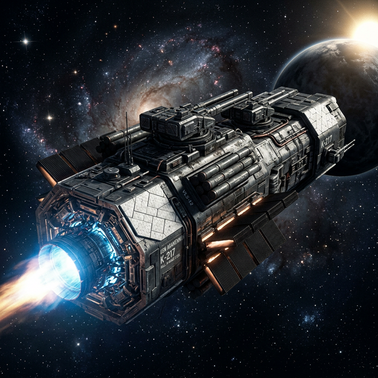
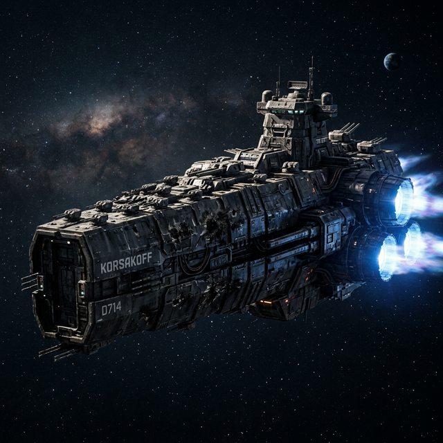
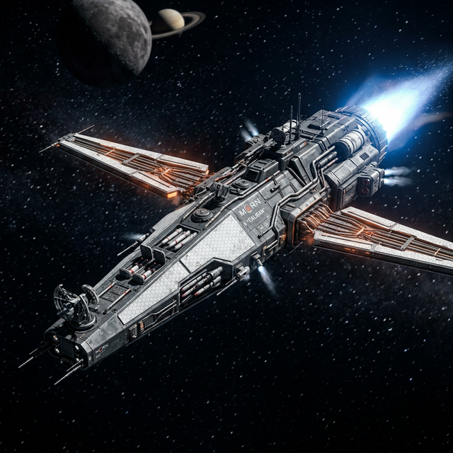
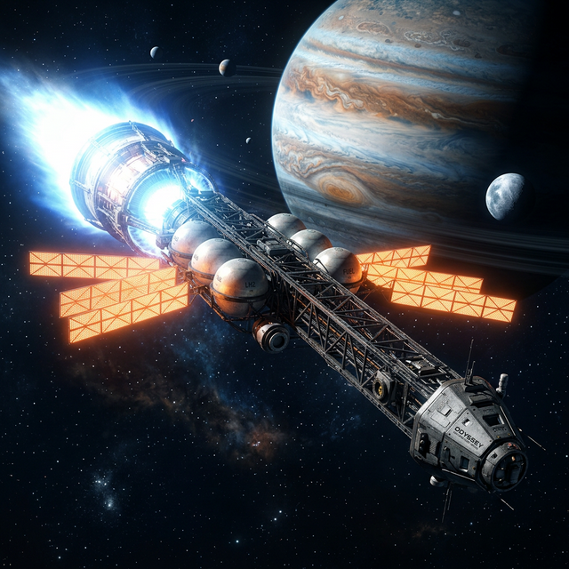
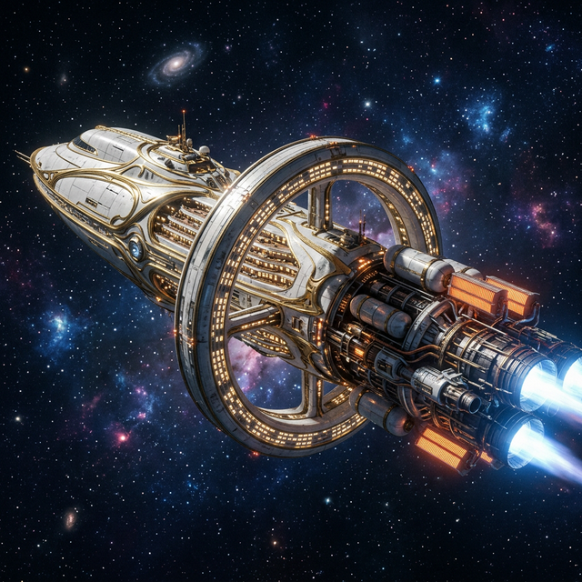
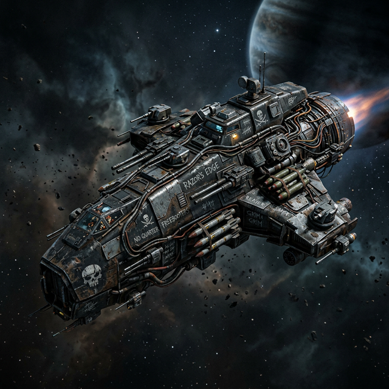
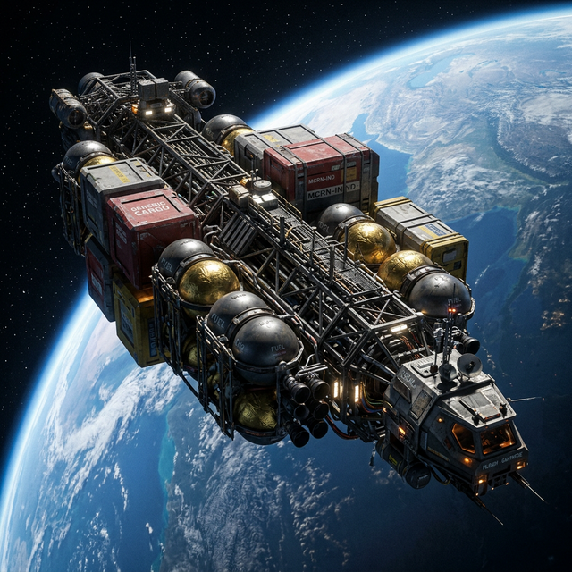
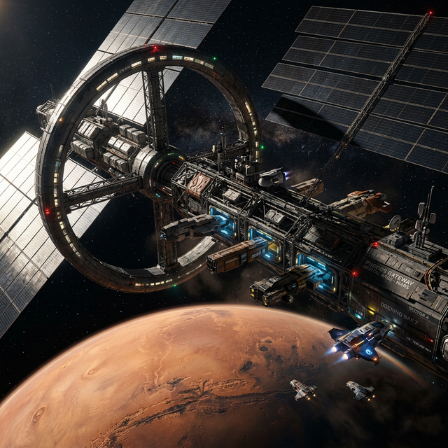

# Ship Aesthetics & Concept Art

This document explores the visual identity of the Delta-V fleet, drawing inspiration from classic hard sci-fi aesthetics.

## Design Philosophy: "Brutalist Functionality"

In the vacuum of space, form follows delta-v. Our ship designs prioritize:
- **Visible Propulsion**: Large, prominent engine nozzles and fusion drives.
- **Thermal Management**: Extensive radiator fins and heat sinks.
- **Modular Construction**: Exposed trusses, spherical fuel tanks, and swappable cargo containers.
- **Zero-G Optimization**: No wings, no streamlining, and industrial surface finishes (Kapton foil, thermal tiles, matte composites).

## Fleet Concept Gallery

### The Corvette
A compact warship optimized for high-acceleration intercepts.

### The Dreadnaught
A colossal, armored slab of railguns and fusion fire.

### The Frigate
An agile missile platform with high-ISP propulsion.

### The Torch
An experimental vessel built around a massive, high-ISP engine.

### The Liner
A luxury passenger vessel featuring artificial gravity rings.

### The Corsair
A gritty, mismatched raider used for deep-space intercepts.

### The Industrial Fleet
A modular transport system carrying fuel and cargo across the system.

### The Orbital Base
A sprawling industrial hub and defensive fortress.

## Implementation Notes
These images serve as the "mood board" for future asset development. Key color palettes identified:
- **Military (Corvette, Frigate)**: Gunmetal (#2a2d34), Navy (#1a2c42), and warning Amber (#ffc56a).
- **Industrial (Transport, Tanker)**: White tiles (#eef4ff), Metallic Silver (#90a0ba), and Kapton Gold (#d4af37).
- **Experimental (Torch)**: High-energy Cyan (#7ad7ff) and deep Obsidian (#040b16).
