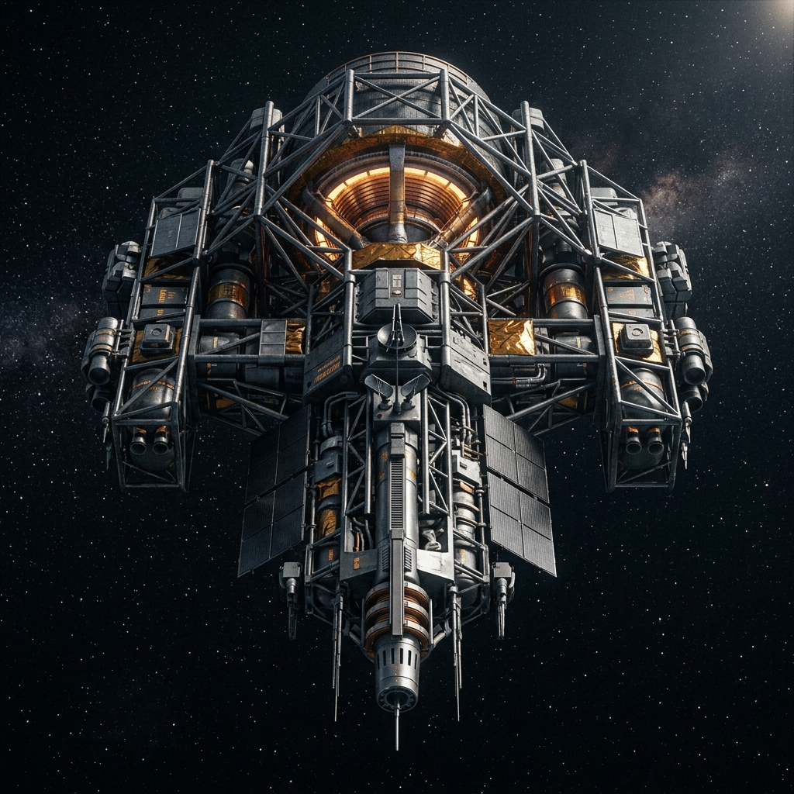
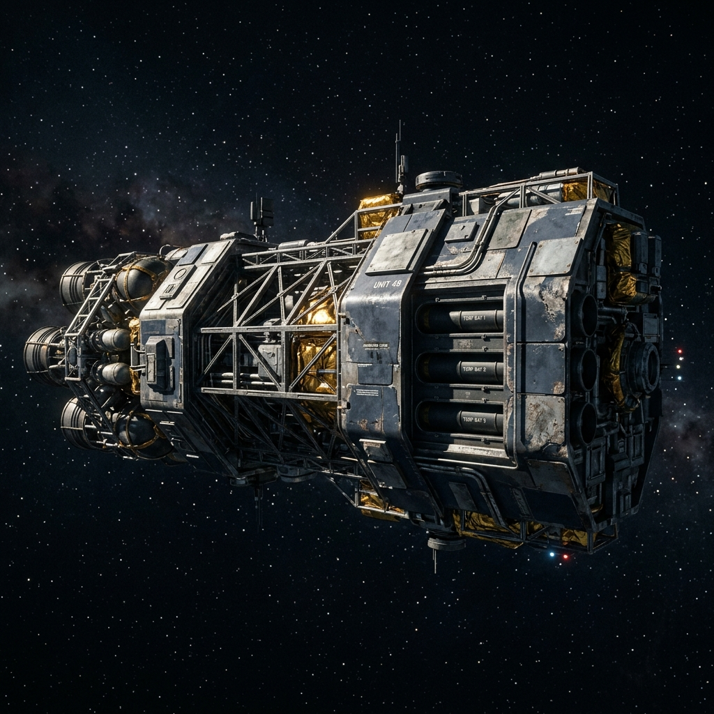
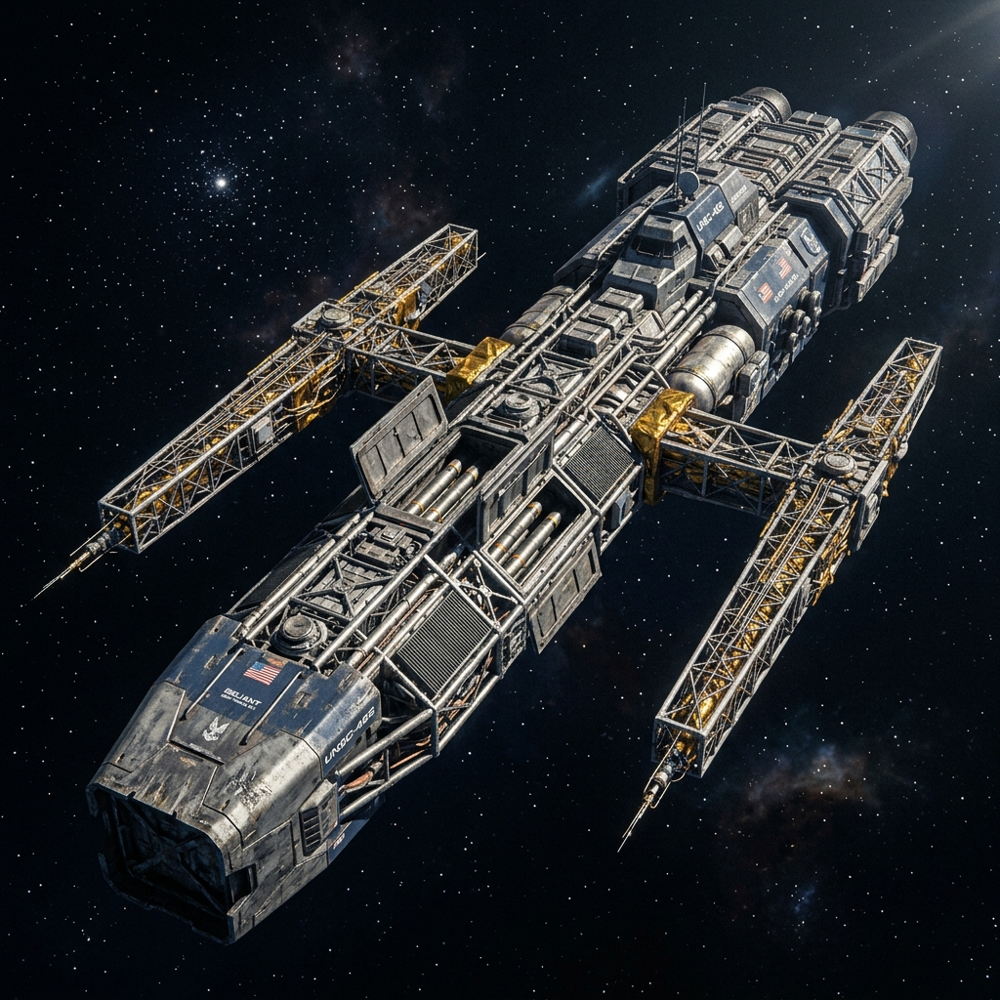
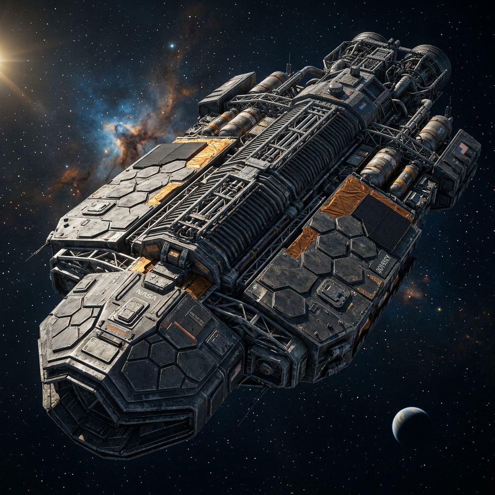
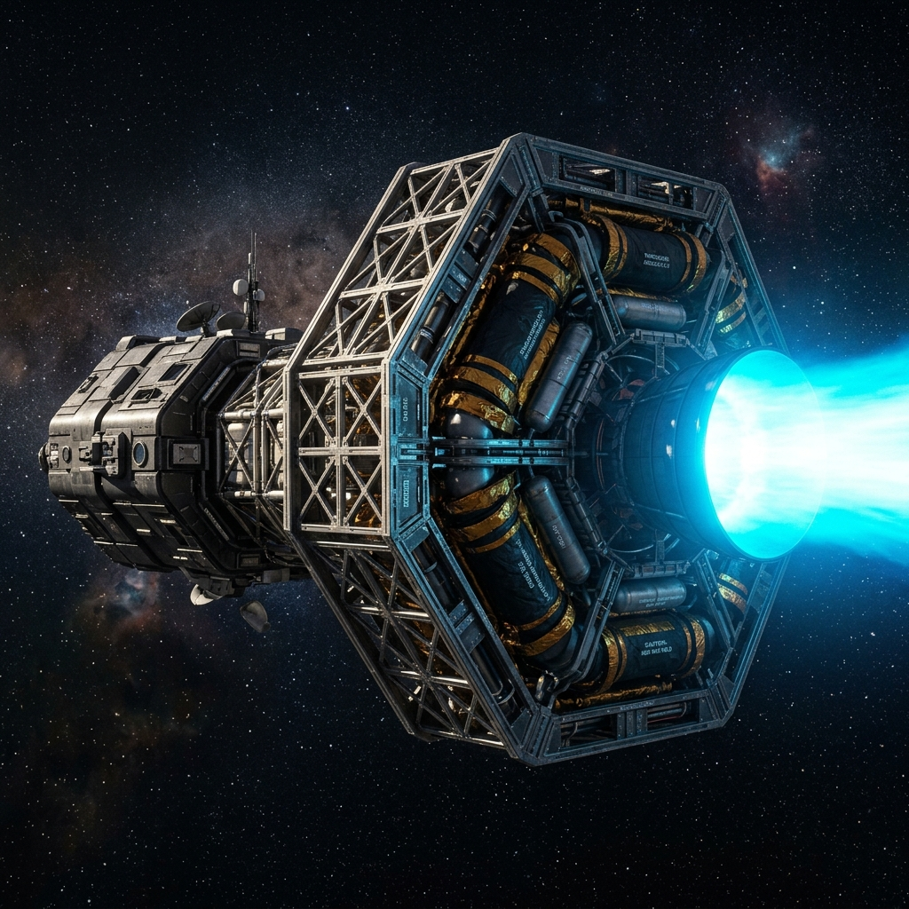
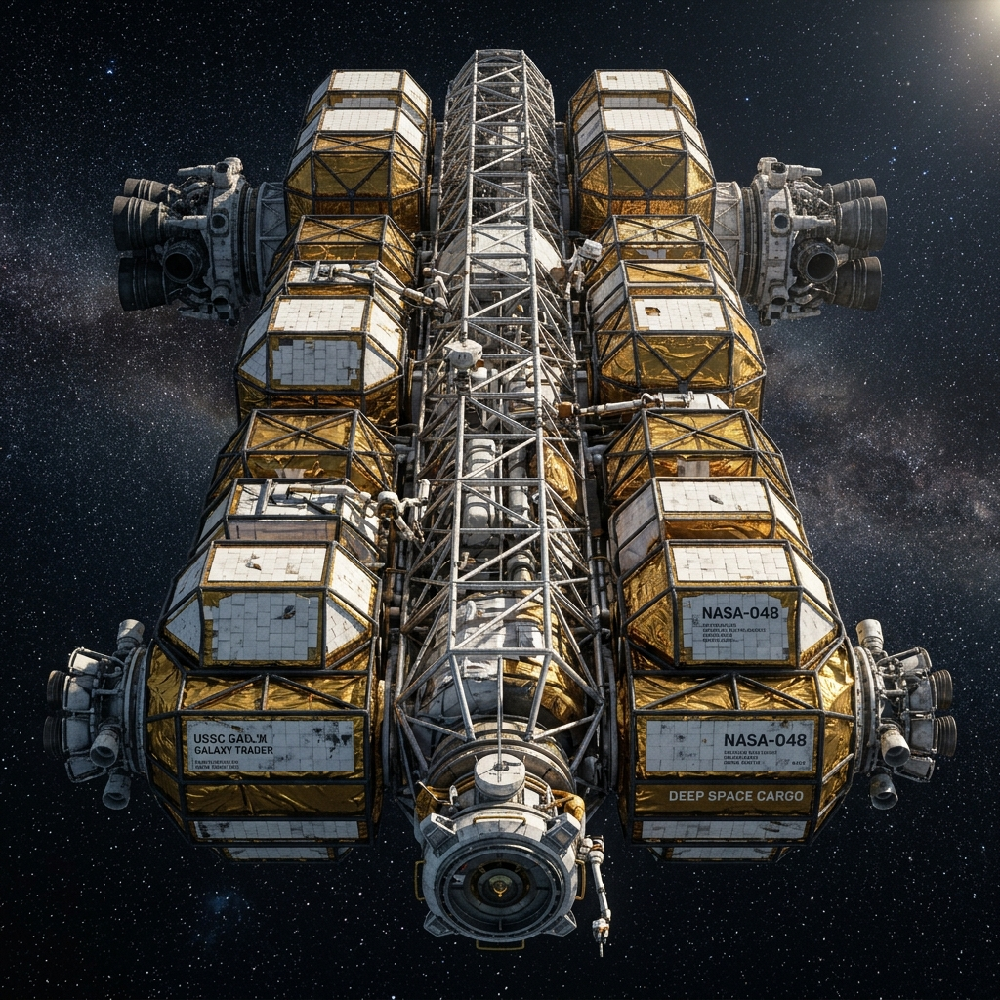
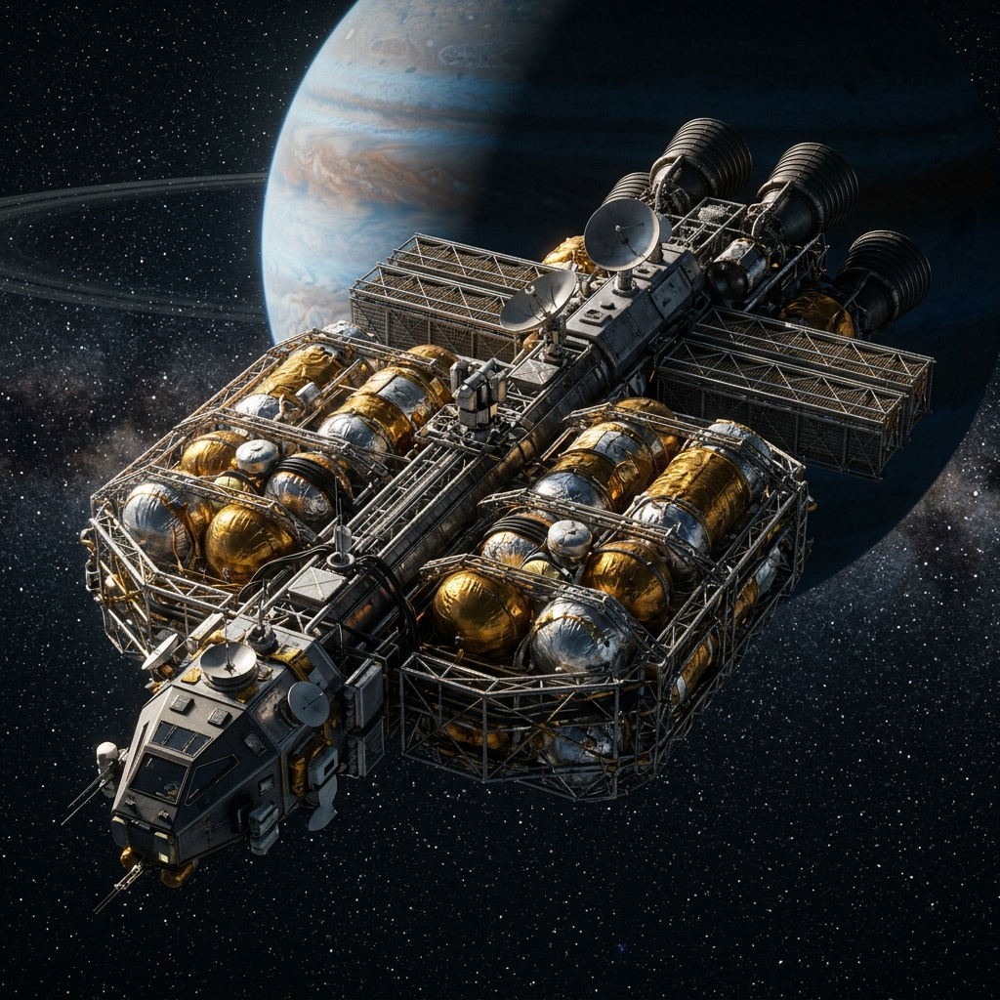
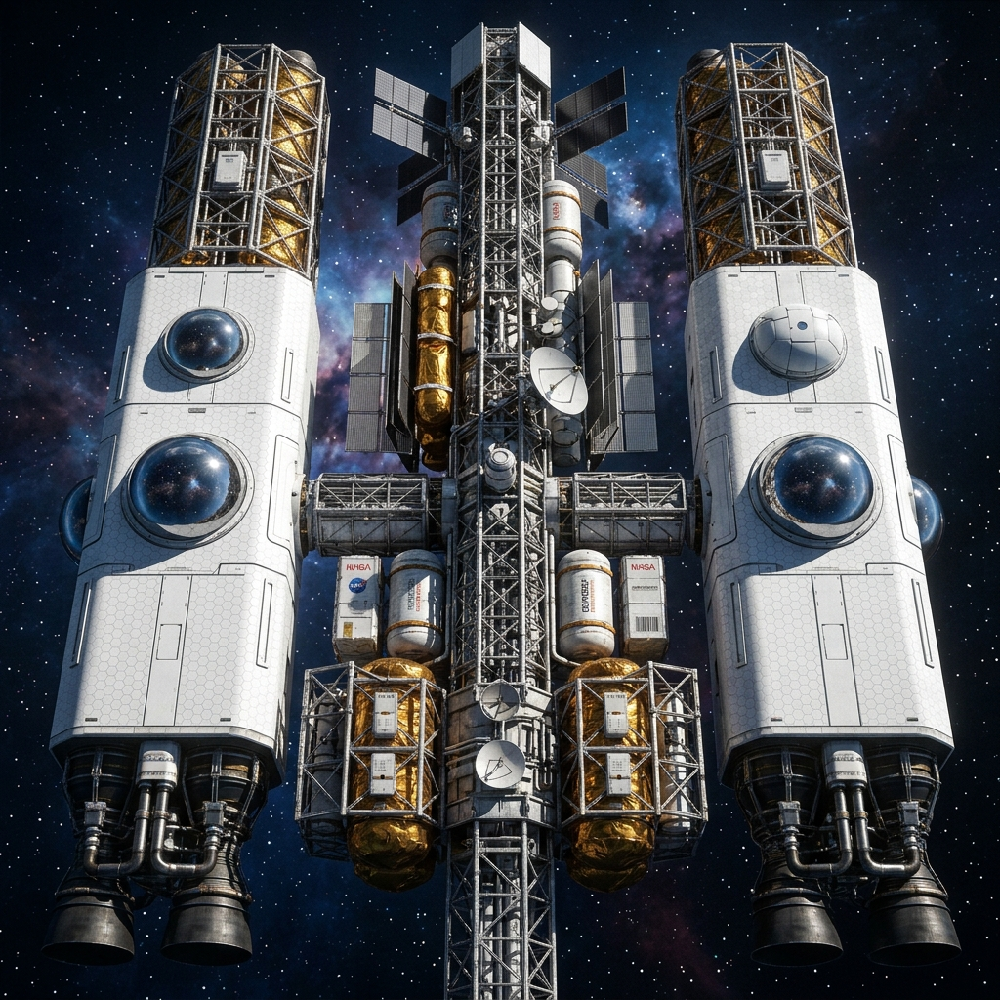
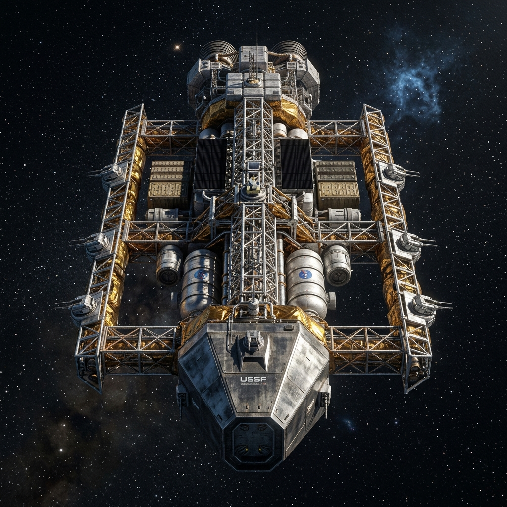
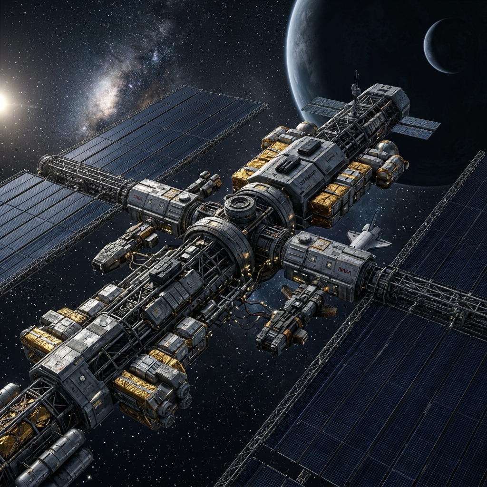

# Ship Aesthetics & Visual Direction

This document defines the visual identity of the Delta-V fleet.
It is a style guide, not the gameplay source of truth.

For gameplay stats and legality, use:

- `src/shared/constants.ts` (`SHIP_STATS`, ship classes, capabilities)
- [SPEC.md](./SPEC.md) (rules and scenario behavior)
- [ARCHITECTURE.md](./ARCHITECTURE.md) (system design)

## Design Philosophy: "Symmetrical NASA-Punk"

In vacuum, form follows delta-v and orbital mechanics. Ship designs should feel engineered, practical, and zero-g-native.

- **Zero-g symmetry first:** no aerodynamic fuselages, no implied "up/down", no airplane cockpits.
- **Visible propulsion:** large engine bells, obvious thrust vectors, believable maneuvering clusters.
- **Thermal realism:** integrated radiators / cooling features rather than decorative fins.
- **Functional materials:** bare trusses, tank geometry, thermal foil, exposed service panels.

## Fleet Visual Taxonomy (Current Roster)

The current playable roster includes:
`transport`, `packet`, `tanker`, `liner`, `corvette`, `corsair`, `frigate`, `dreadnaught`, `torch`, and `orbitalBase`.

### Warships

- **Corvette:** compact interceptor silhouette, aggressive thrust-to-mass look.
  - *Image details:* Small, dense geometric frame dominated by a proportionally large fusion bell. Gunmetal finish with warning amber accents. Prominent point-defense blisters and a clean forward particle-beam spine.
  
  
- **Corsair:** improvised raider profile, asymmetry and retrofit cues.
  - *Image details:* Mid-sized, aggressive but utilitarian. Mismatched ablative armor panels over an exposed truss core. Matte navy and grey finishes with heavy scoring. Visible torpedo launch tubes.
  
  
- **Frigate:** long-range missile/gun platform with mission-flexible geometry.
  - *Image details:* Long, linear hull with heavy forward armor. Symmetrical sensor booms extending outward. Prominent recessed torpedo bays. Clean navy and gunmetal paint scheme.
  
  
- **Dreadnaught:** heavy armored massing, broadside and spinal weapon emphasis. Note: Dreadnaughts are the most resilient warships, capable of firing even when completely disabled.
  - *Image details:* Massive, brutalist hexagonal armor plating. Central ridged spine housing heavy particle accelerators. Multiple layered ablative shields. Minimal exposed delicate structures.
  
  
- **Torch:** high-energy experimental craft dominated by propulsion architecture. Note: Torch ships have sealed, infinite fuel supplies and cannot transfer fuel to other ships.
  - *Image details:* An overpowering, colossal magnetic confinement drive taking up 70% of the vessel's length. Blinding cyan exhaust. Obsidian heat-resistant hull plating.
  
  

### Civilian and Utility Vessels

- **Transport:** modular cargo/passenger hauler; practical logistics frame. Capable of carrying and emplacing Orbital Bases.
  - *Image details:* Skeletal central truss strung with standardized detachable cargo pods. Zero-g utilitarian design. White tile and kapton gold foil wrapping.
  
  
- **Tanker:** fuel-centric mass distribution (tank volume reads clearly).
  - *Image details:* Enormous cluster of silver and kapton gold spherical cryogenic tanks built around a central thrust spine. Minimal crew and command section.
  
  
- **Liner:** civilian long-haul comfort vessel, still fully zero-g functional.
  - *Image details:* Sleek, stark white tiled hull with long modular passenger habitat sections. Large reflective observation blisters and clean, unbroken lines.
  
  
- **Packet:** armed courier and high-value transport capable of emplacing orbital bases; lean hull and practical logistics framing.
  - *Image details:* Streamlined but non-aerodynamic, heavily armored front plate shielding delicate cargo sections. Integrated defensive laser turrets. Metallic silver finish.
  
  

### Fixed Strategic Structure

- **Orbital Base:** industrial-defense installation; immobile fortress silhouette with heavy weapon/readiness cues. Operational even when heavily damaged (operates at D1).
  - *Image details:* Massive sprawling station built around a central heavy-duty docking and refueling hub. Vast flat dark blue solar array grids. Thick armor plating over critical command sectors and fixed torpedo/laser batteries.
  
  

## Implementation Notes

- This repo currently tracks textual visual direction; concept bitmap assets are optional and may live outside source control.
- Keep this guide synchronized with the playable ship roster in `SHIP_STATS`.
- If a ship is added/removed in gameplay code, update this file in the same PR.

### Color Direction

- **Warships:** Gunmetal `#2a2d34`, Navy `#1a2c42`, Warning Amber `#ffc56a`.
- **Industrial/civilian:** White tile `#eef4ff`, Metallic Silver `#90a0ba`, Kapton Gold `#d4af37`.
- **Experimental (Torch family):** High-energy Cyan `#7ad7ff`, Obsidian `#040b16`.
