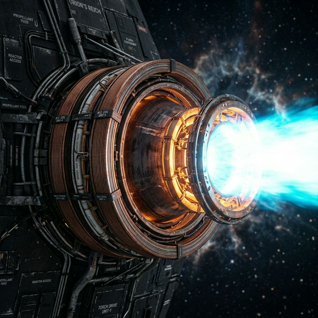
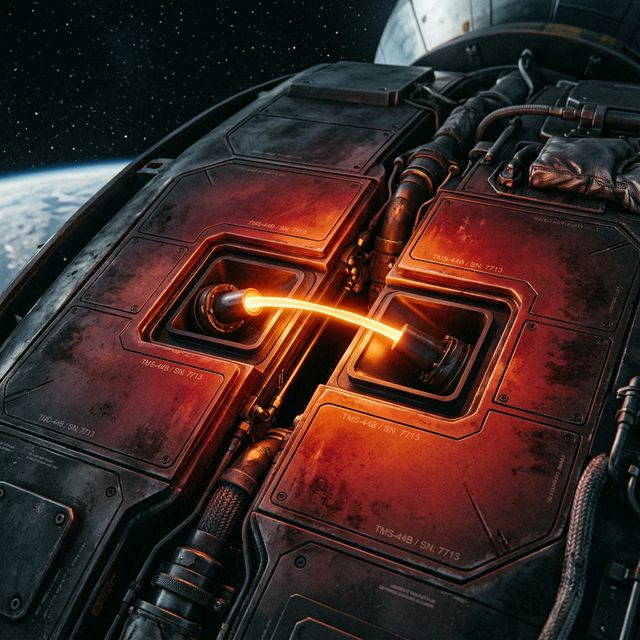
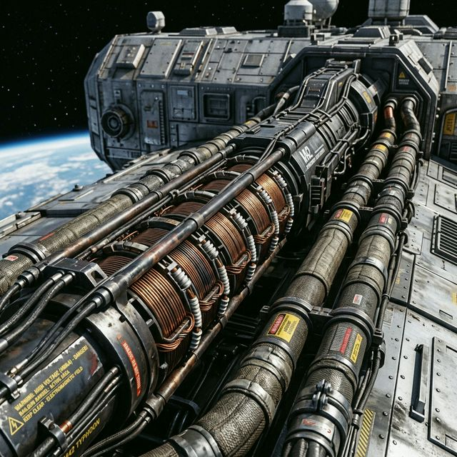
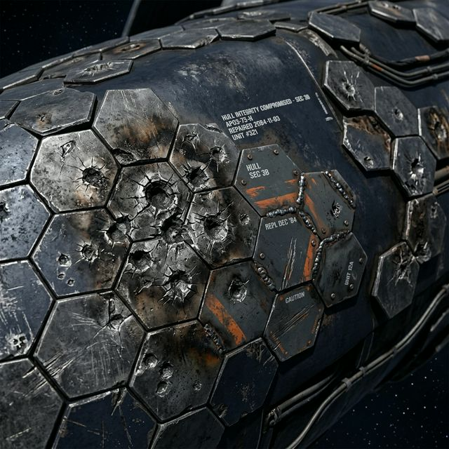
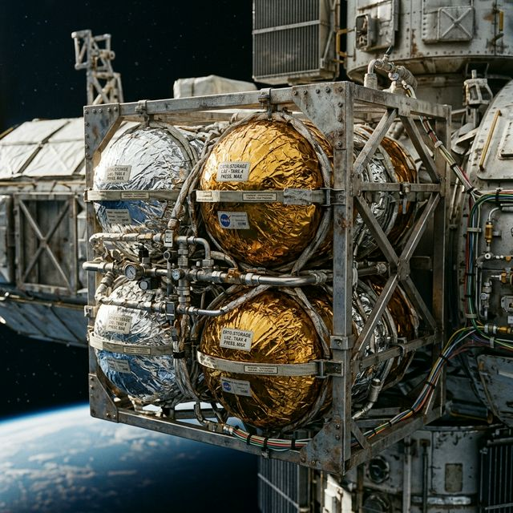
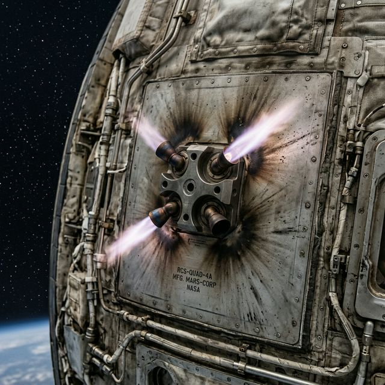
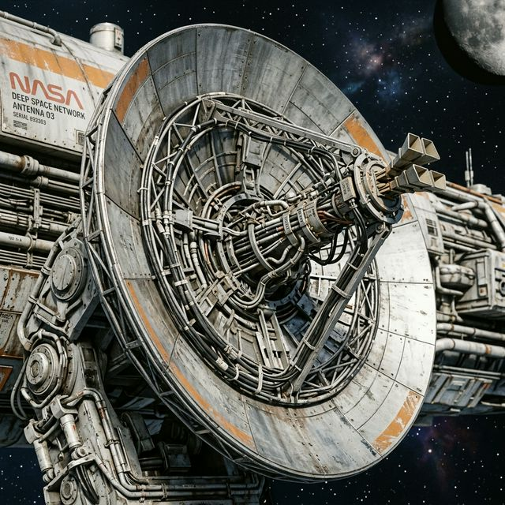
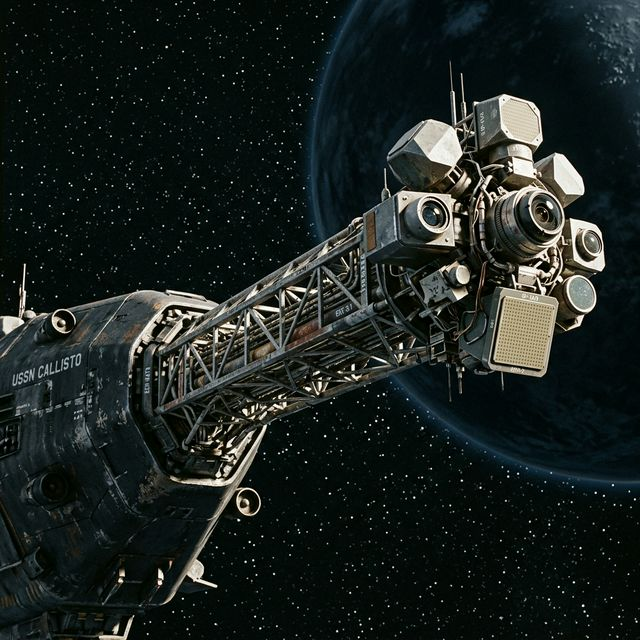
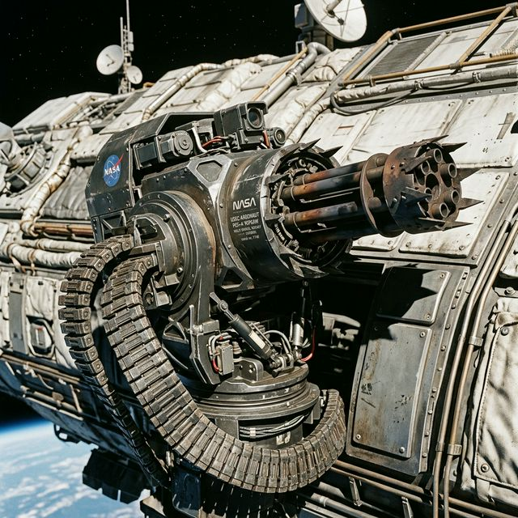
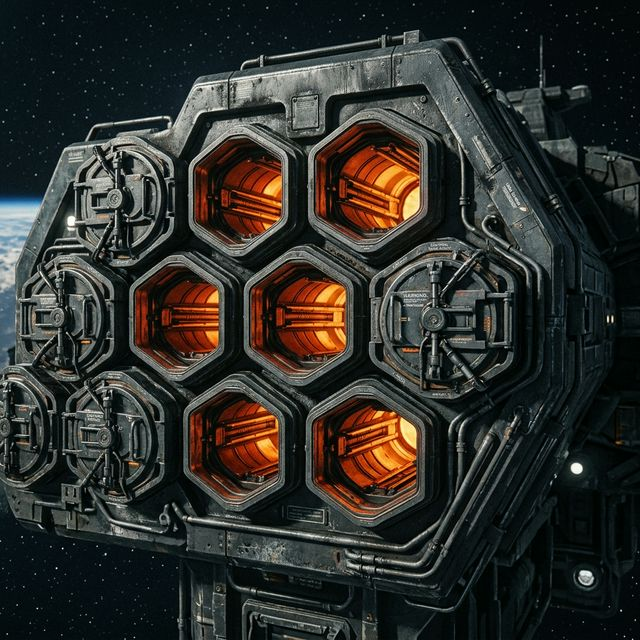

# Delta-V Technology & Component Guide

The Delta-V universe is built on a "NASA-Punk" hard sci-fi foundation. While perfectly adhering to orbital mechanics and Newtonian physics, the game extrapolates on a few key technologies that humanity is currently developing. This document defines how these technologies theoretically work and how they are visually represented on the ships in-game.

By understanding these visual motifs, players can immediately recognize the capabilities and loadout of a ship simply by looking at its silhouette.

These are not claims about present-day deployed fusion torchships. They are speculative extrapolations anchored to real aerospace constraints such as specific impulse, thermal management, shielding, solar power, deep-space communications, and sensing.

---

## 1. High-ISP Fusion Propulsion ("Torch Drives")

**How It Works:** 
Current chemical rockets have high thrust but terrible fuel efficiency (Specific Impulse / ISP), while ion drives have incredible ISP but microscopic thrust. Delta-V ships rely on sustained **Magnetic Confinement Fusion Drives**. Using Deuterium/Helium-3 reactions, these engines direct exhausted plasma out the back via a magnetic nozzle, providing both brutal thrust and incredible fuel efficiency, allowing for continuous rapid brachistochrone trajectories across the solar system.

**Visual Description & Image Placeholder:**

- Massive, realistically scaled engine bells or exposed magnetic nozzle rings.
- Emits a blinding, high-energy cyan or pure white exhaust plume.
- Usually surrounded by heavy, cylindrical magnetic confinement coil rings.

---

## 2. Advanced Thermal Management

**How It Works:** 
In the vacuum of space, dissipating the extreme waste heat from fusion drives and railguns is a monumental challenge. Older ship designs use bulky, fragile radiator fins. The modern Delta-V fleet uses **Liquid Droplet Radiators** (spraying a stream of hot molten coolant directly into the vacuum and catching it meters away to radiate heat) and **Micro-Channel Cooling Arrays** (pumping coolant through hair-thin channels etched directly into the hull plating).

**Visual Description & Image Placeholder:**

- Sleek, flush-mounted hull panels that glow faintly cherry-red or amber under load.
- Exposed mechanical arrays where a precise, glowing stream of liquid stretches momentarily through the vacuum between two catch-basins. 
- *Absence* of protruding, vulnerable traditional fins.

---

## 3. Kinetic Weaponry (Railguns & Coilguns)

**How It Works:** 
Combat in Delta-V happens over vast distances, requiring extreme projectile speeds. Ship weaponry relies on electromagnetism rather than chemical explosives to accelerate solid tungsten or depleted uranium slugs to significant fractions of light speed. Firing these weapons requires massive bursts of energy, pulling directly from the ship's capacitor banks and reactor.

**Visual Description & Image Placeholder:**

- Extremely long, heavy, spine-mounted or turreted barrels.
- Exposed magnetic coils spaced evenly along the length of the barrel.
- Flanked by incredibly thick power conduits and hazard warnings due to massive electromagnetic fields.

---

## 4. Multi-Layer Defenses (Ablative & Whipple Shields)

**How It Works:** 
To survive kinetic railgun impacts, deep space warships utilize layered defenses. The outermost layer is a **Whipple Shield**—a thin, sacrificial bumper designed to vaporize incoming high-velocity slugs upon impact. This spreads the kinetic energy over a much wider area so that the underlying, thick **Ablative Armor** can absorb and slowly slough off the remaining energy without the vital modules being penetrated.

**Visual Description & Image Placeholder:**

- Thick, dense, overlapping hexagonal outer plating.
- Highly utilitarian aesthetic, commonly painted in gunmetal or navy tones.
- Frequently marred with impact craters, scorch marks, and replaced modular segments.

---

## 5. Modular Cryogenic Fuel & Cargo

**How It Works:** 
Deep space logistics requires standardized mass optimization. Fuel (liquid hydrogen and oxygen) is stored in perfect spheres—the most efficient shape for maintaining pressure with minimal material weight. To prevent the cryogenic fuel from boiling off due to solar radiation, the tanks are wrapped in highly reflective Multi-Layer Insulation (MLI).

**Visual Description & Image Placeholder:**

- Clusters of perfectly spherical tanks exposed to space.
- Wrapped heavily in crinkled, highly reflective metallic silver or Kapton gold foil.
- Supported firmly by a skeletal framework of exposed, bare-metal modular trusses.

---

## 6. Reaction Control Systems (RCS)

**How It Works:** 
While massive fusion drives handle main acceleration, ships still need to pitch, yaw, roll, and perform delicate docking maneuvers over short distances in zero-g. They rely on networked clusters of small, hypergolic chemical thrusters or cold-gas jets to provide this precise rotational thrust on all axes.

**Visual Description & Image Placeholder:**

- Small "quad-block" thruster nozzles protruding from the corners and extremities of the hull.
- Often feature scorch marks radiating out from the tiny bells against the plating.
- Visually emits short, sharp, pale bursts of exhaust.

---

## 7. Photovoltaic Solar Arrays

**How It Works:** 
For vessels that don't need continuous massive fusion power (like Orbital Bases) or as auxiliary power backups, enormous deployed solar panels are used to convert sunlight directly into electricity. Because sunlight significantly weakens in deep space, these arrays must be incredibly large to generate sufficient voltage for the station's needs.

**Visual Description & Image Placeholder:**

- Enormous, flat, dark-blue or black rectangular grid arrays extending far from the main hull.
- Supported by delicate-looking unfolding rigid booms and trusses.
- Highly reflective, flat, and fragile appearance compared to the armored main hull.

---

## 8. High-Gain Communication Arrays

**How It Works:** 
In the vast, silent void of the solar system, communicating telemetry and targeting data requires highly focused, narrow-beam frequency transmissions. Large parabolic dish antennas are designed to pierce through background radiation to maintain contact with planetary bases or other ships at extreme ranges.

**Visual Description & Image Placeholder:**

- Large parabolic dishes mounted on articulating mechanical gimbals.
- Extensive wiring and complex central receiver feeds bridging the center of the dish.
- Often clustered near the command deck or sensor booms to minimize signal delay.

---

## 9. LiDAR and Sensor Booms

**How It Works:** 
Visual confirmation is useless at engagement ranges of thousands of kilometers. Ships rely on sophisticated active and passive sensor suites, including LiDAR (Light Detection and Ranging) arrays and thermal imaging, to detect enemies, debris, and navigation hazards. These are mounted on extendable booms to get them away from the electronic "noise" and radiation of their own primary fusion drives.

**Visual Description & Image Placeholder:**

- Long, fragile-looking structural spines protruding from the prow or sides of the ship.
- Tipped with irregular, geometric sensor heads, domed cameras, and flat phased-array radar panels.
- Highly detailed, asymmetrical, and purely utilitarian visual clutter.

---

## 10. Point Defense Cannons (PDCs)

**How It Works:** 
Directly extrapolated from modern naval Close-In Weapon Systems (CIWS) like the Phalanx, PDCs are fast-tracking rotary cannons designed as a ship's last line of defense. They fire curtains of solid tungsten slugs or proximity-fused flak intended to physically shred incoming missiles and drones before they hit the hull.

**Visual Description & Image Placeholder:**

- Small, aggressively spiked multi-barreled rotary cannons housed in armored turrets.
- Mounted on extremely fast-turning spherical or pivoting gimbals scattered across the hull to provide 360-degree overlapping fields of fire.
- Thick, heavy ammunition feed tracks leading down into the ship's magazines.

---

## 11. Guided Missiles and Torpedoes

**How It Works:** 
Because stealth is virtually impossible in the frozen vacuum of space (where the heat of a drive plume shines like a star against the background), combat relies heavily on sheer velocity and overwhelming numbers. Space-rated missiles are essentially autonomous drone-ships, featuring their own sophisticated hypergolic chemical or dirty fusion drives, designed to out-accelerate PDCs through swarm tactics.

**Visual Description & Image Placeholder:**

- Deeply recessed, flush-mounted clusters of hexagonal or cylindrical launch tubes built directly into the armor plating.
- Often glowing amber or red from internal pre-heating before a launch sequence.
- Clean, heavy-duty armored hatch covers meant to protect unfired ordnance from glancing blows.

---

## Reality Anchors & Further Reading

These references are not one-to-one blueprints for Delta-V ships, but they are the real-world technical anchors behind the visual language and fiction:

- [NASA Glenn: Specific Impulse](https://www1.grc.nasa.gov/beginners-guide-to-aeronautics/specific-impulse/) for the propulsion tradeoff Delta-V extrapolates into torch-drive fiction
- [NASA JSC Hypervelocity Impact Technology](https://hvit.jsc.nasa.gov/shield-development/) for the real shielding and impact environment behind Whipple-shield-inspired defenses
- [NASA: Europa Clipper gets super-size solar arrays](https://www.nasa.gov/missions/europa-clipper/nasas-europa-clipper-gets-set-of-super-size-solar-arrays/) for the scale logic behind large deep-space photovoltaic surfaces
- [NASA Deep Space Network](https://www.nasa.gov/directorates/heo/scan/services/networks/deep_space_network) for the communications model behind large high-gain arrays
- [NASA Airborne Science: LiDAR](https://airbornescience.nasa.gov/category/type/Lidar) for the sensing concepts behind active ranging and long sensor booms
