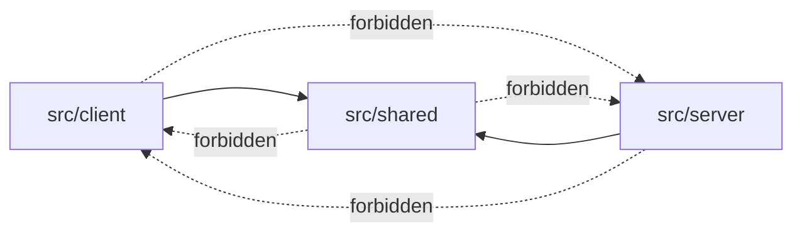

# Layered Architecture

**Category:** Architectural

## Intent

Enforce a strict dependency hierarchy between code layers so that shared game logic is independent of both the server runtime and the client rendering, enabling reuse, testability, and clear ownership boundaries.

## How It Works in Delta-V

Delta-V organizes its source into three top-level layers:

```
src/shared/   -- Pure domain logic. No I/O, no platform dependencies.
src/server/   -- Cloudflare Workers runtime, Durable Objects, storage, WebSockets.
src/client/   -- Browser DOM, Canvas rendering, reactive UI, user input.
```



**Import rules (strictly enforced):**

- `shared/` NEVER imports from `client/` or `server/`. This is verified by a grep search showing zero cross-boundary imports.
- `server/` imports from `shared/` freely.
- `client/` imports from `shared/` freely.
- `client/` NEVER imports from `server/`. This is verified by a grep search showing zero cross-boundary imports.
- `server/` NEVER imports from `client/`. This is enforced by an automated test.

**Sub-layers within each top-level layer:**

The `src/client/` directory is further stratified:
- `client/game/` -- Game session logic, state management, transport, planning.
- `client/renderer/` -- Canvas 2D rendering, animation, visual effects.
- `client/ui/` -- HTML DOM UI panels, overlays, HUD.
- `client/` root -- Input handling, reactive primitives, telemetry.

The `src/shared/engine/` directory contains the pure game engine:
- `engine/` root -- Engine entry points, game creation, event projector.
- `engine/event-projector/` -- Event-to-state projection by category.

## Key Locations

| Purpose | File | Role |
|---|---|---|
| Import boundary test (server) | `src/server/import-boundary.test.ts` | verifies `server/` never imports `client/` |
| Shared engine re-exports | `src/shared/engine/game-engine.ts` | public pure-engine barrel |
| Shared types | `src/shared/types/` | domain and protocol contracts |
| Server entry point | `src/server/index.ts` | Worker HTTP entry |
| Client entry point | `src/client/main.ts` | browser bootstrap |
| Shared protocol validation | `src/shared/protocol.ts` | runtime guards at the boundary |

## Code Examples

The automated import boundary test in `src/server/import-boundary.test.ts` scans all server TypeScript files for client imports:

```typescript
// src/server/import-boundary.test.ts
const CLIENT_IMPORT_PATTERN =
  /(?:from|import)\s+['"][^'"]*\/client\/[^'"]*['"]/g;

describe('server import boundaries', () => {
  it('does not import client modules from server files', () => {
    const violations = collectTypeScriptFiles(SERVER_ROOT).flatMap(
      (filePath) => {
        const source = readFileSync(filePath, 'utf8');
        const matches = [...source.matchAll(CLIENT_IMPORT_PATTERN)];
        return matches.map(
          (match) =>
            `${relative(SERVER_ROOT, filePath)} -> ${match[0] ?? 'unknown import'}`,
        );
      },
    );
    expect(violations).toEqual([]);
  });
});
```

The shared engine barrel file exports only pure functions with no platform dependencies (`src/shared/engine/game-engine.ts`):

```typescript
// src/shared/engine/game-engine.ts
export {
  processAstrogation,
  processOrdnance,
  skipOrdnance,
} from './astrogation';
export {
  beginCombatPhase,
  endCombat,
  processCombat,
  processSingleCombat,
  skipCombat,
} from './combat';
export { processFleetReady } from './fleet-building';
export { createGame } from './game-creation';
export {
  processLogistics,
  processSurrender,
  skipLogistics,
} from './logistics';
export { processEmplacement } from './ordnance';
export { filterStateForPlayer, type ViewerId } from './resolve-movement';
```

## Consistency Analysis

**Strengths:**

- The import boundary test provides automated enforcement for the server-to-client boundary. This runs in CI and prevents accidental violations.
- The `shared/` layer is mostly pure in practice. A grep for `Date.now()`, `console.`, `fetch(`, and `crypto.` in `src/shared/engine/` only hits tests; the remaining determinism caveat is the default RNG parameter on `createGame`, which is tracked separately as a known gap.
- Types flow cleanly: domain types are defined in `shared/types/`, protocol types in `shared/types/protocol.ts`, and both server and client consume them without redefinition.

**Weaknesses:**

- There is no automated boundary test for the client-to-server direction. The server test covers server-not-importing-client, but there is no equivalent test asserting that client never imports server. A grep confirms no violations currently exist, but there is no CI enforcement.
- There is no automated test that `shared/` never imports from `client/` or `server/`. The boundary is maintained by convention, verified here by grep.
- The `buildSolarSystemMap()` function in `shared/map-data.ts` is called in multiple layers -- both the server (`game-do.ts`, `projection.ts`) and the client (`client-kernel.ts`) construct their own map instances. This is correct (each layer owns its instance), but the map construction itself contains hardcoded data rather than being configurable, making it a static coupling point.

## Completeness Check

- **Missing: bidirectional boundary tests.** Only the server boundary is tested. Adding tests for shared-imports-nothing-from-platform and client-imports-nothing-from-server would make the architecture self-documenting.
- **Missing: linting rules.** ESLint import restriction rules (e.g., `no-restricted-imports`) could enforce boundaries at the IDE level, catching violations before tests run.
- **Consider: shared/ sub-layer boundaries.** The `shared/engine/` directory has no enforced boundary against other `shared/` modules. If engine purity matters (see pattern 07), a more granular boundary test could verify that `shared/engine/` only imports from `shared/` utility and type modules, never from `shared/ai.ts` or other potentially impure modules.

## Related Patterns

- **Stateless Pure Engine** (07) -- The shared layer's purity is the foundation for the layered architecture.
- **Hexagonal Architecture** (05) -- Ports live at layer boundaries (e.g., `GameTransport` at the client-server boundary).
- **Composition Root** (04) -- Each layer's entry point wires dependencies without crossing layer boundaries.
