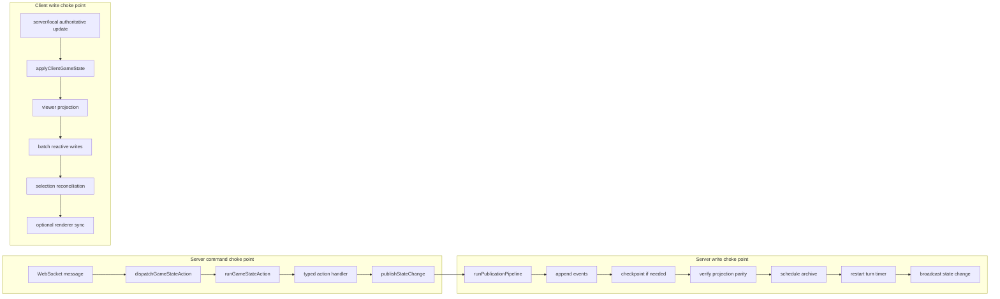

# SRP Choke Points

**Category:** Architectural

## Intent

Route each cross-cutting mutation flow through a small number of owning functions so validation, persistence, telemetry, parity checks, and UI reconciliation happen in one place instead of being reimplemented ad hoc.

## How It Works in Delta-V

Delta-V has three main choke points.

### 1. `publishStateChange` -> `runPublicationPipeline` (incremental server writes)

Incremental server-side game-state mutations flow through `publishStateChange`, which delegates to `runPublicationPipeline`. The pipeline appends events, checkpoints when needed, verifies projection parity, schedules archival, restarts the turn timer when requested, and broadcasts the state-bearing message.

This is the normal write path used by all game-state action handlers and by turn-timeout publication. The one current exception is initial game creation in `match.ts`, which still appends events, verifies parity, broadcasts, and starts the timer directly rather than routing through `publishStateChange`.

### 2. `dispatchGameStateAction` / `runGameStateAction` (server command execution)

All websocket game-state commands are routed through `dispatchGameStateAction`, which selects the typed handler for the message and runs it through `runGameStateAction`. That runner owns:

1. loading the current authoritative state
2. invoking the engine action
3. converting thrown exceptions into telemetry + client-visible errors
4. short-circuiting engine failures
5. invoking the handler's `publish` callback on success

### 3. `applyClientGameState` (authoritative client state writes)

Authoritative `ClientSession.gameState` writes flow through `applyClientGameState` in `game-state-store.ts`. That function owns spectator visibility projection, batched reactive updates, selection cleanup when a ship disappears, and optional renderer synchronization for tests and narrow presentation paths.



## Key Locations

| Purpose | File | Role |
|---|---|---|
| Publication runner | `src/server/game-do/publication.ts` | Ordered post-mutation pipeline |
| Action dispatch and runner | `src/server/game-do/actions.ts` | Uniform game-state action execution |
| DO binding | `src/server/game-do/game-do.ts` | Wires `publishStateChange` deps |
| Match initialization | `src/server/game-do/match.ts` | Current init-time bypass path |
| Client authoritative state writes | `src/client/game/game-state-store.ts` | `applyClientGameState` / `clearClientGameState` |

## Code Examples

Incremental server publication:

```typescript
export const runPublicationPipeline = async (
  deps: PublicationDeps,
  state: GameState,
  primaryMessage?: StatefulServerMessage,
  options?: PublicationOptions,
): Promise<void> => {
  const { actor = null, restartTurnTimer = true, events = [] } = options ?? {};

  const roomCode = await deps.getGameCode();
  const replayMessage = resolveStateBearingMessage(state, primaryMessage);

  const eventSeq = await appendEvents(deps.storage, state.gameId, actor, events);
  await checkpointIfNeeded(deps.storage, state.gameId, state, eventSeq, events);
  await deps.verifyProjectionParity(state);
  archiveIfGameOver(deps, state, roomCode, events);

  if (restartTurnTimer) {
    await deps.startTurnTimer(state);
  }

  deps.broadcastStateChange(state, replayMessage);
};
```

Uniform command execution and error handling:

```typescript
export const runGameStateAction = async <
  Success extends { state: GameState },
>(
  deps: RunActionDeps,
  ws: WebSocket,
  action: (
    gameState: GameState,
  ) => Success | EngineFailure | Promise<Success | EngineFailure>,
  onSuccess: (result: Success) => Promise<void> | void,
): Promise<void> => {
  const gameState = await deps.getCurrentGameState();

  if (!gameState) {
    return;
  }

  let result: Success | EngineFailure;
  try {
    result = await action(gameState);
  } catch (err) {
    const code = await deps.getGameCode();
    console.error(
      `Engine error in game ${code}`,
      `(phase=${gameState.phase}, turn=${gameState.turnNumber}):`,
      err,
    );
    deps.reportEngineError(code, gameState.phase, gameState.turnNumber, err);
    deps.sendError(ws, 'Engine error — action rejected, game state preserved');
    return;
  }

  if ('error' in result) {
    deps.sendError(ws, result.error.message, result.error.code);
    return;
  }

  await onSuccess(result);
};
```

Authoritative client-state writes:

```typescript
export const applyClientGameState = (
  deps: ApplyClientGameStateDeps,
  state: GameState,
): void => {
  const visibleState = projectClientVisibleState(state, deps.isSpectator);

  batch(() => {
    deps.ctx.gameState = visibleState;

    const selectedId = deps.ctx.planningState.selectedShipId;

    if (selectedId) {
      const selectedShip = visibleState.ships.find(
        (ship) => ship.id === selectedId,
      );

      if (!selectedShip || selectedShip.lifecycle === 'destroyed') {
        deps.ctx.planningState.setSelectedShipId(null);
      }
    }

    deps.renderer?.setGameState(visibleState);
  });
};
```

## Consistency Analysis

**Strengths:**

- Incremental server mutations converge on one publication runner with explicit ordered stages.
- Game-state websocket commands all share the same fetch-run-error-publish wrapper.
- Client authoritative state writes have an explicit ownership contract in the module header.
- Turn-timeout publication reuses the same server write path as player actions.

**Known gaps:**

- `initGameSession` in `match.ts` is still a separate initialization-time publication path.
- `broadcastStateChange` remains available as a lower-level callback inside DO wiring, so the choke point is conventional rather than structurally impossible to bypass.
- `clearClientGameState` is a second, intentionally tiny client write entry point for menu/session teardown.

## Completeness Check

- The next structural improvement is to route initial game creation through the same publication path or extract a first-publication variant of the pipeline.
- If stronger enforcement is needed, keep lower-level publication helpers private to the owning module so new code cannot skip the choke point accidentally.

## Related Patterns

- **Event Sourcing** (01) — event persistence hangs off the server write choke point.
- **Pipeline** (15) — the publication choke point is implemented as an ordered pipeline.
- **Composition Root** (04) — choke-point dependencies are wired centrally, not resolved ad hoc.
