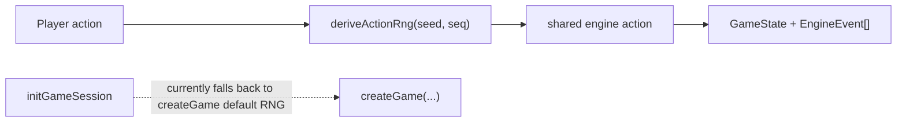

# Stateless Service (Pure Engine)

**Category:** Architectural

## Intent

Keep all game logic in pure, stateless functions that take inputs (game state, player actions, map data, RNG) and return outputs (new state, events) without performing I/O, accessing global state, or mutating their inputs. This enables deterministic testing, replay correctness, and shared execution between server and client.

## How It Works in Delta-V

The game engine lives entirely in `src/shared/engine/` and follows strict purity rules:

**Input immutability:** Every engine entry point performs `structuredClone(inputState)` as its first operation, ensuring the caller's state is never mutated. This is verified by `clone-on-entry.test.ts`, which snapshots state before calling each engine function and asserts identity after the call.

**No I/O:** Engine functions never call `fetch`, `console.log`, `Date.now()`, or access the filesystem. A grep of `src/shared/engine/` confirms that `Date.now()`, `console.`, `fetch(`, and `crypto.` appear only in test files, with one determinism caveat around setup RNG defaults.

**RNG injection:** Action-resolution randomness is injected as a `rng: () => number` parameter. The engine does not call `Math.random` inside combat, movement, logistics, or ordnance processing. On the server action path, the RNG is derived from a deterministic seed via `deriveActionRng(seed, seq)`, making outcomes reproducible for a given match seed and event sequence. Initial game creation is not fully tightened yet: `createGame` still has `rng: () => number = Math.random`, and `initGameSession` currently relies on that default.

**RNG capture in events:** The `rng-capture.test.ts` file verifies that all non-deterministic outcomes (combat dice rolls, ramming rolls, ordnance detonation rolls) are captured as explicit fields in the emitted `EngineEvent` objects. This means replay does not need to re-run the same RNG sequence -- outcomes are stored as facts.

**Map as read-only input:** The `SolarSystemMap` is passed into every engine function that needs spatial information. The map is constructed from static data (`buildSolarSystemMap`) and never mutated by the engine.

**Shared execution:** Because the engine is pure and platform-independent, it runs identically on:
- The Cloudflare Workers server (multiplayer game state transitions).
- The browser client (local/AI single-player games via `createLocalTransport`).
- Test harnesses (hundreds of unit tests with no mocking required).



## Key Locations

| Purpose | File | Role |
|---|---|---|
| Engine barrel (public API) | `src/shared/engine/game-engine.ts` | exported engine surface |
| Astrogation (with `structuredClone`) | `src/shared/engine/astrogation.ts` | representative clone-on-entry action |
| Combat | `src/shared/engine/combat.ts` | largest RNG-heavy action path |
| Fleet building | `src/shared/engine/fleet-building.ts` | setup purchase validation |
| Logistics and surrender | `src/shared/engine/logistics.ts` | transfer and surrender rules |
| Game creation | `src/shared/engine/game-creation.ts` | initial state builder and setup RNG |
| Turn advancement | `src/shared/engine/turn-advance.ts` | in-place internal mutator |
| Victory and game-end checks | `src/shared/engine/victory.ts` | in-place internal mutators |
| Clone-on-entry tests | `src/shared/engine/clone-on-entry.test.ts` | verifies caller state is preserved |
| RNG capture tests | `src/shared/engine/rng-capture.test.ts` | verifies outcomes are emitted as facts |
| Server RNG injection | `src/server/game-do/game-do.ts` | derives seeded action RNG |
| Initial game setup | `src/server/game-do/match.ts` | current unseeded `createGame` call |

## Code Examples

Every engine entry point clones its input and collects events (`src/shared/engine/astrogation.ts`):

```typescript
// src/shared/engine/astrogation.ts
export const processAstrogation = (
  inputState: GameState,
  playerId: PlayerId,
  orders: AstrogationOrder[],
  map: SolarSystemMap,
  rng: () => number,
): MovementResult | StateUpdateResult | { error: EngineError } => {
  const state = structuredClone(inputState);
  const engineEvents: EngineEvent[] = [];

  const phaseError = validatePhaseAction(state, playerId, 'astrogation');
  if (phaseError) return { error: phaseError };
  // ...
};
```

Combat functions also follow the same pure pattern (`src/shared/engine/combat.ts`):

```typescript
// src/shared/engine/combat.ts
export const processCombat = (
  inputState: GameState,
  playerId: PlayerId,
  attacks: CombatAttack[],
  map: SolarSystemMap,
  rng: () => number,
): CombatPhaseResult | { error: EngineError } => {
  const state = structuredClone(inputState);
  const engineEvents: EngineEvent[] = [];
  // ...
};
```

The clone-on-entry test verifies input immutability (`src/shared/engine/clone-on-entry.test.ts`):

```typescript
// src/shared/engine/clone-on-entry.test.ts
describe('clone-on-entry: engine entry points do not mutate input state', () => {
  describe('processAstrogation', () => {
    it('does not mutate input on success', () => {
      const state = makeState();
      const snapshot = snapshotState(state);
      const ship = must(state.ships.find((s) => s.owner === 0));
      processAstrogation(
        state, 0,
        [{ shipId: ship.id, burn: null, overload: null }],
        map, fixedRng,
      );
      expect(snapshotState(state)).toBe(snapshot);
    });
  });
});
```

RNG is injected and seeded deterministically on the server (`src/server/game-do/game-do.ts`):

```typescript
// src/server/game-do/game-do.ts
private async getActionRng(): Promise<() => number> {
  const gameId = await this.getLatestGameId();
  if (!gameId) { return Math.random; }

  const [seed, seq] = await Promise.all([
    getMatchSeed(this.storage, gameId),
    getEventStreamLength(this.storage, gameId),
  ]);

  if (seed === null) { return Math.random; }
  return deriveActionRng(seed, seq);
}
```

Initial game setup is the current exception (`src/server/game-do/match.ts`):

```typescript
// src/server/game-do/match.ts
const { gameId, matchSeed } = await allocateMatchIdentity(deps.storage, code);
const gameState = createGame(scenario, deps.map, gameId, findBaseHex);
```

## Consistency Analysis

**Strengths:**

- Every mutating engine entry point (`processAstrogation`, `processOrdnance`, `skipOrdnance`, `processFleetReady`, `beginCombatPhase`, `processCombat`, `processSingleCombat`, `endCombat`, `skipCombat`, `processLogistics`, `skipLogistics`, `processSurrender`, `processEmplacement`) follows the `structuredClone(inputState)` pattern on line 1. No exceptions.
- The server action path is deterministic by construction. Every action function that needs randomness takes `rng: () => number`, and production multiplayer actions resolve that RNG from `deriveActionRng(seed, seq)`.
- The clone-on-entry test covers all major entry points for both success and error paths.
- The RNG capture test verifies that dice outcomes are stored in events, not reconstructed from RNG during replay.

**Weaknesses:**

- The `advanceTurn` function in `turn-advance.ts` does NOT clone its input -- it mutates the state directly. This is safe because `advanceTurn` is always called on an already-cloned state within a parent engine function (e.g., at the end of `processCombat` or `skipLogistics`). However, it breaks the self-contained purity rule -- if `advanceTurn` were ever called directly on uncloned state, it would mutate it. The clone-on-entry test does not cover `advanceTurn` as a standalone entry point.
- Similarly, `checkGameEnd` and `applyCheckpoints` in `victory.ts` mutate their state parameter in place. These are internal functions always called on cloned state, but they are exported and could theoretically be called unsafely by external code.
- The `createGame` function does not clone any input (it builds state from scratch), which is correct, but its default `rng = Math.random` parameter means a caller can still get non-deterministic setup by omission. `initGameSession` currently does this on the authoritative server path, so initial setup determinism is not yet fully enforced.
- The `projection.ts` module on the server calls `buildSolarSystemMap()` at module scope (line 18), creating a module-level singleton. This is not a purity violation of the engine itself, but it means the projection module has static state.

## Completeness Check

- **Consider: `readonly` input types.** The engine functions take `GameState` as a mutable type but promise not to mutate it. TypeScript's `Readonly<GameState>` (deeply applied) would make the immutability contract compile-time enforced rather than relying on `structuredClone` and tests.
- **Consider: property-based testing.** The existing clone-on-entry tests are example-based. Property-based tests (already used for hex/movement/combat) could be extended to verify clone-on-entry for arbitrary state shapes.
- **Missing: deterministic setup path.** `createGame` still permits an implicit RNG, and the server's initial game-creation path currently uses it. Until that is fixed, action replay is deterministic but initial setup reproducibility is only partially enforced.
- **Consider: sealing internal mutators.** Functions like `advanceTurn`, `checkGameEnd`, and `applyCheckpoints` could be made module-private (not exported) to prevent external code from calling them on uncloned state. Currently they are exported because the event projector and tests use them, but extracting them into an `internal` sub-module with restricted exports would improve safety.

## Related Patterns

- **Event Sourcing** (01) -- The engine's purity enables deterministic replay. Events capture all non-deterministic outcomes.
- **Layered Architecture** (03) -- The engine lives in `shared/`, importable by both server and client precisely because it has no platform dependencies.
- **Hexagonal Architecture** (05) -- The `GameTransport` local adapter runs the same pure engine on the client that the server runs remotely.
- **CQRS** (02) -- The engine is the command-side logic; its outputs feed both the event store (server) and the UI state (client).
