# Pipeline / Chain of Responsibility

## Category

Behavioral

## Intent

Express multi-step flows as explicit ordered stages so each stage has a narrow responsibility, the overall sequence is visible in one place, and cross-cutting work can be inserted without smearing logic across the codebase.

## How It Works in Delta-V

Delta-V uses pipeline-style sequencing in four important places.

### 1. Publication Pipeline (server)

`runPublicationPipeline` is the clearest named pipeline in the repo. For each incremental state change it performs:

1. append events
2. checkpoint when a turn boundary or game-over event was produced
3. verify projection parity
4. schedule archival if the match ended
5. restart the turn timer when requested
6. broadcast the resolved state-bearing message

### 2. Input Pipeline (client)

The pointer and keyboard path is layered:

1. raw DOM events in `input.ts`
2. stateful pointer interpretation in `input-interaction.ts`
3. semantic `InputEvent` values (`clickHex`, `hoverHex`)
4. pure interpretation in `interpretInput`
5. `GameCommand` dispatch in `dispatchGameCommand`
6. domain-specific handler side effects

UI buttons are a sibling path: they skip Layers 1-4 and emit `GameCommand` values directly into the same dispatch layer.

### 3. Client Message Pipeline (client)

Incoming websocket messages flow through:

1. raw typed `S2C` message
2. pure `deriveClientMessagePlan`
3. plan dispatch in `message-handler.ts`
4. authoritative update application and presentation

### 4. Render Pipeline (client)

Each frame follows a stable draw order:

1. clear screen / background fill
2. static scene cache or static scene draw (`stars`, `hex grid`, `asteroids`, `gravity`, `bodies`)
3. map border, base markers, landing targets
4. gameplay overlays (`base threat zones`, `detection ranges`, `course layers`)
5. ordnance, torpedo guidance, combat overlay
6. trails and animated movement paths
7. ships, flashes, combat effects
8. screen-space overlays (`screen flash`, `toasts`, `minimap`)

```mermaid
flowchart TD
  subgraph Server["Server publication"]
    P1["append events"] --> P2["checkpoint"]
    P2 --> P3["verify parity"]
    P3 --> P4["schedule archive"]
    P4 --> P5["restart timer"]
    P5 --> P6["broadcast"]
  end

  subgraph Input["Client input"]
    I1["DOM event"] --> I2["pointer interaction"]
    I2 --> I3["InputEvent"]
    I3 --> I4["interpretInput"]
    I4 --> I5["GameCommand"]
    I5 --> I6["dispatchGameCommand"]
  end

  subgraph Message["Client message handling"]
    M1["S2C message"] --> M2["deriveClientMessagePlan"]
    M2 --> M3["dispatchClientMessagePlan"]
    M3 --> M4["applyAuthoritativeUpdate / UI actions"]
  end
```



## Key Locations

| File | Pipeline | Role |
|------|----------|------|
| `src/server/game-do/publication.ts` | Publication | Ordered post-mutation runner |
| `src/client/input.ts` | Input | DOM capture and semantic event emission |
| `src/client/input-interaction.ts` | Input | Drag/pinch/minimap interpretation |
| `src/client/game/input-events.ts` | Input | `InputEvent` -> `GameCommand[]` |
| `src/client/game/command-router.ts` | Input | `GameCommand` -> handler |
| `src/client/game/client-message-plans.ts` | Message | `S2C` -> `ClientMessagePlan` |
| `src/client/game/message-handler.ts` | Message | Plan dispatch |
| `src/client/game/authoritative-updates.ts` | Message | Authoritative state/presentation pipeline |
| `src/client/renderer/renderer.ts` | Render | Frame order and scene layering |

## Code Examples

Publication pipeline:

```typescript
export const runPublicationPipeline = async (
  deps: PublicationDeps,
  state: GameState,
  primaryMessage?: StatefulServerMessage,
  options?: PublicationOptions,
): Promise<void> => {
  const { actor = null, restartTurnTimer = true, events = [] } = options ?? {};
  const roomCode = await deps.getGameCode();
  const replayMessage = resolveStateBearingMessage(state, primaryMessage);

  const eventSeq = await appendEvents(deps.storage, state.gameId, actor, events);
  await checkpointIfNeeded(deps.storage, state.gameId, state, eventSeq, events);
  await deps.verifyProjectionParity(state);
  archiveIfGameOver(deps, state, roomCode, events);

  if (restartTurnTimer) {
    await deps.startTurnTimer(state);
  }

  deps.broadcastStateChange(state, replayMessage);
};
```

Input interpretation and dispatch:

```typescript
const handleInput = (event: InputEvent) => {
  const interactionMode = deriveInteractionMode(deps.ctx.stateSignal.peek());
  if (interactionMode === 'animating') {
    return;
  }

  const commands = interpretInput(
    event,
    deps.ctx.gameStateSignal.peek(),
    interactionMode,
    deps.map,
    deps.ctx.playerId as PlayerId,
    deps.ctx.planningState,
  );

  for (const cmd of commands) {
    dispatchGameCommand(commandRouterDeps, cmd);
  }
};
```

Message planning before imperative handling:

```typescript
export const handleServerMessage = (
  deps: MessageHandlerDeps,
  msg: S2C,
): void => {
  const plan = deriveClientMessagePlan(
    deps.ctx.state,
    deps.ctx.reconnectAttempts,
    deps.ctx.playerId,
    Date.now(),
    msg,
  );

  dispatchClientMessagePlan(deps, plan);
};
```

Render ordering inside the frame loop:

```typescript
if (map) {
  if (!renderedStatic) {
    renderStarsFn(layerCtx, stars, camera.zoom);
    renderHexGridFn(layerCtx, map, HEX_SIZE, (x, y) => camera.isVisible(x, y));
    renderAsteroidsFn(layerCtx, map, gameState?.destroyedAsteroids ?? [], HEX_SIZE, (x, y) =>
      camera.isVisible(x, y),
    );
    renderGravityIndicatorsFn(layerCtx, map, HEX_SIZE, (x, y) =>
      camera.isVisible(x, y),
    );
    renderBodiesFn(layerCtx, map, HEX_SIZE, now, camera.zoom);
  }

  if (gameState) {
    renderMapBorderFn(layerCtx, map, gameState, playerId, HEX_SIZE, now);
  }

  renderBaseMarkersFn(layerCtx, map, gameState, playerId, HEX_SIZE);
}
```

## Consistency Analysis

**Strengths:**

- Publication is explicit and named; the stage order is easy to audit.
- Input and message flows both converge on typed intermediate values before side effects.
- The renderer keeps a stable layer order and cleanly separates world-space and screen-space drawing.

**Nuances and current gaps:**

- Drag panning intentionally bypasses command dispatch and calls `camera.pan()` directly because it is a continuous high-frequency interaction, not a gameplay command.
- The renderer mixes an explicit draw order with a static-scene cache; the stage order is still stable, but part of the pipeline can be memoized away on a frame.
- Initial game creation in `match.ts` still uses its own direct publication path rather than the standard publication pipeline.

## Completeness Check

- If the render order needs to become more configurable, it could be expressed as an explicit stage array rather than sequential calls in `renderer.ts`.
- The input path is well layered for canvas interactions; UI button flows already reuse the same command-dispatch sink, which is the right compromise.

## Related Patterns

- **Command** (08) — the input pipeline terminates in `GameCommand` dispatch.
- **Derive/Plan** (12) — the client message path derives a pure plan before execution.
- **SRP Choke Points** (06) — the publication pipeline is also the server write choke point.
