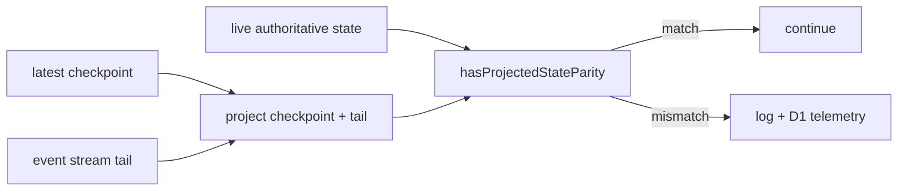

# Parity Check

**Category:** Persistence & State

## Intent

Continuously verify that the event-projected state still matches the live authoritative state so projection bugs or persistence drift are detected immediately instead of surfacing much later as replay corruption.

## How It Works in Delta-V

After each incremental server publication, the publication pipeline calls `verifyProjectionParity(state)`.

That verification path:

1. loads the latest checkpoint
2. loads the event-stream tail after that checkpoint
3. projects the tail onto the checkpoint state
4. normalizes transient fields
5. compares projected and live state with JSON serialization
6. logs and reports mismatches without halting the match

The live state remains authoritative. A parity mismatch is treated as an observability failure, not as a runtime rollback trigger.



## Key Locations

| File | Role |
|---|---|
| `src/server/game-do/publication.ts` | parity hook in publication pipeline |
| `src/server/game-do/telemetry.ts` | mismatch reporting and D1 insert |
| `src/server/game-do/archive.ts` | checkpoint + tail recovery |
| `src/server/game-do/projection.ts` | normalization and equality check |

## Code Examples

Normalization before equality:

```typescript
const normalizeStateForParity = (state: GameState): GameState => ({
  ...state,
  players: state.players.map((player) => ({
    ...player,
    connected: false,
  })) as GameState['players'],
});

export const hasProjectedStateParity = (
  projectedState: GameState | null,
  liveState: GameState,
): boolean =>
  projectedState !== null &&
  JSON.stringify(normalizeStateForParity(projectedState)) ===
    JSON.stringify(normalizeStateForParity(liveState));
```

Verification from the telemetry layer:

```typescript
export const verifyGameDoProjectionParity = async (
  storage: DurableObjectStorage,
  state: GameState,
  onMismatch: (gameId: string, liveState: GameState) => Promise<void>,
): Promise<void> => {
  const hasParity = await hasProjectionParity(storage, state.gameId, state);

  if (!hasParity) {
    await onMismatch(state.gameId, state);
  }
};
```

## Consistency Analysis

**Strengths:**

- The check runs on every incremental publication, not just at turn boundaries.
- Recovery uses the same checkpoint-plus-tail path that reconnect and replay tooling depend on.
- Mismatches are surfaced through both logs and telemetry.

**Current gap:**

- Production normalization currently strips only `player.connected`, while the test suite also filters `ready` and `detected` in some parity comparisons. If those fields are legitimately non-replayable, production and test normalization should be aligned.

**Other tradeoffs:**

- `JSON.stringify` equality is simple and reliable for the current data shape, but it makes mismatch output coarse and order-sensitive.
- The check is observability-only by design; it will not stop a broken match automatically.

## Completeness Check

- The highest-value follow-up is to align normalization with the fields that truly diverge and add structured diffs to mismatch logging.
- If parity cost ever becomes an issue, the current checkpoint-plus-tail design is already the right place to optimize rather than weakening the invariant itself.

## Related Patterns

- **Event Stream + Checkpoint Recovery** (31) — parity depends on checkpoint + tail reconstruction.
- **Event Sourcing** (01) — parity is the runtime correctness check for the event model.
- **Mutable Clone** (35) — replay and checkpoint code clone state before mutation.
