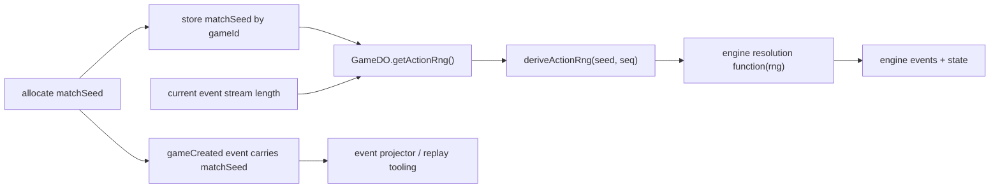

# Deterministic RNG Injection

**Category:** Persistence & State

## Intent

Keep gameplay randomness reproducible by passing RNG functions explicitly into engine resolution paths instead of letting engine code reach for ambient randomness.

## How It Works in Delta-V

Delta-V uses a match-scoped seed plus event-sequence-derived action seeds for authoritative server play.

### Match seed allocation

When a match is created, the server allocates a `matchSeed` using `crypto.getRandomValues` and stores it alongside the match identity.

### Per-action RNG derivation

For authoritative server actions, `GameDO.getActionRng()` loads the current match seed and current event-stream length, then returns `deriveActionRng(seed, seq)`. This gives each action a deterministic RNG stream without having to persist mutable PRNG state between actions.

### Explicit injection into engine entry points

Turn-resolution entry points accept `rng: () => number` explicitly:

- `processAstrogation`
- `processOrdnance`
- `skipOrdnance`
- `beginCombatPhase`
- `processCombat`
- `processSingleCombat`
- `skipCombat`
- `endCombat`

Utility helpers such as `rollD6`, `shuffle`, and `randomChoice` also take RNG explicitly so randomness stays visible at the call boundary.

### Local and non-authoritative flows

Local single-player flows intentionally pass `Math.random` because they are not persisted or replayed through the event stream. Tests often pass fixed RNG functions for reproducibility.



## Key Locations

| File | Role |
|---|---|
| `src/shared/prng.ts` | `mulberry32` and `deriveActionRng` |
| `src/server/game-do/archive.ts` | match-seed allocation and persistence |
| `src/server/game-do/game-do.ts` | authoritative per-action RNG wiring |
| `src/shared/engine/game-creation.ts` | setup-time RNG consumer |
| `src/shared/engine/event-projector/lifecycle.ts` | current `gameCreated` projection path |
| `src/client/game/local.ts` | local play intentionally using `Math.random` |

## Code Examples

PRNG derivation:

```typescript
export const deriveActionRng = (
  matchSeed: number,
  actionSeq: number,
): (() => number) => mulberry32((matchSeed ^ Math.imul(actionSeq, KNUTH)) | 0);
```

Authoritative server wiring:

```typescript
private async getActionRng(): Promise<() => number> {
  const gameId = await this.getLatestGameId();

  if (!gameId) {
    return Math.random;
  }

  const [seed, seq] = await Promise.all([
    getMatchSeed(this.storage, gameId),
    getEventStreamLength(this.storage, gameId),
  ]);

  if (seed === null) {
    return Math.random;
  }

  return deriveActionRng(seed, seq);
}
```

Setup-time randomness still lives behind an injected RNG parameter:

```typescript
export const createGame = (
  scenario: ScenarioDefinition,
  map: SolarSystemMap,
  gameCode: string,
  findBaseHex: (
    map: SolarSystemMap,
    bodyName: string,
  ) => { q: number; r: number } | null,
  rng: () => number = Math.random,
): GameState => {
  // ...
  const fugitive = randomChoice(playerShips, rng);
  // ...
};
```

## Consistency Analysis

**Strengths:**

- Authoritative turn-resolution paths do not call `Math.random` internally; randomness is injected.
- The seed + sequence scheme keeps replay deterministic without persisting evolving PRNG state.
- Tests can force deterministic outcomes with trivial stub RNGs.

**Current gaps:**

- `createGame` still has a `Math.random` default, and the production match-initialization path currently calls it without threading the allocated `matchSeed`.
- The `gameCreated` projector path currently reconstructs setup with `createGame(..., () => 0)` and then relies on follow-up events such as `fugitiveDesignated` to correct hidden-identity state.
- `getActionRng` still falls back to `Math.random` when no `gameId` or `matchSeed` is available for backward-compatibility paths.

## Completeness Check

- The biggest remaining improvement is to thread `matchSeed` through initial game creation and `gameCreated` projection so setup-time randomness is reproducible from the event stream itself rather than corrected afterward.
- If legacy unseeded matches no longer matter, the `Math.random` fallback in `getActionRng` can become an error instead of a silent downgrade in determinism.

## Related Patterns

- **Event Sourcing** (01) — deterministic randomness matters because state is reconstructed from events.
- **Visitor (Event Projection)** (14) — the projector should be able to rebuild the same initial randomized setup.
- **Deterministic RNG in Tests** (56) — tests rely on the same injected RNG seam.
