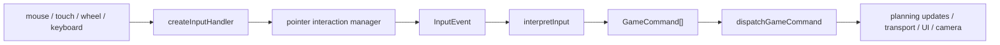

# 3-Layer Input Pipeline

## Category
Client-Specific

## Intent

Keep browser input mechanics separate from gameplay interpretation and side effects. Raw events become semantic input, semantic input becomes typed commands, and only commands are allowed to trigger game/UI mutations.

## How It Works in Delta-V

### Layer 1: Raw input capture

`createInputHandler()` in `input.ts` binds mouse, touch, wheel, and double-click listeners. It delegates drag, pinch, hover, and click classification to `createPointerInteractionManager()` from `input-interaction.ts`.

This layer knows about:

- camera transforms
- minimap hit-testing
- screen-to-world conversion
- pointer state such as drag threshold and pinch distance

This layer does **not** know about planning state, turn rules, or command handlers.

### Layer 2: Input interpretation

`interpretInput()` in `input-events.ts` converts semantic `InputEvent` values into `GameCommand[]` using only snapshots of game state, map state, player identity, and planning state. This is the pure rules layer for canvas interactions.

### Layer 3: Command dispatch

`dispatchGameCommand()` in `command-router.ts` routes each command into the domain-specific handler group that owns the side effect.



## Key Locations

| File | Role |
|---|---|
| `src/client/input.ts` | raw DOM event capture |
| `src/client/input-interaction.ts` | drag/pinch/minimap logic |
| `src/client/game/input-events.ts` | semantic interpretation |
| `src/client/game/command-router.ts` | command dispatch |
| `src/client/game/main-interactions.ts` | wires Layers 1-3 together |
| `src/client/game/commands.ts` | `GameCommand` union and keyboard mapping |

## Code Examples

Layer 1 emits semantic input:

```typescript
const handleClick = (screenX: number, screenY: number) => {
  if (handleMinimapClick(screenX, screenY)) return;

  const worldPos = camera.screenToWorld(screenX, screenY);
  const hex = pixelToHex(worldPos, HEX_SIZE);

  onInput({ type: 'clickHex', hex });
};
```

Layer 2 is pure interpretation:

```typescript
export const interpretInput = (
  event: InputEvent,
  state: GameState | null,
  interactionMode: InteractionMode,
  map: SolarSystemMap | null,
  playerId: PlayerId,
  planning: InteractivePlanningSnapshot,
): GameCommand[] => {
  switch (event.type) {
    case 'clickHex':
      return interpretClickHex(
        event.hex,
        state,
        interactionMode,
        map,
        playerId,
        planning,
      );
    case 'hoverHex':
      if (state) return [{ type: 'setHoverHex', hex: event.hex }];
      if (planning.hoverHex) return [{ type: 'setHoverHex', hex: null }];
      return [];
  }
};
```

Layer 3 dispatches commands through a typed registry:

```typescript
const commandHandlers = {
  ...astrogationHandlers,
  ...combatHandlers,
  ...logisticsHandlers,
  ...ordnanceHandlers,
  ...fleetAndNavigationHandlers,
  ...uiAndLifecycleHandlers,
} satisfies CommandHandlerMap;

export const dispatchGameCommand = <T extends GameCommand>(
  deps: CommandRouterDeps,
  cmd: T,
): void => {
  const handler = commandHandlers[cmd.type] as (
    deps: CommandRouterDeps,
    cmd: T,
  ) => void;

  handler(deps, cmd);
};
```

## Consistency Analysis

**Strengths:**

- DOM code stops at `InputEvent`; it does not reach directly into gameplay handlers.
- Interpretation is pure and heavily testable because it only depends on snapshot inputs.
- The command router centralizes side effects by concern.

**Intentional exceptions:**

- Drag panning calls `camera.pan()` directly inside the pointer layer because it is continuous viewport control, not a gameplay command.
- Keyboard shortcuts and button clicks can enter directly at Layer 3 by emitting `GameCommand` values. That is a sibling path, not a violation, because they still share the same command-dispatch sink.

## Completeness Check

- The pipeline cleanly covers canvas input. Future work should keep new interactive affordances converging on `GameCommand` rather than adding one-off side-effect handlers in DOM code.

## Related Patterns

- **Pipeline** (15) — this is the client input pipeline in concrete form.
- **Command** (08) — Layer 2 produces the command objects consumed by Layer 3.
- **Camera/Viewport Transform** (43) — Layer 1 uses camera transforms for coordinate conversion.
