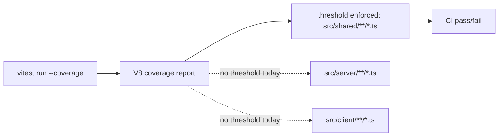

# Coverage Thresholds

## Category

Testing

## Intent

Prevent coverage regression on critical game logic by enforcing minimum statement, branch, function, and line coverage percentages. The CI build fails if coverage drops below the configured thresholds, creating explicit coverage floors that teams can ratchet upward over time.

## How It Works in Delta-V

Vitest's coverage configuration in `vitest.config.ts` uses the `v8` provider and defines per-path thresholds. Currently, thresholds are set only for `src/shared/**/*.ts`. In practice this acts as a manual ratchet on the shared layer, because CI fails if coverage drops below those configured floors.

The thresholds are:

- **Statements**: 84%
- **Branches**: 75%
- **Functions**: 88%
- **Lines**: 85%

Coverage is reported in three formats: `text` (console output), `html` (browsable report), and `json-summary` (machine-readable for CI). Reports go to the `./coverage` directory.

Test files (`src/**/*.test.ts`) are excluded from coverage measurement to avoid inflating the numbers.



## Key Locations

- `vitest.config.ts` -- full coverage configuration

## Code Examples

The current coverage configuration:

```typescript
export default defineConfig({
  test: {
    include: ['src/**/*.test.ts'],
    exclude: ['e2e/**'],
    coverage: {
      provider: 'v8',
      include: ['src/**/*.ts'],
      exclude: ['src/**/*.test.ts'],
      reporter: ['text', 'html', 'json-summary'],
      reportsDirectory: './coverage',
      thresholds: {
        // Prevent coverage backsliding on game logic (shared engine)
        'src/shared/**/*.ts': {
          statements: 84,
          branches: 75,
          functions: 88,
          lines: 85,
        },
      },
    },
  },
});
```

## Consistency Analysis

The threshold pattern is applied to the shared layer only. Server and client modules do not have explicit thresholds, which reflects the architecture's emphasis on shared game logic as the most critical test surface.

The comment "Prevent coverage backsliding on game logic" makes the intent explicit in the config file itself, which is good practice.

The branch threshold (75%) is notably lower than the others, acknowledging that some defensive branches (error paths, edge cases in complex game rules) are harder to exercise. This is a pragmatic choice.

## Completeness Check

- **Missing: server thresholds**: The server `game-do` modules have substantial test coverage but no enforced floor. Adding thresholds for high-value paths such as `src/server/game-do/**/*.ts` would prevent regression there too.
- **Missing: client thresholds**: Client code is harder to test (DOM, canvas), but some client modules already have focused unit tests. Selective thresholds for client hotspots could be added.
- **Missing: ratchet automation**: The thresholds are manually set. An automated tool that reads current coverage and updates thresholds to the current level (ratcheting up) would ensure continuous improvement.
- **E2E exclusion**: The `e2e/` directory is excluded from the test glob entirely, not just from coverage. This is correct.

## Related Patterns

- **51 -- Co-Located Tests**: Coverage is measured against `src/**/*.ts` and tests live alongside those files.
- **52 -- Property-Based Testing**: Property tests contribute significantly to the shared engine's high coverage numbers by exercising broad input spaces.
- **55 -- Mock Storage**: Server test coverage depends on mock storage enabling unit tests of DO logic.
