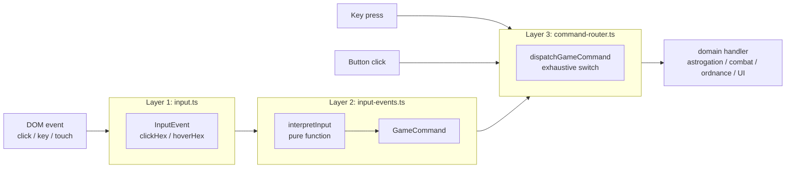

# Client Patterns

How the framework-free browser client stays coherent. [CODING_STANDARDS.md](../docs/CODING_STANDARDS.md) covers naming conventions (`derive*`, `build*`, `apply*`, `create*`), function prefix tables, factory patterns, and the `el()` / `listen()` / `visible()` / `text()` / `cls()` helper APIs — this chapter walks through the patterns that tie input, state, rendering, and DOM together.

Each section follows the same structure: the pattern, a minimal example, where it lives, and why this shape.

---

## Three-Layer Input Pipeline

**Pattern.** DOM events never reach game logic. They pass through three layers: raw capture → game interpretation → command dispatch.



Layer 1 knows camera transforms but nothing about game rules. Layer 2 is pure — it takes snapshots and returns commands. Layer 3 routes to domain handlers. Keyboard shortcuts and button clicks enter directly at Layer 3, sharing the same dispatch sink.

**Minimal example.**

```ts
// Layer 1 — knows camera transforms, nothing about game rules
canvas.addEventListener('click', (e) => emit({ kind: 'clickHex', hex: screenToHex(e) }));

// Layer 2 — pure function from (InputEvent, phase, state) → commands
const commands = interpretInput(event, phase, planningState);

// Layer 3 — exhaustive dispatch, compile-time checked
dispatchGameCommand(commands[0], deps);
```

**Where it lives.** Layer 1: `src/client/input.ts`. Layer 2: `src/client/game/input-events.ts::interpretInput`. Layer 3: `src/client/game/command-router.ts::dispatchGameCommand`. Keyboard shortcuts (`game/keyboard.ts`) and UI button clicks (`game/main-interactions.ts`) enter directly at Layer 3 — a sibling path, not a violation, since they share the same dispatch sink.

**Why this shape.**

- Layer 2 is a pure function, which means every phase/state/input combination is testable without a browser.
- The handler map in Layer 3 uses `satisfies CommandHandlerMap` so adding a new `GameCommand` variant fails to compile until a handler exists.
- Raw DOM and game rules never share a scope — a hover event can't accidentally set a ship's velocity.

---

## Client State Machine

**Pattern.** A flat string union describes where the UI is. Transitions are *derived* from authoritative `GameState`, not imperatively set; state-entry side effects go through a single applier.

**Minimal example.**

```ts
type ClientState =
  | 'menu' | 'connecting' | 'waitingForOpponent'
  | 'playing_astrogation' | 'playing_ordnance' | 'playing_combat'
  | 'playing_logistics'   | 'playing_movementAnim' | 'playing_opponentTurn'
  | 'gameOver';

// Pure derivation from server state:
const next = derivePhaseTransition(currentState, gameState);
applyClientStateTransition(ctx, next);   // single applier owns screen + effects
```

**Where it lives.** State names in `src/client/game/session-model.ts`. Derivation in `src/client/game/phase.ts`. Entry-rule table in `src/client/game/phase-entry.ts::CLIENT_STATE_ENTRY_RULES` (`Record<ClientState, ClientStateEntryRule>` — exhaustive by construction). Apply in `game/state-transition.ts`. Interaction mode (coarser UI enum) in `game/interaction-fsm.ts`.

**Why this shape.**

- Derivation means the client state can't diverge from the server state — the server sends `GameState`, we compute our view of it.
- `Record<ClientState, …>` + exhaustive `switch` in `deriveInteractionMode` catch missing cases at compile time.
- A single applier is the only place that mutates stored state, starts timers, resets cameras, or triggers tutorials — so state entry effects can't scatter.

---

## Reactive Signals (Zero-Dependency)

**Pattern.** A 213-line signals library (`signal`, `computed`, `effect`, `batch`, plus `DisposalScope` / `withScope`) owns durable UI state where it removes imperative fan-out. Transient events (toasts, sounds) stay imperative.

**Minimal example.**

```ts
// Session owns reactive state:
const stateSignal = signal<ClientState>('menu');

// Views subscribe without subscribing:
effect(() => {
  const state = stateSignal();         // auto-tracked read
  applyUIVisibility(buildScreenVisibility(state));
});

// Smart DOM helpers accept signals directly:
visible(confirmBtn, computed(() => stateSignal() === 'playing_astrogation'));
```

**Where it lives.** Primitives in `src/client/reactive.ts` (zero imports, tested in `reactive.test.ts`). Consumers: `ClientSession` reactive properties, `PlanningStore.revisionSignal`, overlay/replay/timer view models, and the `visible()` / `text()` / `cls()` helpers in `src/client/dom.ts`.

**Why this shape.**

- **Narrow scope** — signals remove the class of bugs where "the HUD forgot to re-render when turn changed," without paying for React.
- **Auto-tracking** — effects record which signals they read, no manual subscription.
- **Scopes + `listen` + smart helpers** — teardown is LIFO and automatic inside any `withScope` block.

---

## Session Model as Aggregate Root

**Pattern.** One `ClientSession` object owns every piece of durable client state. Reactive fields are defined through `defineReactiveSessionProperty` so `session.state = 'menu'` transparently updates both the plain field and its companion signal.

**Minimal example.**

```ts
// Every reactive field has a field and a ReadonlySignal:
session.state = 'menu';          // plain assignment
stateSignal.subscribe(...)        // reactive subscription

// Sub-stores are owned, not shared:
session.planningState: PlanningStore;
session.logisticsState: LogisticsStore | null;
```

**Where it lives.** `src/client/game/session-model.ts` defines the aggregate. `session-signals.ts` exposes the signal companions. Narrow `Pick` types (`ClientSessionMessageContext`, `ClientSessionStateTransitionContext`, …) limit what each collaborator can reach.

**Why this shape.**

- One root means one place to inspect in tests and one place for teardown.
- Reactive properties via `Object.defineProperty` give imperative call-site syntax with reactive semantics — no `.set()` boilerplate.
- `Pick`-narrowed context types are compile-time access control. Modules only see the fields they genuinely need.

---

## Planning Store (Ephemeral Turn State)

**Pattern.** All uncommitted UI planning — burns, overloads, queued attacks, selections, hover — lives in one store with a single `revisionSignal` that bumps on every mutation. Phase transitions reset the relevant sub-state.

**Minimal example.**

```ts
// Set a burn:
planningStore.setBurn(shipId, direction);
// → bumps planningStore.revisionSignal

// HUD re-derives:
const hud = computed(() => deriveHudViewModel({
  planning: planningStore,
  state: session.gameState,
  revision: planningStore.revisionSignal(),   // triggers recompute
}));
```

**Where it lives.** `src/client/game/planning.ts`. `PlanningStore` exposes mutation methods; narrow `PlanningState` read type is passed by reference to the renderer. Input layer receives `PlanningState` (read-only) in `interpretInput`.

**Why this shape.**

- Coarse-grained `revisionSignal` is enough — planning changes cluster in time and the HUD re-derivation is cheap.
- Renderer holds `PlanningState` by reference, so previews (dashed course, ghost ship, fuel cost label) are always up to date without a setter API.
- The read-type vs mutation-type split means the input pipeline can't accidentally mutate — TypeScript enforces it.

---

## Canvas Renderer Factory

**Pattern.** `createRenderer(canvas, planningState)` composes ~17 drawing modules and runs a `requestAnimationFrame` loop. A static scene layer (stars, grid, gravity, asteroids, bodies) caches to an offscreen canvas keyed by camera + viewport, avoiding per-frame hex redraws.

**Where it lives.** `src/client/renderer/renderer.ts` is the shell. Layer modules: `scene.ts`, `ships.ts`, `entities.ts`, `vectors.ts`, `effects.ts`, `overlay.ts`, `minimap.ts`, `static-scene.ts`, `static-layer.ts`, `animation.ts`, plus `camera.ts`. Public type is `ReturnType<typeof createRenderer>` (exported as `Renderer`).

**Why this shape.**

- **Factory over class** — the renderer owns mutable long-lived state (animation managers, cache), but without `extends` or `instanceof` machinery. `ReturnType<typeof create…>` keeps the public type in sync with the implementation automatically.
- **Static scene caching** — redrawing thousands of hex tiles every frame is wasteful when the camera is idle. Cache key includes camera pos/zoom, canvas dims, body animation bucket (250 ms), and destroyed asteroids.
- **Build-then-draw** (`buildBodyView` → `renderBodies`) separates view computation from Canvas drawing, making view logic testable without a Canvas context.

---

## Animation Manager with Completion Guarantees

**Pattern.** Ship and ordnance movement animations have explicit completion paths: a normal finish, a fallback timer (`duration + 500 ms`), and an immediate skip when the tab is hidden. State is cleared *before* `onComplete` fires so the callback can't observe mid-animation state.

**Where it lives.** `src/client/renderer/animation.ts::createMovementAnimationManager`. Accepts optional `now`, `setTimeout`, `clearTimeout`, `isDocumentHidden`, `durationMs` for deterministic tests.

**Why this shape.**

- **Game state is post-movement before the animation starts.** The animation is purely cosmetic interpolation; it can't block the engine.
- **Triple completion path** — a network hiccup or hidden tab won't leave the UI frozen "animating."
- **Injected clock** — tests advance time without real timers.

---

## Trusted HTML Boundary

**Pattern.** All `innerHTML` writes go through `setTrustedHTML()` or `clearHTML()` in `src/client/dom.ts`. Nothing else may call `innerHTML =` directly. Enforced by a pre-commit grep check.

**Where it lives.** `src/client/dom.ts` (lines ~100). Callers: HUD, ship list, fleet building, game log. All callers today pass internally-generated markup (game state, static strings, computed display values) — nothing user-controlled.

**Why this shape.**

- If user-controlled content ever renders as HTML (chat, player names, modded scenarios), one boundary can add a sanitizer. Scattered `innerHTML` writes would make that audit impossible.
- Grep-enforced keeps the boundary from re-opening during refactors.

---

## Disposal Scopes

**Pattern.** Anything with a lifetime (effects, computeds, DOM listeners, timers) registers with a `DisposalScope`. Scopes dispose LIFO; a second scope can be nested; `withScope(scope, fn)` implicitly registers anything created inside.

**Minimal example.**

```ts
const scope = createDisposalScope();
withScope(scope, () => {
  effect(() => renderHud());           // registers with scope
  listen(window, 'resize', onResize);  // registers with scope
});
// Later:
scope.dispose();   // tears everything down LIFO
```

**Where it lives.** `src/client/reactive.ts` (`createDisposalScope`, `withScope`, `registerDisposer`). Every view and manager that creates `computed()` or `effect()` graphs owns a scope and exposes `dispose()`.

**Why this shape.**

- Central scope registration means every module has one teardown path. No "oh I forgot to remove that listener."
- On effect re-runs, previously registered nested disposers run first — no stacking subscriptions.
- LIFO disposal handles "child view → parent view" teardown order correctly.

---

## Transport Adapter (WebSocket vs Local AI)

**Pattern.** `GameTransport` hides whether the current game is multiplayer or local AI. Action handlers call `transport.submitAstrogation(orders)` — they never branch on `isLocalGame` inside submission logic.

**Where it lives.** `src/client/game/transport.ts`. Two factories: `createWebSocketTransport(send)` wraps a WebSocket, `createLocalTransport(deps)` runs the engine directly.

**Why this shape.**

- Action code is identical for multiplayer and single-player — the engine is the same.
- Adding a new mode (bridge, MCP-driven local session) only needs a new transport factory.

---

## Cross-Cutting Theme: Pure Core, Imperative Shell

Several of the patterns on this page (derive/plan, input pipeline, state-machine derivation, planning-store read types, build-then-draw) share a shape: a pure function computes "what should happen" as data; a thin imperative layer performs the side effect. This is the functional-core / imperative-shell pattern ([Gary Bernhardt, "Boundaries", SCNA 2012](https://www.destroyallsoftware.com/talks/boundaries)), applied consistently across the client.

The main advantage is testability — a `derivePhaseTransition` test doesn't need a DOM, and a `buildScreenVisibility` test doesn't need a browser. The main discipline is keeping planners pure: the moment a planner reaches for `document` or `setTimeout`, the imperative shell has leaked inward.
