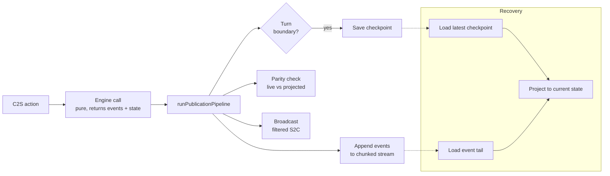

# Engine & Architecture Patterns

How the authoritative server stays consistent and why the shared engine has the shape it does. Read [ARCHITECTURE.md](../docs/ARCHITECTURE.md) first for the high-level layer diagrams and module inventory; this chapter zooms into the recurring patterns behind those layers.

Each section has four parts: **the pattern**, a **minimal example**, **where it lives**, and **why this shape**.

---

## Event-Sourced Match State

**Pattern.** Every mutation to an in-progress match is a versioned event appended to a per-match stream. Live state, replays, and reconnection are all *projections* of that stream plus periodic checkpoints — never a separate "current state" slot maintained by hand.



**Minimal example.**

```ts
// Engine produces events alongside state (pure):
const result = processAstrogation(state, playerId, orders, map, rng);
//    { state, movements, engineEvents: EngineEvent[] }

// Durable Object appends, checkpoints, then broadcasts:
runPublicationPipeline(deps, {
  result,
  envelopeOf: (e) => ({ gameId, seq: nextSeq(), ts: now(), actor, event: e }),
});
```

**Where it lives.** `src/shared/engine/engine-events.ts` defines the 32-member `EngineEvent` union. `src/server/game-do/archive.ts` + `archive-storage.ts` handle the append-only stream in 64-event chunks (`EVENT_CHUNK_SIZE`). `src/shared/engine/event-projector/` projects a stream back to state. `src/server/game-do/publication.ts` is the single writer.

**Why this shape.**

- **Recovery is free** — any observer who can read the stream can reconstruct the game. No drift between live state and "what we saved."
- **Replays are the same code path** as live play, filtered for the viewer. No second implementation.
- **Chunked storage** (64 events per key) keeps individual DO storage values well under the 128 KB limit while surviving the ~100–300 events a typical match produces in a handful of writes.
- **Checkpoints at turn boundaries** amortize projection cost — reconnecting mid-match reads the latest checkpoint plus a short tail, not the whole history.

---

## Parity Check Between Live and Projected State

**Pattern.** After every incremental publication, the server reconstructs state from checkpoint + event tail (same code path as reconnection) and compares it to the live in-memory result. Any mismatch is logged to D1 telemetry but does **not** halt the match.

**Where it lives.** `src/server/game-do/publication.ts` (`verifyProjectionParity`), `src/server/game-do/telemetry.ts` (`projection_parity_mismatch` event), `src/server/game-do/projection.ts`.

**Why this shape.**

- Replay correctness is the core invariant of the whole event-sourcing design. If live ≠ projected, the stream is lying about the match.
- Observability-only (not fatal) — a parity bug shouldn't take matches offline. The log-and-move-on stance accepts correctness-risk for availability while alerts fire.

---

## Side-Effect-Free Shared Engine

**Pattern.** Everything under `src/shared/` has zero I/O: no DOM, no network, no storage, no `Math.random`, no `console.log`. Turn-resolution entry points (`processAstrogation`, `processCombat`, `processOrdnance`, …) `structuredClone()` their input state on entry, then mutate the clone internally for speed. The caller's state is never touched.

**Minimal example.**

```ts
// Inside processCombat:
const working = structuredClone(state);   // caller's `state` is never mutated
applyDamage(working.ships[i], roll);      // mutate clone for efficiency
return { state: working, engineEvents, results };
// Caller must use result.state — their original reference is unchanged.
```

**Where it lives.** `src/shared/engine/` (all files), enforced by `src/shared/engine/clone-on-entry.test.ts` and the pre-commit grep checks on `Math.random` / `innerHTML` / `console.*`.

**Why this shape.**

- **Rollback safety** — if the engine throws mid-turn, the server's real state is untouched.
- **Speculative branching** — AI search and projection verification can invoke engine functions freely without defensive cloning.
- **Testability** — every engine call is a pure function (given RNG). Property-based fuzzing is cheap.

---

## Deterministic RNG via Per-Match Seed

**Pattern.** The server generates a 32-bit seed per match (`crypto.getRandomValues`), persists it, and emits it in the `gameCreated` event. Before each engine call, `deriveActionRng(matchSeed, eventSeq)` derives a deterministic PRNG — replaying events N…M reproduces the same randomness without replaying 1…N-1. RNG is mandatory on turn-resolution entry points.

**Minimal example.**

```ts
// Server side, each action:
const rng = deriveActionRng(matchSeed, state.eventSeq);
const result = processCombat(state, playerId, attacks, map, rng);
//  ^ same state + seq + matchSeed → identical result, every time.
```

**Where it lives.** `src/shared/prng.ts` (`mulberry32`, `deriveActionRng`). `src/server/game-do/actions.ts` (`getActionRng`). Engine entry points take `rng: () => number` as a required parameter.

**Why this shape.**

- **Replay determinism** — the event stream alone is enough to verify history offline.
- **Jumpable RNG** — Knuth multiplicative hashing (`0x9e3779b9`) means we don't need to replay 1..N-1 to derive the Nth action's RNG.
- **Injectable in tests** — `() => 0.5` or a seeded sequence pins outcomes.

---

## Single Choke Points for Side Effects

**Pattern.** Where a side-effecting domain has an obvious owner, one function owns it. Instead of N call sites each doing a small piece of "persist + broadcast + schedule," one applier function is the only path.

**Where it lives.**

| Domain | Choke point |
|--------|-------------|
| Server action execution | `runGameStateAction` (`game-do/actions.ts`) |
| Server state publication | `runPublicationPipeline` (`game-do/publication.ts`) — appends events, checkpoints, parity-checks, archives, restarts timer, broadcasts |
| Client command dispatch | `dispatchGameCommand` (`game/command-router.ts`) |
| Client authoritative apply | `applyClientGameState` (`game/game-state-store.ts`) |
| Client state-entry effects | `applyClientStateTransition` (`game/state-transition.ts`) |
| Client UI visibility | `applyUIVisibility` inside `createUIManager` |

**Why this shape.**

- Drift between similar flows is the main cost of duplication. If five call sites each "save state and broadcast," one of them will forget to restart the turn timer.
- Tests get a narrow seam — you can assert the whole publication pipeline fired by stubbing one collaborator.

---

## Composition Root for Client Construction

**Pattern.** One function wires every collaborator and returns an object with narrow exports (`dispose`, `renderer`, `showToast`). No module constructs its own dependencies; they come in through `deps` objects typed as callable getters.

**Minimal example.**

```ts
const deps: CombatActionDeps = {
  getGameState: () => ctx.gameState,       // getter — reads fresh state each call
  getPlayerId: () => ctx.playerId,
  ui,                                       // stable reference — not a getter
  showToast,
};
const actions = createCombatActions(deps);
```

**Where it lives.** `src/client/game/client-kernel.ts::createGameClient` is the root. `createInputHandler`, `createUIManager`, `createRenderer`, `createCamera`, `createBotClient`, and the `*Actions` factories all accept their deps at construction time.

**Why this shape.**

- Factories over classes make testing trivial — pass mock deps, inspect the returned methods.
- **Callable getters** (`getGameState()` vs direct reference) ensure collaborators always read the *current* state and let us break circular init-order dependencies without `Proxy`.
- The kernel is the only place where "which module talks to which" is visible. Collaborators don't reach for globals.

---

## Layer Boundaries (shared / server / client)

**Pattern.** Three top-level source directories with strict import rules:

- `shared/` imports only from `shared/`.
- `server/` imports from `shared/` and `server/`, never from `client/`.
- `client/` imports from `shared/` and `client/`, never from `server/`.

**Where it lives.** `src/server/import-boundary.test.ts` and `src/shared/import-boundary.test.ts` enforce directional rules at test time. The pre-commit grep checks enforce the "no I/O in shared" sub-rule.

**Why this shape.**

- The shared engine is the contract between client and server. If one side pulls the other's code, the boundary blurs and replay/parity breaks silently.
- Running the engine in Node for simulation or in the browser for local AI games uses the exact same code.

---

## Cross-Cutting Theme: Initial Game Creation Is the Outlier

Five of the patterns on this page note that initial match setup goes through a separate code path from incremental actions: it doesn't use `runPublicationPipeline`, it doesn't thread `matchSeed` into `createGame`, it emits `gameCreated` + `fugitiveDesignated` events outside the normal return path, and its reproducibility is only partial. Consolidating initial creation into the same pipeline as every other action would close all five gaps at once — this is the single highest-leverage architecture refactor available in the codebase today.
