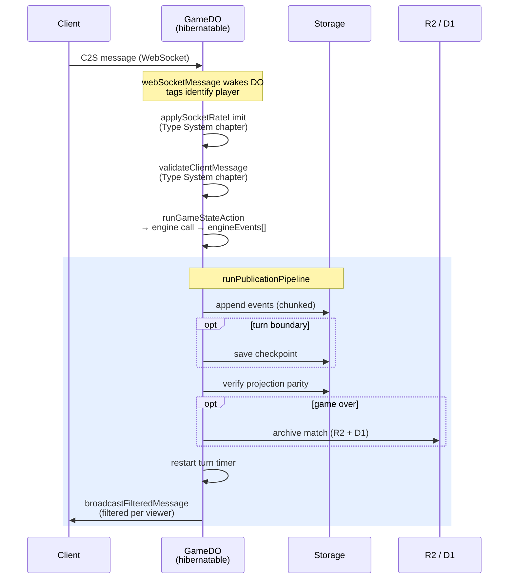

# Protocol & Persistence Patterns

How WebSocket actions turn into persisted events and back into broadcast state. [ARCHITECTURE.md](../docs/ARCHITECTURE.md) shows the high-level action path; this chapter zooms into the patterns that make replay, reconnection, and spectating correct.

Each section: the pattern, a minimal example, where it lives, and why this shape.

---

## Chunked Event Storage

**Pattern.** Per-match events live in fixed-size chunks of 64 events per storage key, not one key per event and not one giant key per match. New events append to the current chunk; the chunk count and sequence counter update in one atomic `storage.put(entries)`.

**Minimal example.**

```ts
// Keys for gameId "ROOM1-m2":
events:ROOM1-m2:chunk:0     → EventEnvelope[]  (first 64 events)
events:ROOM1-m2:chunk:1     → EventEnvelope[]  (next 64)
eventChunkCount:ROOM1-m2    → 2
eventSeq:ROOM1-m2           → 128
```

**Where it lives.** `src/server/game-do/archive-storage.ts` (`EVENT_CHUNK_SIZE = 64`, read/write helpers). `archive.ts` builds envelopes. `archive-compat.ts` lazily migrates legacy single-key streams on first access.

**Why this shape.**

- **Value-size ceiling.** Durable Object storage values max out at 128 KB. A typical match is 100–300 events (~6–32 KB per chunk), well inside the limit.
- **Atomic appends.** Writing modified chunk + chunk-count + seq in one `storage.put(record)` call prevents split-brain after a crash.
- **Fast tail reads.** `Math.floor(afterSeqExclusive / EVENT_CHUNK_SIZE)` jumps directly to the first chunk needing replay — reconnection doesn't scan the whole stream.

---

## Event Envelopes

**Pattern.** Raw engine events are wrapped in envelopes before persistence. Envelopes carry identity metadata — game, sequence, timestamp, actor — separate from the event payload. The engine never knows about envelopes; the publication pipeline wraps them.

**Minimal example.**

```ts
interface EventEnvelope {
  gameId: GameId;            // stable per-match id ("ROOM1-m2")
  seq: number;               // monotonic within this match
  ts: number;                // server time
  actor: PlayerId | 'server';
  event: EngineEvent;        // 1 of 32 domain event shapes
}
```

**Where it lives.** Type in `src/shared/engine/engine-events.ts`. Construction in `src/server/game-do/archive.ts`. Used by projection (`event-projector/`) and replay timelines (`game-do/projection.ts`).

**Why this shape.**

- **`seq` is authoritative ordering.** Timestamps drift; sequence numbers don't.
- **`gameId` is stable even across room reuse.** A single room code can host multiple matches (`m1`, `m2` suffix on rematch) — the gameId disambiguates.
- **`actor` enables per-player provenance** for replay viewers and anti-cheat audits without parsing the event body.

---

## Checkpoints at Turn Boundaries

**Pattern.** After every `turnAdvanced` or `gameOver` event, the server saves a full `GameState` snapshot. Reconstruction loads the latest checkpoint plus the event tail after it — not the whole stream.

**Where it lives.** `src/server/game-do/publication.ts::checkpointIfNeeded`, keyed by `checkpoint:${gameId}:${turn}`. Schema migration runs on both save (`normalizeArchivedGameState`) and load (`normalizeArchivedStateRecord`).

**Why this shape.**

- **Bounded projection cost.** Without checkpoints, a 50-turn match takes 50 turns' worth of projection to reconstruct. With per-turn checkpoints, it's at most one turn's tail.
- **Turn boundaries, not every event.** Checkpointing every event would 10× storage writes for no recovery benefit — a turn's events are a natural atomic unit.
- **Non-atomic with event append is benign.** A crash between checkpoint save and event append leaves a stale checkpoint, but the tail covers the gap — correctness never depends on both writes committing together.

---

## Publication Pipeline (Single Writer)

**Pattern.** Every state-changing action runs through one function that appends events, checkpoints at turn boundaries, verifies parity, writes the match archive on game-over, restarts the turn timer, and broadcasts. Not six separate helpers — one pipeline.

**Minimal example.**

```ts
await runPublicationPipeline(deps, {
  result,                                       // from engine call
  envelopeOf: (e) => ({ gameId, seq, ts, actor, event: e }),
  broadcastMessage: messageBuilders.forResult(result),
});
// Equivalent to: append events → checkpoint? → parity → archive? → timer → broadcast
```

**Where it lives.** `src/server/game-do/publication.ts`. Called by `game-do/actions.ts::runGameStateAction` for C2S actions and `game-do/turn-timeout.ts::runGameDoTurnTimeout` for alarm-driven timeouts.

**Why this shape.**

- Any new action automatically gets event persistence, checkpoint cadence, parity verification, archive-on-end, timer management, and broadcasting — *for free*. There's no way to forget a step.
- Tests stub one collaborator (`storage`, `broadcast`, `archive`) and assert on the whole pipeline.

---

## Discriminated Union Messages (C2S / S2C)

**Pattern.** All WebSocket messages are TypeScript discriminated unions keyed by `type`. Runtime validation produces typed values; TypeScript's exhaustive checking catches missing handlers.

**Minimal example.**

```ts
type C2S =
  | { type: 'astrogation'; orders: AstrogationOrder[] }
  | { type: 'combat'; attacks: CombatAttack[] }
  | { type: 'skipOrdnance' }
  | …;

// Exhaustiveness enforced by `satisfies`:
const HANDLERS = {
  astrogation: handleAstrogation,
  combat: handleCombat,
  skipOrdnance: handleSkipOrdnance,
  …
} satisfies Record<GameStateActionType, unknown>;
```

**Where it lives.** Types in `src/shared/types/protocol.ts`. Runtime validation in `src/shared/protocol.ts::validateClientMessage`. Dispatch map in `src/server/game-do/actions.ts`. `AuxMessage = Exclude<C2S, { type: GameStateActionType }>` separates chat/ping/rematch from state-mutating actions.

**Why this shape.**

- **Single source of truth.** Client and server share the union; neither can ship a message shape the other doesn't understand.
- **Compile-time exhaustiveness.** Adding a new C2S variant fails to compile on the server until a handler exists.
- **Clean rate-limit boundary.** `AuxMessage` lets the DO route chat/ping separately from game-state actions without re-parsing.

---

## Single State-Bearing Message per Action

**Pattern.** Every state-mutating action produces exactly one S2C message that carries the full updated `GameState`. Clients replace their state wholesale — no delta patching, no optimistic updates.

**Minimal example.**

```ts
// Server:
publishStateChange(result);
//   → broadcastMessage: { type: 'movementResult', movements, events, state }
//   (exactly one state-bearing frame)
//
// Client:
onStateBearingMessage((msg) => applyClientGameState(msg.state));
```

**Where it lives.** `StatefulServerMessage` union in `src/shared/types/protocol.ts` covers `gameStart`, `stateUpdate`, `movementResult`, `combatResult`, `combatSingleResult`. Builders in `src/server/game-do/message-builders.ts`. `gameOver` is intentionally separate — sent *after* the final state-bearing message.

**Why this shape.**

- **Reconnection is trivial.** A returning client gets one `stateUpdate` — no replaying of deltas.
- **No ordering bugs.** With deltas, mis-ordered or dropped frames desynchronize the client from the server. With wholesale state, the latest message is the truth.
- **Bandwidth cost is acceptable.** A typical `GameState` is a few KB and messages are turn-paced.

---

## Viewer-Aware Filtering

**Pattern.** Before any state goes to a socket, it passes through `filterStateForPlayer(state, viewerId)` which strips hidden information per viewer. Players keep full own-state visibility; unrevealed enemy ships have `identity` stripped; spectators receive a spectator-safe projection.

**Minimal example.**

```ts
// In broadcastFilteredMessage:
for (const ws of getWebSockets()) {
  const viewerId = ws.deserializeAttachment().viewerId;   // 0 | 1 | 'spectator'
  ws.send(JSON.stringify({
    ...message,
    state: filterStateForPlayer(message.state, viewerId),
  }));
}
```

**Where it lives.** Filter in `src/shared/engine/resolve-movement.ts::filterStateForPlayer`. Broadcast in `src/server/game-do/broadcast.ts::broadcastFilteredMessage`. Socket tagging in `ctx.acceptWebSocket(ws, ['player:0'])` etc.

**Why this shape.**

- **Server-authoritative hidden state.** The fugitive ship in Escape never has `identity.hasFugitives = true` in an opponent's broadcast frame — the filter strips it before send.
- **Early-return optimization.** When no ship has identity fields and the scenario doesn't use hidden-identity rules, the original state is returned by reference (zero allocation).
- **Same filter for replays and live spectators.** `?viewer=spectator` on the WebSocket URL tags the socket; replay timelines pass through the same code. No parallel "filter for replay" implementation.

---

## Hibernatable WebSocket

**Pattern.** The Durable Object uses Cloudflare's hibernation API (`acceptWebSocket`, `webSocketMessage`, `webSocketClose`) instead of classic `addEventListener`. The DO can hibernate between messages — no in-memory state survives a wake.

**Minimal example.**

```ts
// Upgrade path:
ctx.acceptWebSocket(server, [`player:${playerId}`]);

// Later, on wake:
webSocketMessage(ws: WebSocket, message: string) {
  const tags = ctx.getTags(ws);            // ["player:0"] — recovered from the socket
  const state = await getProjectedCurrentStateRaw();  // from storage, not memory
  …
}
```

**Where it lives.** `src/server/game-do/game-do.ts` (accept + message/close callbacks). `game-do/ws.ts` (hibernation entrypoints). `game-do/fetch.ts` (welcome + reconnect). `game-do/session.ts` (disconnect grace).

**Why this shape.**

- **Cost.** Hibernation lets a DO idle without tearing down its sockets. Alarm-driven wake-ups stay cheap.
- **Tags replace an in-memory socket map.** `getWebSockets(['player:0'])` looks up by tag — no parallel `Map<playerId, WebSocket>` to keep in sync.
- **`WeakMap<WebSocket, …>` survives wake cycles.** Cloudflare preserves WebSocket objects across hibernation, so per-socket rate limits and replaced-socket sets stay valid within a wake.

---

## Single-Alarm Multi-Deadline Scheduling

**Pattern.** One alarm per DO, rescheduled after each state change. Three independent deadlines (disconnect grace 30 s, turn timeout 2 min, inactivity 5 min) are tracked in storage; `getNextAlarmAt()` computes the nearest; a discriminated action type tells the handler what fired.

**Where it lives.** `src/server/game-do/alarm.ts` (`resolveAlarmAction` returns `disconnectExpired` | `turnTimeout` | `inactivityTimeout`). Constants in `session.ts::DISCONNECT_GRACE_MS = 30_000`. `inactivityAt` cache flushed to storage at most once per 60 s to avoid write amplification from frequent pings.

**Why this shape.**

- **Single alarm slot.** DOs have one alarm — storing three deadlines and taking the min is the only way to multiplex cleanly.
- **Discriminated action type.** The handler dispatches with an exhaustive `switch`; there's no "guess which deadline fired" logic.
- **Flush throttling.** Inactivity pings happen often; each one doesn't need a storage write. In-memory cache + 60 s flush keeps writes bounded.

---

## Cross-Pattern Flow

A single C2S action threads these patterns in order:



Every step has a single owner, a single reason to exist, and a single place to look when debugging.
