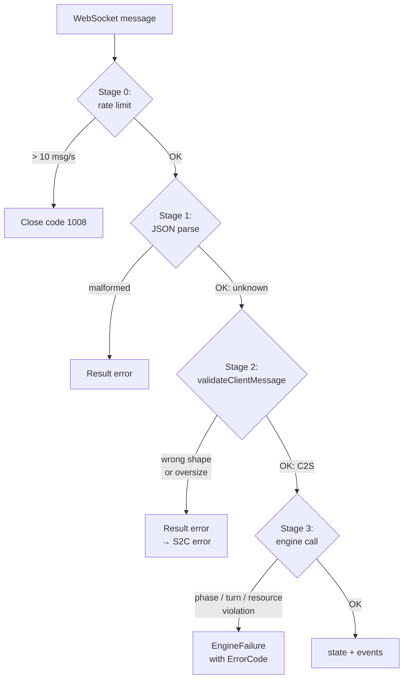

# Type System & Validation Patterns

How Delta-V keeps bad data out of the engine and bad requests out of the server. [CODING_STANDARDS.md](../docs/CODING_STANDARDS.md) covers general TypeScript style; this chapter walks through the project-specific techniques.

Each section: the pattern, a minimal example, where it lives, and why this shape. Rough edges at the end of each section.

---

## Branded Types for Nominal Typing

**Pattern.** Raw `string` values that mean different things (hex keys, room codes, player tokens) are branded at the type level so they can't be substituted for each other. The brand is a phantom property — zero runtime cost.

**Minimal example.**

```ts
// Declaration:
type HexKey = string & { readonly [__brand]: never };

// Safe constructor — only way to build a HexKey from structured data:
const hexKey = ({ q, r }: HexCoord): HexKey => `${q},${r}` as HexKey;

// Unsafe cast — only at serialization boundaries:
const asHexKey = (s: string) => s as HexKey;

// TypeScript prevents mix-ups:
function lookup(key: HexKey) { … }
lookup('bananas');    // compile error — plain string can't pass as HexKey
lookup(hexKey({q: 0, r: 0}));   // fine
```

**Where it lives.** `HexKey` in `src/shared/hex.ts`. `RoomCode`, `PlayerToken`, `GameId`, `AgentToken`, `MatchToken` in `src/shared/ids.ts`. Runtime guards `isRoomCode`, `isPlayerToken` and normalize functions for tokens.

**Why this shape.**

- **Zero runtime cost.** Branded types vanish at runtime; they're pure TypeScript.
- **Boundary discipline.** `hexKey(coord)` is the structured constructor, `asHexKey(str)` is the unsafe cast — the two names tell reviewers which invariants hold.
- **Compile-time bug-finding.** Pre-branded, a function taking `string` could be called with any string; post-branded, only the right kind.

**Rough edges.**

- `HexKey` has no `isHexKey` runtime guard. A format check (`/^-?\d+,-?\d+$/`) would let `asHexKey` validate instead of blindly casting.
- Ship IDs, ordnance IDs, and body names are still plain `string`. They're used as lookup keys across many modules — branding them would catch mistakes like `getShip(ordnanceId)`.

---

## Multi-Stage Validation Pipeline

**Pattern.** Incoming client messages pass through four distinct validation stages, each with its own error surface. Rate limits come first so flood attacks can't exhaust later stages; the engine is last and trusts its input.



**Where it lives.** Stage 0: `src/server/game-do/socket.ts::applySocketRateLimit`. Stage 1: `src/server/game-do/socket.ts::parseClientSocketMessage`. Stage 2: `src/shared/protocol.ts::validateClientMessage`. Stage 3: engine entry points in `src/shared/engine/*`. Runner `src/server/game-do/actions.ts::runGameStateAction` wraps engine calls in try/catch so unexpected throws become typed errors, not state corruption.

**Why this shape.**

- **Fail early and cheaply.** Flood detection and JSON parsing are O(bytes) before we spend time on shape checks.
- **Each stage owns its error.** Stage 2 returns a `Result<C2S>` with a clear "invalid shape" message; Stage 3 returns an `EngineFailure` with an `ErrorCode`.
- **Bounded bodies.** Stage 2 enforces `MAX_FLEET_PURCHASES = 64`, `MAX_ASTROGATION_ORDERS`, `MAX_ORDNANCE_LAUNCHES`, `MAX_COMBAT_ATTACKS`. No engine code has to defensively check array sizes.

**Rough edges.**

- All validation is hand-written (no Zod/io-ts). Keeps the bundle lean but requires a manual update for every new field.
- Some engine modules return `{ error: { code, message } }` directly; others use the `engineFailure()` helper. The helper should be preferred everywhere.
- S2C validation (`validateServerMessage`) is structural only — the server is authoritative, so deep `GameState` validation on outbound is intentionally absent. A compromised server could send malformed state.

---

## Error Code Enum

**Pattern.** A closed string enum carries the *category* of a runtime error across the protocol boundary. The client decides what to do with it; the server just names the category.

**Minimal example.**

```ts
enum ErrorCode {
  INVALID_PHASE = 'INVALID_PHASE',     // timing
  NOT_YOUR_TURN = 'NOT_YOUR_TURN',
  INVALID_SHIP = 'INVALID_SHIP',       // reference
  INVALID_TARGET = 'INVALID_TARGET',
  INVALID_SELECTION = 'INVALID_SELECTION',
  INVALID_INPUT = 'INVALID_INPUT',     // input
  NOT_ALLOWED = 'NOT_ALLOWED',         // authorization
  INVALID_PLAYER = 'INVALID_PLAYER',
  RESOURCE_LIMIT = 'RESOURCE_LIMIT',   // resources
  STATE_CONFLICT = 'STATE_CONFLICT',   // consistency
}

// S2C error carries it:
{ type: 'error', message: 'Not your turn', code: ErrorCode.NOT_YOUR_TURN }
```

**Where it lives.** Enum in `src/shared/types/domain.ts`. Attached to S2C `error` in `src/shared/types/protocol.ts`. Engine returns it inside `EngineFailure`.

**Why this shape.**

- **Stable wire values.** String values survive serialization cleanly and read well in telemetry dashboards.
- **Client can branch.** `STATE_CONFLICT` means re-read state and retry; `INVALID_INPUT` means the UI sent something invalid and should surface a different message.
- **`code` is optional.** Errors from outside the engine (rate limits, server internals) don't have to invent a code.

**Rough edges.**

- `INVALID_PLAYER` is defined but unused anywhere.
- Rate-limit closures use WebSocket close code 1008 instead of an error code — a `RATE_LIMITED` code would give clients a way to back off cleanly.
- Client tracks `plan.code` for telemetry but doesn't branch on it for user-facing messages yet. Context-aware error UI is a backlog opportunity.

---

## Rate Limiting

**Pattern.** Multiple rate-limit layers at different scopes. Edge/Worker layer caps per-IP; DO layer caps per-socket and per-player. Each layer has a tight reason to exist.

**Minimal example.**

```ts
// Per-socket message cap (enforced in the DO):
const WS_MSG_RATE_LIMIT = 10;           // messages
const WS_MSG_RATE_WINDOW_MS = 1_000;    // per second
// Exceeds → close socket with code 1008

// Per-player chat soft-throttle:
const CHAT_RATE_LIMIT_MS = 500;         // min gap between chat messages
// Within window → silently dropped
```

**Where it lives and what it limits.** Canonical values in [SECURITY.md](../docs/SECURITY.md#rate-limiting-architecture). Constants in `src/server/reporting.ts` (Worker-level, per-IP) and `src/server/game-do/socket.ts` (DO-level, per-socket / per-player).

**Why this shape.**

- **Layers catch different attacks.** Per-IP Worker limits catch mass room-creation or probe scanning; per-socket DO limits catch a single connection flooding; per-player chat throttle catches spam from a legitimate socket.
- **Pure functions.** `applySocketRateLimit(now, ws)` takes `now` as a parameter and stores state in `WeakMap<WebSocket, RateWindow>`. Deterministic to test.
- **Soft vs hard.** Chat is *silently dropped* over the window (user just retries); socket flood is *hard-closed* (abusive).

**Rough edges.**

- No per-action rate limit beyond the socket-wide 10/s — one socket could burn its whole budget on fleetReady if it wanted. Legitimate clients never approach it.
- Per-socket only, not per-IP — multiple sockets from one IP each get 10/s. Worker-layer per-IP limits cover connection churn but not in-connection activity.

---

## Result\<T, E\> and Engine-Style Returns

**Pattern.** Two parallel conventions for "success or error" depending on context. `Result<T, E>` is the generic workhorse; engine-style `{ state, … } | { error }` is specialized for heterogeneous engine success shapes.

**Minimal example.**

```ts
// Result<T, E> — parse / validate / lookup. Narrow with .ok:
const parsed: Result<C2S> = validateClientMessage(raw);
if (!parsed.ok) return sendError(ws, parsed.error);
dispatch(parsed.value);

// Engine-style — engine entry points. Narrow with 'error' in result:
const result = processAstrogation(state, playerId, orders, map, rng);
if ('error' in result) return result.error;
return result.state;       // result also has `movements`, `engineEvents`, …
```

**Where it lives.** Generic `Result<T, E = string>` in `src/shared/types/domain.ts`. Engine-style shapes per entry point in `src/shared/engine/`.

**Why this shape.**

- **Two shapes because two patterns.** Validators return a single success value (`Result<C2S>`); engine entry points return state plus per-action extras (movements, events, transfer log entries) that vary. Unifying them would force every engine call into a single huge success type.
- **Neither throws.** The engine doesn't throw for validation failures — callers see structured errors and can decide. Only the try/catch in `runGameStateAction` catches unexpected *bugs*.
- **Implicit invariant.** `'error' in result` narrowing works because no success shape has an `error` field. Adding one would break narrowing — a more explicit discriminant would be safer if the types grow.

---

## Cross-Pattern Flow

A single C2S message threads these patterns in order:

```
1. Worker-layer per-IP rate limits (if HTTP path)
2. Socket flood rate limit (Stage 0)
3. JSON parse (Stage 1, Result<unknown>)
4. Shape + size validation (Stage 2, Result<C2S>, branded types applied)
5. Engine call (Stage 3, structuredClone + RNG + engine)
   → success: EngineEvent[] + new state
   → failure: EngineFailure with ErrorCode
6. S2C response — state-bearing success or { type: 'error', code, message }
```

Each layer can reject independently. A reader tracing a bug from "wrong error surfaced to user" can walk the pipeline in one direction.
